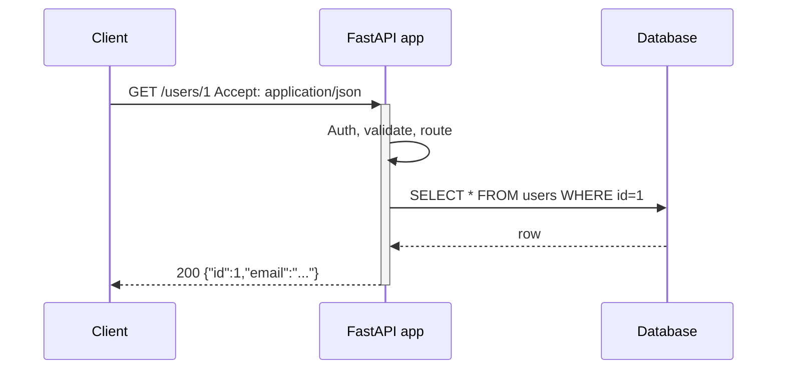

Your phone app never talks to the database directly. It sends a request to a URL, gets JSON back, and trusts that the server did the right checks. That contract — what you can ask for, how you ask, and what comes back — is the **API**. Once you see backends as products with interfaces, HTTP status codes, auth, and versioning stop feeling like trivia and start feeling like product design.

## Intuition

Think of a restaurant kitchen. Guests do not walk in and flip pans. They use a menu (operations), place an order (request), and receive a plate (response). The kitchen can change suppliers and recipes as long as the menu stays stable. An API is that menu for software: **clients** (web, mobile, other services) stay decoupled from **implementation** (Postgres, Redis, third-party SDKs).

A good API is boring on purpose. Same inputs should produce predictable outputs. Errors should be typed (`404` vs `500`), not vague. Auth should be explicit. That predictability is what lets teams ship clients and servers on different calendars.

## How it works

Most web APIs use **HTTP**: a client opens a connection (or reuses one), sends a method + path + headers + optional body, and waits for a status code + headers + body. The server routes the request to a handler, runs validation and business logic, maybe hits a database, then serializes a response.



Common styles:

- **REST** — resources as URLs (`/orders/42`), verbs as HTTP methods.
- **GraphQL** — one endpoint; client declares the shape of the response.
- **RPC / gRPC** — call named procedures; often binary and typed.
- **WebSocket** — long-lived bidirectional channel for push/realtime.

Whatever the style, the durable idea is the same: a **contract**. Document it (OpenAPI), version it when you break it, and treat accidental breaking changes as production bugs.

APIs also sit at trust boundaries. Anything past the API boundary is “inside”: secrets, SQL, private network. Anything before it is untrusted input. That is why validation, authn/authz, rate limits, and careful error messages live at the edge — not deep in random helper functions.

## In code

A minimal FastAPI surface that looks like a real API: typed request/response, status codes, and a SQL-backed lookup.

```python
# pip install fastapi uvicorn
from fastapi import FastAPI, HTTPException
from pydantic import BaseModel, EmailStr
import sqlite3

app = FastAPI(title="Users API")

def get_db():
    conn = sqlite3.connect("app.db")
    conn.row_factory = sqlite3.Row
    return conn

class UserOut(BaseModel):
    id: int
    email: EmailStr

class UserCreate(BaseModel):
    email: EmailStr

@app.on_event("startup")
def init_db():
    with get_db() as db:
        db.execute(
            "CREATE TABLE IF NOT EXISTS users ("
            "id INTEGER PRIMARY KEY, email TEXT UNIQUE NOT NULL)"
        )
        db.commit()

@app.get("/users/{user_id}", response_model=UserOut)
def get_user(user_id: int):
    with get_db() as db:
        row = db.execute(
            "SELECT id, email FROM users WHERE id = ?", (user_id,)
        ).fetchone()
    if row is None:
        raise HTTPException(status_code=404, detail="User not found")
    return UserOut(id=row["id"], email=row["email"])

@app.post("/users", response_model=UserOut, status_code=201)
def create_user(body: UserCreate):
    with get_db() as db:
        try:
            cur = db.execute(
                "INSERT INTO users (email) VALUES (?)", (body.email,)
            )
            db.commit()
            user_id = cur.lastrowid
        except sqlite3.IntegrityError:
            raise HTTPException(status_code=409, detail="Email taken")
    return UserOut(id=user_id, email=body.email)
```

Run with `uvicorn main:app --reload`. Hit `POST /users` with `{"email":"a@example.com"}`, then `GET /users/1`. You have already practiced the core loop: contract -> validate -> persist -> respond.

## What goes wrong

- **Leaky internals** — returning stack traces or SQL errors teaches attackers your schema and panics clients.
- **Undocumented side effects** — a “read” endpoint that writes analytics or mutates state breaks caching and retries.
- **Chatty contracts** — dozens of round-trips for one screen; fix with better resource design, batch endpoints, or GraphQL — not with hope.
- **Silent breaking changes** — renaming a JSON field without a version or deprecation window breaks every mobile app still in the wild.
- **Trusting the client** — never accept `is_admin: true` from the body; derive privileges server-side after authentication.

## One-line summary

An API is a stable, documented contract that lets clients use your backend without knowing how it is implemented.

## Key terms

- **API:** Application Programming Interface — the operations and data shapes a system exposes.
- **Client / server:** caller vs implementer of the contract.
- **HTTP:** request/response protocol most web APIs use.
- **Contract:** agreed request/response shapes, status codes, and semantics.
- **OpenAPI:** machine-readable API description (often generated from FastAPI).
- **Payload:** body of a request or response (commonly JSON).
- **Endpoint:** a specific URL + method combination your API supports.
