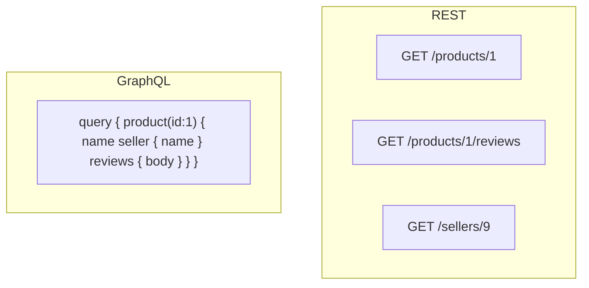

You ship a product page that needs a product, its seller, and three reviews. With REST you might fire three endpoints (or one bloated “include everything” resource). With GraphQL the client asks for exactly those fields in one round-trip — then you discover N+1 SQL queries on the server. Neither style is magic; both are about **who controls the shape of the data** and what that costs at the edge and in the database.

## Intuition

**REST** models the world as **resources** with URLs. `GET /products/42` returns a product representation. Related data lives at related URLs, or is embedded by convention. Caching, CDNs, and HTTP tooling love this because a URL + method is a natural cache key.

**GraphQL** models the world as a **graph** with a schema. The client sends a query document naming fields and nested selections. One HTTP `POST /graphql` (usually) carries many logical reads. Over-fetching shrinks; under-fetching shrinks; complexity moves into resolvers, auth per field, and query cost limits.

Choose REST when URLs map cleanly to product nouns and you want HTTP caching and simple mental models. Choose GraphQL when many clients need different slices of a rich graph and you can invest in schema discipline and query governance.

## How it works

REST in practice:

- Resources: `/users`, `/users/{id}`, `/users/{id}/orders`
- Methods express intent: GET read, POST create, PUT/PATCH update, DELETE remove
- Status codes and `ETag` / `Cache-Control` headers carry protocol meaning
- Versioning via path (`/v1/...`) or headers

GraphQL in practice:

- Schema types + fields + mutations + (optionally) subscriptions
- Client query selects fields; server resolves each field (often with DataLoader batching)
- Errors often arrive as `200` with an `errors` array — HTTP status alone is not enough
- Introspection helps tooling; also helps attackers if left wide open in production



Performance is not “GraphQL faster.” REST can be one well-designed aggregate endpoint. GraphQL can be slower if every field hits the DB. Measure payload size, round-trips, and query plans.

## In code

REST-style FastAPI resources, then a tiny GraphQL-shaped alternative using the same SQL store (illustrative, not a full GraphQL stack).

```python
from fastapi import FastAPI, HTTPException
from pydantic import BaseModel
import sqlite3

app = FastAPI()

def db():
    c = sqlite3.connect("shop.db")
    c.row_factory = sqlite3.Row
    return c

# --- REST: explicit resources ---
@app.get("/products/{pid}")
def get_product(pid: int):
    with db() as conn:
        p = conn.execute("SELECT id, name, seller_id FROM products WHERE id=?", (pid,)).fetchone()
    if not p:
        raise HTTPException(404)
    return dict(p)

@app.get("/products/{pid}/reviews")
def get_reviews(pid: int):
    with db() as conn:
        rows = conn.execute(
            "SELECT id, body FROM reviews WHERE product_id=? LIMIT 20", (pid,)
        ).fetchall()
    return [dict(r) for r in rows]

# --- "GraphQL-like" single endpoint: client picks fields ---
class GqlQuery(BaseModel):
    product_id: int
    fields: list[str]  # e.g. ["name", "seller_name", "reviews"]

ALLOWED = {"name", "seller_name", "reviews"}

@app.post("/gql-lite")
def gql_lite(q: GqlQuery):
    bad = set(q.fields) - ALLOWED
    if bad:
        raise HTTPException(400, detail=f"Unknown fields: {bad}")
    out = {}
    with db() as conn:
        p = conn.execute(
            "SELECT p.name, s.name AS seller_name FROM products p "
            "JOIN sellers s ON s.id = p.seller_id WHERE p.id=?",
            (q.product_id,),
        ).fetchone()
        if not p:
            raise HTTPException(404)
        if "name" in q.fields:
            out["name"] = p["name"]
        if "seller_name" in q.fields:
            out["seller_name"] = p["seller_name"]
        if "reviews" in q.fields:
            out["reviews"] = [
                dict(r)
                for r in conn.execute(
                    "SELECT body FROM reviews WHERE product_id=?", (q.product_id,)
                )
            ]
    return out
```

Real GraphQL (Strawberry, Ariadne, graphene) adds a schema and resolvers; the lesson holds: **field selection is a product feature** that needs allow-lists, depth limits, and batched SQL.

## What goes wrong

- **REST chatty APIs** — mobile on a bad network dies from ten sequential GETs; design aggregates or BFF layers.
- **REST kitchen-sink resources** — returning every join “just in case” wastes bandwidth and couples clients to unused fields.
- **GraphQL N+1** — resolving `reviews` per product in a loop; fix with joins or DataLoader-style batching.
- **Unbounded GraphQL queries** — deeply nested queries as DoS; enforce depth/complexity limits and auth on sensitive fields.
- **Treating GraphQL errors as HTTP success only** — clients must inspect `errors`; ops must still log resolver failures.

## One-line summary

REST exposes resources over HTTP; GraphQL lets clients select fields from a schema — pick based on caching needs, client diversity, and your willingness to govern queries.

## Key terms

- **REST:** resource-oriented API style using URLs and HTTP methods.
- **Resource:** a noun exposed at a URL (user, order, product).
- **GraphQL:** query language and runtime for selecting typed fields from a graph.
- **Over-fetching / under-fetching:** too much or too little data in a response.
- **Resolver:** server function that loads one GraphQL field.
- **BFF:** Backend-for-Frontend — API tailored to one client surface.
- **N+1 query:** one query plus one query per related row — a common GraphQL pitfall.
