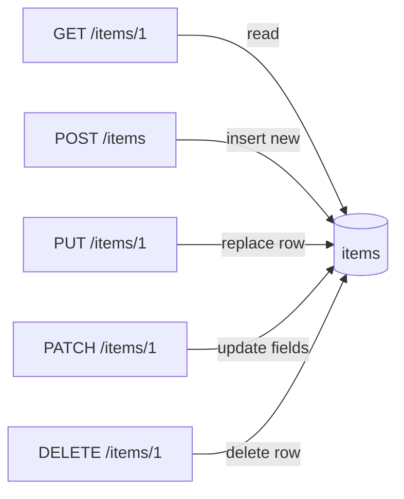

A junior engineer makes “create order” a `GET` because the frontend can put params in the query string. Then a prefetch, a crawler, or a CDN cache fires it twice and you bill the customer twice. **HTTP methods are not fashion** — they encode safety and idempotency promises that infrastructure and clients already rely on.

## Intuition

Methods answer two questions: **does this change server state?** and **is retrying safe?**

- **Safe** methods (GET, HEAD, OPTIONS) should not change state. Caches and browsers assume this.
- **Idempotent** methods (GET, PUT, DELETE, HEAD, OPTIONS) may be retried: doing them N times has the same effect as once (for that resource).
- **POST** is neither safe nor idempotent by default — each call may create a new side effect.

PUT replaces a whole resource at a known URL. PATCH applies a partial update. DELETE removes. POST creates or triggers actions when the server assigns identity (`POST /orders` → `201` with new id).

## How it works

| Method | Typical use | Safe | Idempotent |
| --- | --- | --- | --- |
| GET | Read | Yes | Yes |
| POST | Create / action | No | No (unless you add keys) |
| PUT | Full replace at URL | No | Yes |
| PATCH | Partial update | No | Usually designed to be |
| DELETE | Remove | No | Yes |



Semantics beat pedantry: a `POST /search` that only reads is common when query bodies are huge — but then do not cache it as a GET. Prefer GET for pure reads so CDNs and browsers can help.

## In code

FastAPI routes that map methods to SQL the way production APIs do.

```python
from fastapi import FastAPI, HTTPException
from pydantic import BaseModel, Field
import sqlite3

app = FastAPI()

def conn():
    c = sqlite3.connect("items.db")
    c.row_factory = sqlite3.Row
    return c

class Item(BaseModel):
    name: str
    price_cents: int = Field(ge=0)

class ItemPatch(BaseModel):
    name: str | None = None
    price_cents: int | None = Field(default=None, ge=0)

@app.on_event("startup")
def setup():
    with conn() as db:
        db.execute(
            "CREATE TABLE IF NOT EXISTS items ("
            "id INTEGER PRIMARY KEY, name TEXT NOT NULL, price_cents INTEGER NOT NULL)"
        )
        db.commit()

@app.get("/items/{item_id}")
def get_item(item_id: int):
    with conn() as db:
        row = db.execute("SELECT * FROM items WHERE id=?", (item_id,)).fetchone()
    if not row:
        raise HTTPException(404, "Not found")
    return dict(row)

@app.post("/items", status_code=201)
def create_item(body: Item):
    with conn() as db:
        cur = db.execute(
            "INSERT INTO items (name, price_cents) VALUES (?, ?)",
            (body.name, body.price_cents),
        )
        db.commit()
        new_id = cur.lastrowid
    return {"id": new_id, **body.model_dump()}

@app.put("/items/{item_id}")
def put_item(item_id: int, body: Item):
    with conn() as db:
        cur = db.execute(
            "UPDATE items SET name=?, price_cents=? WHERE id=?",
            (body.name, body.price_cents, item_id),
        )
        if cur.rowcount == 0:
            # Idempotent upsert-style PUT: create at this id
            db.execute(
                "INSERT INTO items (id, name, price_cents) VALUES (?, ?, ?)",
                (item_id, body.name, body.price_cents),
            )
        db.commit()
    return {"id": item_id, **body.model_dump()}

@app.patch("/items/{item_id}")
def patch_item(item_id: int, body: ItemPatch):
    updates = body.model_dump(exclude_unset=True)
    if not updates:
        raise HTTPException(400, "Empty patch")
    cols = ", ".join(f"{k}=?" for k in updates)
    with conn() as db:
        cur = db.execute(
            f"UPDATE items SET {cols} WHERE id=?",
            (*updates.values(), item_id),
        )
        db.commit()
        if cur.rowcount == 0:
            raise HTTPException(404)
        row = db.execute("SELECT * FROM items WHERE id=?", (item_id,)).fetchone()
    return dict(row)

@app.delete("/items/{item_id}", status_code=204)
def delete_item(item_id: int):
    with conn() as db:
        db.execute("DELETE FROM items WHERE id=?", (item_id,))
        db.commit()
    # Second DELETE is still 204 — idempotent at HTTP level
```

Note PUT’s upsert option: repeating the same PUT leaves the same final state. POST always inserts a new row unless you add an idempotency key (later lesson).

## What goes wrong

- **Mutating GET** — prefetch and link scanners will trigger side effects.
- **POST for everything** — loses caching, intermediary assumptions, and clear audit trails.
- **PUT that partially updates** — clients send incomplete bodies and wipe fields to null; use PATCH for partials.
- **DELETE that 404s on second call** — some APIs prefer `404` after delete; others return `204` always. Pick one and document it; retries care.
- **Ignoring method override tricks** — legacy clients sending `POST` + `X-HTTP-Method-Override: DELETE` need explicit support or rejection.

## One-line summary

Use GET to read, POST to create/actions, PUT to replace, PATCH to partially update, and DELETE to remove — matching safety and idempotency to how clients and caches behave.

## Key terms

- **Safe method:** must not change server state (GET, HEAD, OPTIONS).
- **Idempotent method:** repeating has the same effect as once.
- **PUT:** full replacement of the resource at a URL.
- **PATCH:** partial modification of a resource.
- **POST:** create a subordinate resource or run a non-idempotent action.
- **Upsert:** insert-or-update; often how PUT is implemented.
- **Side effect:** any lasting change (DB write, email, charge).
