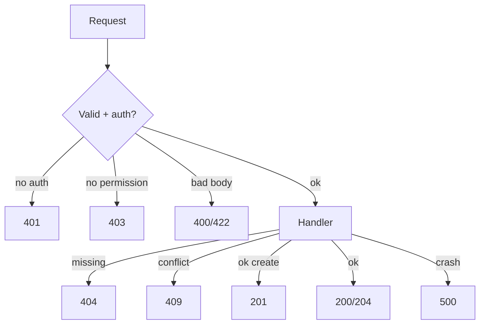

A mobile client gets `{ "error": "nope" }` with HTTP `200`. The retry library thinks success. The spinner stops. Support tickets start. **Status codes are a shared language** between your API, browsers, CDNs, load balancers, and client SDKs — misuse them and every layer makes the wrong decision.

## Intuition

Codes fall into families:

- **2xx** — it worked (from the protocol’s point of view).
- **3xx** — go elsewhere (redirect / use cache).
- **4xx** — **you** (the client) messed up: bad input, missing auth, wrong URL.
- **5xx** — **we** (the server) messed up: bug, dependency down, timeout upstream.

Clients should retry many 5xx and `429` (with backoff). They should **not** retry `400` or `404` blindly. Ops dashboards alert on 5xx rates. Getting the family right matters more than memorizing every obscure code.

## How it works

| Code | Meaning | Typical API use |
| --- | --- | --- |
| 200 | OK | Successful GET/PUT/PATCH with body |
| 201 | Created | Successful POST that created a resource |
| 204 | No Content | Successful DELETE / empty body |
| 400 | Bad Request | Validation failed |
| 401 | Unauthorized | Missing/invalid credentials (unauthenticated) |
| 403 | Forbidden | Authenticated but not allowed |
| 404 | Not Found | Unknown id/path |
| 409 | Conflict | Duplicate email, version conflict |
| 422 | Unprocessable | Semantically invalid (often validation) |
| 429 | Too Many Requests | Rate limited |
| 500 | Internal Error | Unhandled bug |
| 502/503/504 | Bad gateway / unavailable / timeout | Proxy or dependency issues |



Name trap: **401 Unauthorized** historically means “unauthenticated.” **403 Forbidden** means “we know who you are; still no.” Return 404 instead of 403 when you must not leak that a resource exists (IDOR hardening).

## In code

Consistent FastAPI error mapping with a small SQL example for conflicts and not-found.

```python
from fastapi import FastAPI, HTTPException, Depends, Header
from fastapi.responses import JSONResponse, Response
from pydantic import BaseModel, EmailStr, field_validator
import sqlite3

app = FastAPI()

def db():
    c = sqlite3.connect("app.db")
    c.row_factory = sqlite3.Row
    return c

class Register(BaseModel):
    email: EmailStr
    age: int

    @field_validator("age")
    @classmethod
    def adult(cls, v: int) -> int:
        if v < 13:
            raise ValueError("age must be >= 13")
        return v

def require_user(authorization: str | None = Header(default=None)) -> str:
    if not authorization or not authorization.startswith("Bearer "):
        raise HTTPException(status_code=401, detail="Login required")
    token = authorization.removeprefix("Bearer ").strip()
    if token != "secrettoken":
        raise HTTPException(status_code=401, detail="Invalid token")
    return "alice"

@app.post("/users", status_code=201)
def register(body: Register):
    with db() as conn:
        try:
            cur = conn.execute(
                "INSERT INTO users (email, age) VALUES (?, ?)",
                (body.email, body.age),
            )
            conn.commit()
        except sqlite3.IntegrityError:
            raise HTTPException(status_code=409, detail="Email already registered")
    return {"id": cur.lastrowid, "email": body.email}

@app.get("/admin/stats")
def admin_stats(user: str = Depends(require_user)):
    if user != "admin":
        raise HTTPException(status_code=403, detail="Admins only")
    return {"ok": True}

@app.get("/orders/{order_id}")
def get_order(order_id: int, user: str = Depends(require_user)):
    with db() as conn:
        row = conn.execute(
            "SELECT id, owner FROM orders WHERE id=?", (order_id,)
        ).fetchone()
    if row is None or row["owner"] != user:
        # Hide existence from other users
        raise HTTPException(status_code=404, detail="Order not found")
    return {"id": row["id"]}

@app.delete("/sessions/current", status_code=204)
def logout(user: str = Depends(require_user)):
    return Response(status_code=204)

@app.exception_handler(Exception)
async def unhandled(_, exc: Exception):
    # Never leak exc to clients in production
    return JSONResponse(status_code=500, content={"detail": "Internal error"})
```

Validation errors from Pydantic become `422` automatically in FastAPI — that is fine; document it. For domain rules (“coupon expired”), prefer explicit `400`/`409` with stable `detail` codes your clients can switch on.

## What goes wrong

- **Everything is 200** — breaks retries, caches, and monitoring.
- **401 vs 403 confusion** — clients show the wrong UI (login wall vs permission denied).
- **500 for bad input** — looks like your outage; fix validation to return 4xx.
- **404 vs 403 leaks** — returning 403 on private IDs confirms the resource exists.
- **Wrong success code** — `200` on create without an id, or `201` without a `Location`/body when clients expect one.

## One-line summary

Use 2xx for success, 4xx when the client must change the request, and 5xx when the server failed — so every layer can retry, cache, and alert correctly.

## Key terms

- **Status code:** three-digit HTTP result classifying the outcome.
- **2xx / 4xx / 5xx:** success / client error / server error families.
- **401 vs 403:** unauthenticated vs authenticated-but-forbidden.
- **409 Conflict:** request clashes with current resource state.
- **429:** rate limit exceeded; often includes `Retry-After`.
- **Idempotent retry:** safe to repeat after certain failures when method/body allow it.
- **Problem details:** structured error body (e.g. `detail`, machine `code`).
