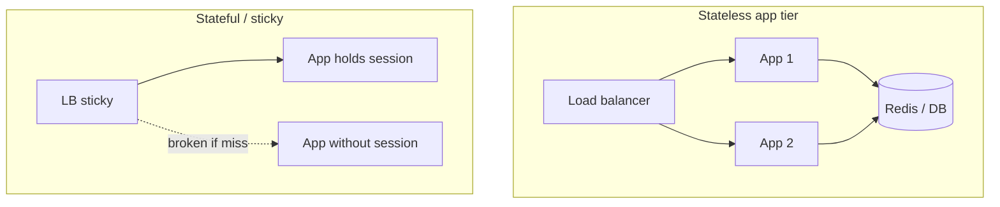

You put your API behind two identical app servers and a load balancer. Half of logins randomly fail. The cause: session data lived in process memory on server A, and the next request hit server B. **Stateless vs stateful** is really about where conversation memory lives — and whether any replica can serve the next request.

## Intuition

A **stateless** API treats each request as self-contained: credentials or tokens travel with the request; the server does not need “you were here before” in local RAM. Shared stores (DB, Redis) may hold data, but any instance can read them.

A **stateful** API (or server) remembers prior interaction in memory or sticky affinity: shopping-cart objects in process, WebSocket rooms pinned to a node, classic server sessions without a shared store.

HTTP itself is request/response and often called “stateless,” but **your application** can still be stateful on top. The design goal for horizontally scaled HTTP APIs is usually: **stateless app tier + shared durable state**.

## How it works



Patterns that keep the app tier stateless:

- Send a **session id** cookie; store session payload in Redis
- Send a **JWT** (or opaque token looked up in a store)
- Put workflow state in the database keyed by `order_id`, not in RAM

Stateful still wins for:

- Multiplayer / WebSocket fan-out with local connection objects
- Long-lived TCP protocols
- Legacy apps where refactor cost dominates (then use sticky sessions carefully)

Sticky sessions are a patch, not a strategy: deploy restarts and uneven load still hurt.

## In code

Contrast an in-memory (stateful) cart with a Redis-shaped (stateless app) cart. Redis shown as a dict stand-in so the example runs anywhere.

```python
from fastapi import FastAPI, Header, HTTPException, Response
from pydantic import BaseModel
import secrets
import time

app = FastAPI()

# --- Stateful: process memory (breaks with multiple replicas) ---
CARTS: dict[str, dict[str, int]] = {}

@app.post("/stateful/cart/items")
def stateful_add(item_id: str, qty: int = 1, response: Response = None):
    sid = secrets.token_hex(8)
    # Bug-by-design demo: new sid every call unless client rounds back — and store is local
    CARTS.setdefault(sid, {})
    CARTS[sid][item_id] = CARTS[sid].get(item_id, 0) + qty
    response.set_cookie("sid", sid)
    return {"sid": sid, "cart": CARTS[sid]}

# --- Stateless app tier: shared session store ---
SESSION_STORE: dict[str, dict] = {}  # pretend Redis
SESSION_TTL = 3600

class AddItem(BaseModel):
    item_id: str
    qty: int = 1

def load_session(sid: str) -> dict:
    entry = SESSION_STORE.get(sid)
    if not entry or entry["exp"] < time.time():
        raise HTTPException(401, "Session expired")
    return entry["data"]

@app.post("/cart/items")
def add_item(body: AddItem, x_session_id: str | None = Header(default=None)):
    if not x_session_id:
        x_session_id = secrets.token_hex(16)
        SESSION_STORE[x_session_id] = {
            "exp": time.time() + SESSION_TTL,
            "data": {"items": {}},
        }
    data = load_session(x_session_id)
    items = data["items"]
    items[body.item_id] = items.get(body.item_id, 0) + body.qty
    SESSION_STORE[x_session_id]["exp"] = time.time() + SESSION_TTL
    return {"session_id": x_session_id, "items": items}

@app.get("/cart")
def get_cart(x_session_id: str = Header(...)):
    return load_session(x_session_id)

# SQL-backed resource state (also "stateless app"): any replica works
import sqlite3

@app.get("/orders/{order_id}")
def get_order(order_id: int):
    with sqlite3.connect("shop.db") as db:
        db.row_factory = sqlite3.Row
        row = db.execute(
            "SELECT id, status FROM orders WHERE id=?", (order_id,)
        ).fetchone()
    if not row:
        raise HTTPException(404)
    return dict(row)
```

The cart still has **state** — in the shared store. The **API servers** stay replaceable. That distinction is what interviewers mean by “stateless REST.”

## What goes wrong

- **Local sessions + multi-instance** — random logouts; fix with Redis/DB sessions or sticky LB (worse).
- **Huge JWT “state”** — stuffing the whole cart into a cookie/JWT blows size limits and complicates revocation.
- **Hidden sticky affinity** — works in staging (one node), fails in prod.
- **WebSocket fan-out ignored** — HTTP API is stateless but realtime layer still needs Redis pub/sub across nodes.
- **Assuming DB = stateful API** — durable data is fine; pinning request handling to one process is the problem.

## One-line summary

Prefer a stateless app tier where any replica can serve any request by reading shared stores; reserve sticky in-memory state for connections that truly need it.

## Key terms

- **Stateless API:** each request carries what the server needs (or a key into shared storage).
- **Stateful server:** relies on local memory or sticky routing for continuity.
- **Sticky session:** load balancer always routes a client to the same node.
- **Shared session store:** Redis/DB holding session data for all replicas.
- **Horizontal scaling:** adding more app instances behind a balancer.
- **Affinity:** routing rule that prefers a specific backend for a client.
