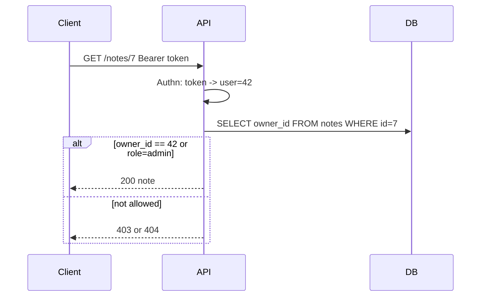

A support tool shows every user’s private notes because the API checked “is logged in?” and stopped there. That is an **authentication** success and an **authorization** failure. Confusing the two is one of the most common — and most expensive — backend bugs.

## Intuition

**Authentication (authn)** answers: *Who are you?* Password, magic link, OAuth, API key, mTLS — somehow you prove an identity (or fail).

**Authorization (authz)** answers: *What are you allowed to do?* Roles, permissions, policies, ownership checks — after you know who it is.

Order matters: identify first, then permit. Returning `401` means “we don’t know you.” Returning `403` means “we know you; still no.” For private resources, many APIs return `404` to avoid leaking existence.

## How it works

Typical request pipeline:

1. Extract credential (cookie, `Authorization: Bearer`, API key header)
2. Authenticate -> `user_id` / service principal
3. Authorize -> role, scope, or row-level rule
4. Run business logic



Models you will see:

- **RBAC** — roles like `admin`, `editor` map to permissions
- **ABAC / policies** — attributes (org_id, resource tag) drive allow/deny
- **Ownership** — `WHERE owner_id = :user_id` on every query
- **Scopes** — OAuth-style `read:orders` strings on tokens

Never trust a client-sent `user_id` or `is_admin` field as truth. Derive identity from the credential; derive permission from server-side rules.

## In code

FastAPI dependency injection separating authn from authz, with SQL ownership checks.

```python
from enum import Enum
from fastapi import FastAPI, Depends, HTTPException, Header
from pydantic import BaseModel
import sqlite3
import hashlib
import secrets

app = FastAPI()

class Role(str, Enum):
    user = "user"
    admin = "admin"

def db():
    c = sqlite3.connect("app.db")
    c.row_factory = sqlite3.Row
    return c

# --- Authn: credential -> user ---
def hash_pw(pw: str, salt: str) -> str:
    return hashlib.sha256(f"{salt}:{pw}".encode()).hexdigest()

class Principal(BaseModel):
    id: int
    role: Role

def authenticate(authorization: str | None = Header(default=None)) -> Principal:
    if not authorization or not authorization.startswith("Bearer "):
        raise HTTPException(401, "Not authenticated")
    token = authorization.split(" ", 1)[1]
    with db() as conn:
        row = conn.execute(
            "SELECT u.id, u.role FROM tokens t "
            "JOIN users u ON u.id = t.user_id "
            "WHERE t.token = ? AND t.revoked = 0",
            (token,),
        ).fetchone()
    if not row:
        raise HTTPException(401, "Invalid token")
    return Principal(id=row["id"], role=Role(row["role"]))

# --- Authz helpers ---
def require_admin(user: Principal = Depends(authenticate)) -> Principal:
    if user.role != Role.admin:
        raise HTTPException(403, "Admin only")
    return user

@app.post("/login")
def login(email: str, password: str):
    with db() as conn:
        u = conn.execute(
            "SELECT id, salt, password_hash FROM users WHERE email=?", (email,)
        ).fetchone()
        if not u or u["password_hash"] != hash_pw(password, u["salt"]):
            raise HTTPException(401, "Bad credentials")
        token = secrets.token_urlsafe(32)
        conn.execute(
            "INSERT INTO tokens (token, user_id, revoked) VALUES (?, ?, 0)",
            (token, u["id"]),
        )
        conn.commit()
    return {"access_token": token, "token_type": "bearer"}

@app.get("/notes/{note_id}")
def read_note(note_id: int, user: Principal = Depends(authenticate)):
    with db() as conn:
        note = conn.execute(
            "SELECT id, owner_id, body FROM notes WHERE id=?", (note_id,)
        ).fetchone()
    if note is None:
        raise HTTPException(404, "Not found")
    # Authorization: owner or admin
    if note["owner_id"] != user.id and user.role != Role.admin:
        raise HTTPException(404, "Not found")  # avoid existence leak
    return {"id": note["id"], "body": note["body"]}

@app.get("/admin/users")
def list_users(_admin: Principal = Depends(require_admin)):
    with db() as conn:
        rows = conn.execute("SELECT id, email, role FROM users").fetchall()
    return [dict(r) for r in rows]
```

Login proves identity. `require_admin` and the `owner_id` check grant power. Keep those layers separate so you can audit permissions without rewriting password code.

## What goes wrong

- **Authn only** — any logged-in user can hit `/users/{id}` for all ids (IDOR).
- **Client-side enforcement** — hiding an Admin button is not security; APIs must deny.
- **Confused deputy** — service A calls service B with a powerful key and forgets to pass the end-user’s limits.
- **Privilege in JWT without server checks** — stale `role: admin` after demotion if you never re-validate.
- **Verbose 403 on missing resources** — leaks IDs to scanners.

## One-line summary

Authentication establishes who the caller is; authorization decides what that identity may do — both must happen on the server for every sensitive request.

## Key terms

- **Authentication (authn):** verifying identity.
- **Authorization (authz):** checking permissions.
- **Principal:** the authenticated identity object in your app.
- **RBAC:** role-based access control.
- **IDOR:** Insecure Direct Object Reference — accessing others’ ids by guessing.
- **Scope:** coarse permission string often carried on OAuth tokens.
- **Least privilege:** grant only the access required for the task.
