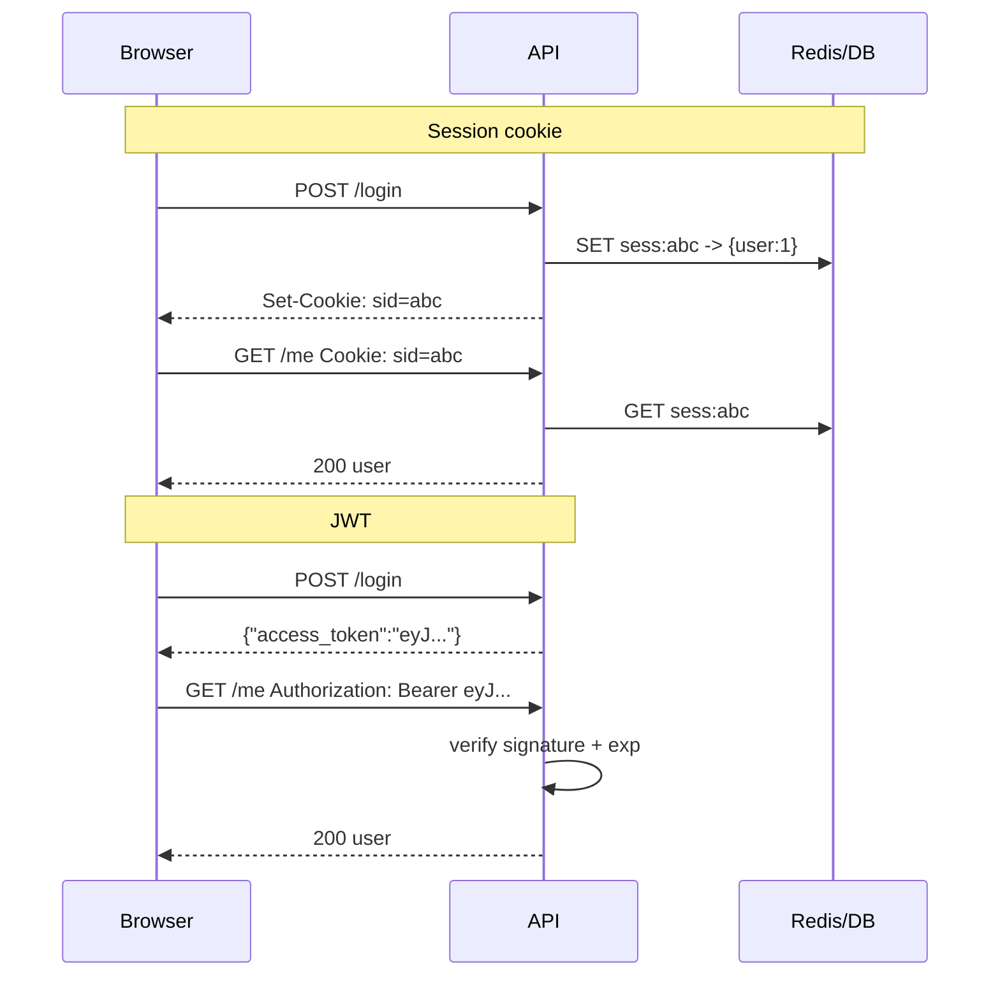

“Just use JWT” is not a security architecture. Sessions and JWTs both answer “is this request allowed?” — they differ in **where session state lives**, how you **revoke** access, and what happens when you run **many API replicas**. Pick the trade-offs on purpose.

## Intuition

**Session-based auth:** after login, the server stores a session record (Redis/DB) and gives the browser an opaque **session id** cookie. Each request sends the cookie; the server looks up the session. Revocation is deleting a row. Data can change every request (role upgrades apply immediately).

**JWT (JSON Web Token):** after login, the server signs a compact token containing claims (`sub`, `exp`, maybe `role`). The client sends `Authorization: Bearer ...`. Servers validate the signature and expiry **without a DB hit** (for pure JWT). Revocation is hard: you wait for `exp`, or maintain a denylist (which reintroduces server state).

Opaque tokens looked up in Redis are “session-shaped” even if you put them in a Bearer header. The real axis is **reference token** (lookup) vs **self-contained signed token**.

## How it works



| Concern | Server session | JWT access token |
| --- | --- | --- |
| Revoke immediately | Easy | Hard (denylist/short TTL) |
| DB/Redis on each request | Yes | No (unless denylist) |
| Size / cookies | Small id | Larger claims blob |
| Cross-service | Shared store or SSO | Public key verify |
| XSS risk | Cookie if not HttpOnly | Token in JS storage is risky |

Common production combo: **short-lived JWT access token + refresh token** stored server-side or as HttpOnly cookie, or classic **opaque session** for first-party browsers.

## In code

Both patterns in FastAPI. JWT uses the standard library HMAC for illustration (prefer `PyJWT` in real apps).

```python
import hmac
import hashlib
import json
import base64
import secrets
import time
from fastapi import FastAPI, HTTPException, Response, Cookie, Header
from pydantic import BaseModel

app = FastAPI()
SECRET = b"dev-only-change-me"
SESSIONS: dict[str, dict] = {}  # use Redis in production

class LoginIn(BaseModel):
    user_id: int
    password: str

def b64url(data: bytes) -> str:
    return base64.urlsafe_b64encode(data).rstrip(b"=").decode()

def make_jwt(sub: int, ttl_s: int = 900) -> str:
    header = b64url(json.dumps({"alg": "HS256", "typ": "JWT"}).encode())
    payload = b64url(json.dumps({"sub": sub, "exp": int(time.time()) + ttl_s}).encode())
    sig = b64url(hmac.new(SECRET, f"{header}.{payload}".encode(), hashlib.sha256).digest())
    return f"{header}.{payload}.{sig}"

def verify_jwt(token: str) -> int:
    try:
        header, payload, sig = token.split(".")
        expected = b64url(
            hmac.new(SECRET, f"{header}.{payload}".encode(), hashlib.sha256).digest()
        )
        if not hmac.compare_digest(sig, expected):
            raise ValueError("bad sig")
        claims = json.loads(base64.urlsafe_b64decode(payload + "=="))
        if claims["exp"] < time.time():
            raise ValueError("expired")
        return int(claims["sub"])
    except Exception:
        raise HTTPException(401, "Invalid token")

@app.post("/session/login")
def session_login(body: LoginIn, response: Response):
    if body.password != "password":  # demo only
        raise HTTPException(401)
    sid = secrets.token_urlsafe(24)
    SESSIONS[sid] = {"user_id": body.user_id, "exp": time.time() + 3600}
    response.set_cookie(
        "sid", sid, httponly=True, secure=True, samesite="lax", max_age=3600
    )
    return {"ok": True}

@app.get("/session/me")
def session_me(sid: str | None = Cookie(default=None)):
    sess = SESSIONS.get(sid or "")
    if not sess or sess["exp"] < time.time():
        raise HTTPException(401)
    return {"user_id": sess["user_id"], "via": "session"}

@app.post("/session/logout")
def session_logout(sid: str | None = Cookie(default=None), response: Response = None):
    SESSIONS.pop(sid or "", None)
    response.delete_cookie("sid")
    return {"ok": True}

@app.post("/jwt/login")
def jwt_login(body: LoginIn):
    if body.password != "password":
        raise HTTPException(401)
    return {"access_token": make_jwt(body.user_id), "token_type": "bearer"}

@app.get("/jwt/me")
def jwt_me(authorization: str | None = Header(default=None)):
    if not authorization or not authorization.startswith("Bearer "):
        raise HTTPException(401)
    user_id = verify_jwt(authorization.split(" ", 1)[1])
    return {"user_id": user_id, "via": "jwt"}
```

Sessions revoke with `logout`. JWTs keep working until `exp` unless you add a denylist table (`jti` column) checked on each request.

## What goes wrong

- **JWT in localStorage** — XSS steals long-lived tokens; prefer HttpOnly cookies for browsers when possible.
- **Forever JWT** — no `exp`, no rotation; stolen token is eternal.
- **Sensitive data in JWT claims** — tokens are base64, not encrypted; anyone can read payloads.
- **Session fixation** — reuse pre-login session ids; always issue a new id at login.
- **Missing cookie flags** — without `HttpOnly`/`Secure`/`SameSite`, CSRF and theft get easier.

## One-line summary

Sessions store authority server-side behind an opaque id (easy revoke); JWTs carry signed claims (easy scale, harder revoke) — choose based on revocation and trust needs.

## Key terms

- **Session:** server-side record of a logged-in user.
- **Session id:** opaque cookie/key referencing that record.
- **JWT:** signed token encoding claims; often used as a bearer access token.
- **Claim:** field inside a JWT (`sub`, `exp`, `scope`).
- **Refresh token:** long-lived credential used to mint new access tokens.
- **Revocation:** invalidating a credential before natural expiry.
- **HttpOnly cookie:** cookie not readable by JavaScript.
