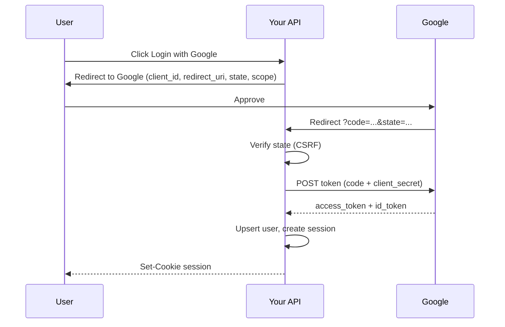

“Login with Google” is not Google giving you the user’s password. It is **OAuth 2.0**: the user authorizes Google to give *your app* a limited access token (and often an identity assertion). Get the redirect dance wrong and you invent open redirects and account takeovers. Get it right and you never store Google passwords.

## Intuition

Three roles:

- **Resource owner** — the user
- **Client** — your app
- **Authorization server / resource server** — Google, GitHub, etc. (often combined)

The user consents; your backend receives an **authorization code** (browser flow), exchanges it for tokens using a **client secret** kept server-side, then either logs the user into *your* session or calls APIs with the access token.

OAuth is **authorization** of API access. **OpenID Connect (OIDC)** layers **authentication** (an `id_token` saying who logged in) on top. “Sign in with X” in product language is usually OIDC.

## How it works

Authorization Code flow (the default for server-rendered or confidential web apps):



Critical parameters:

- **`state`** — random nonce you stored; must match on return (CSRF)
- **`redirect_uri`** — exact allow-listed URL
- **PKCE** — required for public clients (SPAs/mobile); stops code interception
- **Scopes** — `openid email profile` vs powerful API scopes

Never use the old implicit flow for new apps. For first-party username/password APIs, OAuth may be overkill — but for third-party login and delegated API access, it is the standard.

## In code

Illustrative FastAPI authorization-code exchange. Replace the HTTP calls with `httpx` against real provider URLs; keep secrets in env vars.

```python
import os
import secrets
import time
import sqlite3
from urllib.parse import urlencode
from fastapi import FastAPI, HTTPException, Response
from fastapi.responses import RedirectResponse
import json

app = FastAPI()
CLIENT_ID = os.environ.get("GOOGLE_CLIENT_ID", "demo")
CLIENT_SECRET = os.environ.get("GOOGLE_CLIENT_SECRET", "demo")
REDIRECT_URI = "http://localhost:8000/auth/callback"
AUTH_URL = "https://accounts.google.com/o/oauth2/v2/auth"
TOKEN_URL = "https://oauth2.googleapis.com/token"

# ephemeral store → use Redis in production
PENDING: dict[str, float] = {}
SESSIONS: dict[str, int] = {}

def db():
    c = sqlite3.connect("users.db")
    c.row_factory = sqlite3.Row
    return c

@app.get("/auth/login")
def login():
    state = secrets.token_urlsafe(24)
    PENDING[state] = time.time() + 600
    q = urlencode({
        "client_id": CLIENT_ID,
        "redirect_uri": REDIRECT_URI,
        "response_type": "code",
        "scope": "openid email profile",
        "state": state,
        "access_type": "online",
    })
    return RedirectResponse(f"{AUTH_URL}?{q}")

@app.get("/auth/callback")
def callback(code: str | None = None, state: str | None = None, response: Response = None):
    if not code or not state or state not in PENDING or PENDING[state] < time.time():
        raise HTTPException(400, "Invalid state")
    del PENDING[state]

    # Exchange code → tokens (pseudo; use httpx.post in real code)
    token_payload = {
        "code": code,
        "client_id": CLIENT_ID,
        "client_secret": CLIENT_SECRET,
        "redirect_uri": REDIRECT_URI,
        "grant_type": "authorization_code",
    }
    # tokens = httpx.post(TOKEN_URL, data=token_payload).json()
    tokens = {
        "id_token_claims": {"sub": "google-user-123", "email": "a@gmail.com"},
        "access_token": "ya29.demo",
    }
    claims = tokens["id_token_claims"]
    # Verify id_token signature/issuer/audience in production (JWKS)!

    with db() as conn:
        conn.execute(
            "CREATE TABLE IF NOT EXISTS users ("
            "id INTEGER PRIMARY KEY, email TEXT UNIQUE, google_sub TEXT UNIQUE)"
        )
        row = conn.execute(
            "SELECT id FROM users WHERE google_sub=?", (claims["sub"],)
        ).fetchone()
        if row:
            user_id = row["id"]
        else:
            cur = conn.execute(
                "INSERT INTO users (email, google_sub) VALUES (?, ?)",
                (claims["email"], claims["sub"]),
            )
            conn.commit()
            user_id = cur.lastrowid

    sid = secrets.token_urlsafe(24)
    SESSIONS[sid] = user_id
    resp = RedirectResponse("/", status_code=302)
    resp.set_cookie("sid", sid, httponly=True, secure=True, samesite="lax")
    return resp
```

After OAuth succeeds, issue **your** session or JWT. Do not pass Google’s access token to the browser unless the browser must call Google APIs directly — and then use careful XSS controls.

## What goes wrong

- **Missing `state` / PKCE** — login CSRF and code theft.
- **Open redirect** — letting `redirect_uri` be a request parameter without allow-list.
- **Treating access token as proof of login forever** — use `id_token` (OIDC) verified properly, then your own session.
- **Account linking bugs** — attaching a Google `sub` to an existing email without proving ownership.
- **Leaking client secret** — putting it in mobile apps or frontend bundles.

## One-line summary

OAuth 2.0 lets users grant your app limited access via an authorization server; for “Login with X,” use the authorization code flow (with PKCE when public) and then create your own session.

## Key terms

- **OAuth 2.0:** framework for delegated authorization.
- **OIDC:** OpenID Connect — identity layer on OAuth (id_token).
- **Authorization code:** short-lived code exchanged server-side for tokens.
- **Access token:** credential to call APIs on the user’s behalf.
- **Refresh token:** long-lived token to obtain new access tokens.
- **PKCE:** Proof Key for Code Exchange — protects public clients.
- **state:** CSRF nonce for the redirect round-trip.
