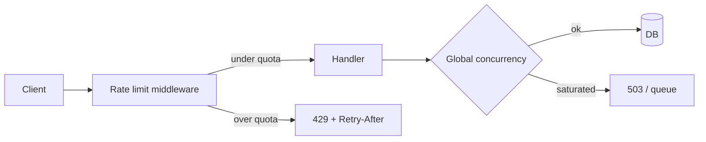

A script burns your password-reset endpoint and your SMS bill. Or a viral launch melts the DB while legitimate users see timeouts. **Rate limiting** and **throttling** are how you keep multi-tenant APIs alive — by bounding how fast a client can spend your CPU, DB, and third-party quotas.

## Intuition

People use the words loosely. Useful distinction:

- **Rate limiting** — enforce a quota: *N requests per window*. Exceed -> reject (`429`) or delay. Protects fairness and abuse.
- **Throttling** — intentionally slow or shed load when the system is hot: reduce concurrency, queue, or return `503` with retry. Protects **system stability**.

In practice one middleware often does both: per-API-key token buckets (limit) plus global concurrency caps (throttle). The product message differs: “you exceeded your plan” vs “we are overloaded, back off.”

## How it works

Common algorithms:

| Algorithm | Idea | Notes |
| --- | --- | --- |
| Fixed window | Count in `[12:00, 12:01)` | Burst at window edges |
| Sliding window | Count in last 60s | Smoother |
| Token bucket | Tokens refill; each request spends one | Allows controlled bursts |
| Leaky bucket | Queue drains at fixed rate | Smooths spikes |

Keys matter: limit by **IP**, **user id**, **API key**, or **route**. Login endpoints need stricter limits than public GETs. Return `Retry-After` seconds when you can.



At the edge (API gateway, Cloudflare, nginx) you block cheaply. In the app you enforce business quotas (“1000 req/day on Free plan”). In the worker pool you cap concurrent DB operations so one tenant cannot exhaust connections.

## In code

Token-bucket style limiter in FastAPI (in-memory demo; use Redis `INCR` + TTL or a gateway in production).

```python
import time
import threading
from fastapi import FastAPI, HTTPException, Request, Depends
from fastapi.responses import JSONResponse

app = FastAPI()

class TokenBucket:
    def __init__(self, rate_per_sec: float, capacity: float):
        self.rate = rate_per_sec
        self.capacity = capacity
        self.tokens = capacity
        self.updated = time.monotonic()
        self.lock = threading.Lock()

    def allow(self, cost: float = 1.0) -> bool:
        with self.lock:
            now = time.monotonic()
            elapsed = now - self.updated
            self.updated = now
            self.tokens = min(self.capacity, self.tokens + elapsed * self.rate)
            if self.tokens >= cost:
                self.tokens -= cost
                return True
            return False

# 10 req/s sustained, burst 20 — keyed by API key or IP
BUCKETS: dict[str, TokenBucket] = {}
BUCKET_LOCK = threading.Lock()

def client_key(request: Request) -> str:
    return request.headers.get("X-API-Key") or (request.client.host if request.client else "unknown")

def rate_limit(request: Request):
    key = client_key(request)
    with BUCKET_LOCK:
        bucket = BUCKETS.get(key)
        if bucket is None:
            bucket = TokenBucket(rate_per_sec=10.0, capacity=20.0)
            BUCKETS[key] = bucket
    if not bucket.allow():
        raise HTTPException(
            status_code=429,
            detail="Rate limit exceeded",
            headers={"Retry-After": "1"},
        )

# Global throttle: max in-flight handlers
MAX_IN_FLIGHT = 50
in_flight = 0
if_lock = threading.Lock()

@app.middleware("http")
async def concurrency_throttle(request: Request, call_next):
    global in_flight
    with if_lock:
        if in_flight >= MAX_IN_FLIGHT:
            return JSONResponse(
                status_code=503,
                content={"detail": "Overloaded"},
                headers={"Retry-After": "2"},
            )
        in_flight += 1
    try:
        return await call_next(request)
    finally:
        with if_lock:
            in_flight -= 1

@app.get("/search", dependencies=[Depends(rate_limit)])
def search(q: str):
    # pretend expensive work
    return {"q": q, "hits": []}

# Redis-shaped fixed window (psycopg/redis style pseudocode)
"""
# redis_client.incr(f"rl:{api_key}:{minute}")
# if count == 1: redis_client.expire(key, 60)
# if count > LIMIT: reject 429
"""
```

Pair limits with **auth**: unauthenticated IPs share a harsh bucket; paying API keys get higher ceilings. Log `429` by key so you can spot scrapers vs misconfigured SDKs.

## What goes wrong

- **Only IP limits** — NAT and mobile gateways punish whole networks; authenticated keys are fairer.
- **In-memory limits on many replicas** — effective limit becomes `N x replicas`; use Redis or the gateway.
- **No Retry-After / jitter** — clients retry in sync and stampede.
- **Limiting the wrong layer** — app returns 200 slowly while DB connection pool is already dead; add concurrency caps.
- **Brutal limits on webhooks** — partner retries amplify; allowlist and separate budgets.

## One-line summary

Rate limiting enforces per-client quotas (often `429`); throttling sheds or slows load to protect the system (often `503` / queues) — use both at the right layers.

## Key terms

- **Rate limit:** maximum requests allowed per identity per time window.
- **Throttle:** degrade or delay traffic to protect capacity.
- **Token bucket:** algorithm allowing refill rate + burst capacity.
- **429 Too Many Requests:** client hit a quota.
- **Retry-After:** header hinting when to retry.
- **Quota:** product-level allowance (e.g. requests/day).
- **Stampede:** synchronized retries overwhelming a recovering service.
