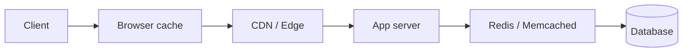

Your product page takes 80 ms from the database on a cold path. After lunch traffic, the same query runs thousands of times per minute with the same answer. **Caching** stores a copy of that answer in a faster or closer store so repeated requests skip recomputation and the primary source — cutting latency and shielding the database.

## Intuition

Think of a sticky note on your monitor: the full spreadsheet lives in a shared drive (slow, authoritative); the sticky note holds the one number you keep looking up. The note is wrong the moment the spreadsheet changes — but until then it saves a trip. Every cache is that sticky note: a trade of freshness for speed.

Caches sit at many layers. The browser remembers static assets. A CDN serves them from a city near the user. Your FastAPI process may keep a tiny in-memory dict. Redis holds a shared hot set across app replicas. The database itself has a buffer pool. Choosing *where* to cache is about who pays for a miss and how wrong a stale value is allowed to be.

:::key
Cache the expensive, read-heavy, slowly changing path — not every byte that moves through your API.
:::

## How it works

**Definition.** A cache is a store optimized for fast reads of recently or frequently used data, with a policy for what lives there and when it dies (TTL, eviction, invalidation).

**Request path.** A typical read looks like: check cache → on hit, return; on miss, load from source of truth → write into cache → return. Writes to the source of truth create a consistency problem (covered in later lessons): you must invalidate, overwrite, or accept TTL-bounded staleness.



**Layers and when to use them.**

| Layer | Where | Typical use |
| --- | --- | --- |
| Browser | Client | Static assets, `Cache-Control` |
| CDN / Edge | Edge POPs | Images, JS/CSS, some GET APIs |
| Application | In-process | Hot computed results, per-pod |
| Distributed cache | Redis, Memcached | Shared cache across replicas |
| DB layer | Buffer pool, query cache | Engine’s own optimization |

**What to cache.** Good candidates: product catalogs, config, rendered fragments, session lookups, expensive aggregations. Avoid or use very short TTL for balances, inventory that must be exact, personalized sensitive payloads, and anything that changes every write.

## In code

A FastAPI “cache-aside” pattern with a Redis-style client. On miss, load from Postgres-shaped SQL and populate the cache.

```python
import json
from fastapi import FastAPI, HTTPException
import redis
import asyncpg

app = FastAPI()
r = redis.Redis(host="localhost", port=6379, decode_responses=True)
# pool = await asyncpg.create_pool(...)  # created at startup


async def fetch_product_from_db(product_id: int) -> dict | None:
    row = await app.state.pool.fetchrow(
        "SELECT id, name, price_cents FROM products WHERE id = $1",
        product_id,
    )
    if not row:
        return None
    return {"id": row["id"], "name": row["name"], "price_cents": row["price_cents"]}


@app.get("/products/{product_id}")
async def get_product(product_id: int):
    key = f"product:{product_id}"
    cached = r.get(key)
    if cached:
        return {"source": "cache", **json.loads(cached)}

    product = await fetch_product_from_db(product_id)
    if product is None:
        raise HTTPException(404, "not found")

    r.setex(key, 60, json.dumps(product))  # TTL 60s
    return {"source": "db", **product}
```

Flow: Redis first, DB second, then `SETEX` so the next N requests are cheap. The TTL is your safety net if invalidation is forgotten.

## What goes wrong

- **Caching the wrong thing** — write-heavy or must-be-exact data looks fast until users see wrong balances or sold-out items.
- **Missing key dimensions** — keying only by `product_id` when price depends on region/currency serves the wrong payload.
- **Unbounded local caches** — in-process dicts grow until the pod OOMs; prefer Redis with maxmemory policies for shared state.
- **Stampede on miss** — popular key expires and every replica hits the DB at once (see later lessons).
- **Treating cache as source of truth** — if Redis dies and you have no DB path, the feature is down.

:::tip
Measure hit rate and p99 latency before and after a cache. A cache that is rarely hit is complexity without payoff.
:::

## One-line summary

Caching keeps a fast copy near the reader; place it where misses are expensive and staleness is acceptable.

## Key terms

- **Cache** — fast store of copies of data from a slower source of truth
- **Cache hit / miss** — data found in cache vs must be loaded from source
- **TTL** — time-to-live; automatic expiry of a cache entry
- **Cache-aside** — app reads cache first, loads source on miss, then fills cache
- **CDN / edge** — geographically distributed caches close to users
- **Distributed cache** — shared cache (e.g. Redis) used by many app instances
