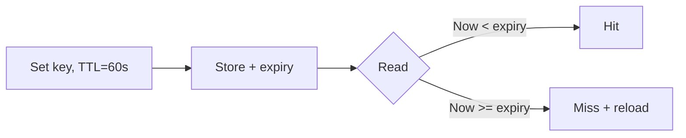

Caches are not infinite. Memory fills, data ages, and something must leave. **Eviction** is the policy that chooses what dies — after a timer (**TTL**), because it is cold (**LRU**), rarely used (**LFU**), or simply oldest (**FIFO**). Pick poorly and you thrash: constantly reloading the hot set while keeping junk forever.

## Intuition

A fridge with a sticky note for “milk expires Friday” is TTL: time decides. A tiny desk where you shove the least-touched paper into the bin when space runs out is LRU: access order decides. Production caches usually combine both — Redis entries expire, and under `maxmemory` the server also drops keys by an eviction policy.

:::key
TTL limits how wrong you can be; LRU/LFU limits how much memory you burn keeping cold data.
:::

## How it works

**TTL (time-to-live).** When you set a key, you attach an expiry. After that wall-clock time, reads miss and you reload. Simple mental model; staleness is bounded by TTL. Bad if TTL is huge for mutable data, or tiny for expensive stable data (constant recompute).



**LRU (least recently used).** Maintain an order of last access. On insert when full, drop the tail (coldest). Hot keys stay. Cost: tracking access (Redis approximates with sampling for efficiency).

**LFU / FIFO / random.** LFU keeps popular keys even if not touched recently. FIFO drops oldest insert regardless of hits — simple, often worse. Random is cheap and surprisingly okay as a baseline under pressure.

| Strategy | When evict | Best for |
| --- | --- | --- |
| TTL | Clock hits expiry | Bounded staleness |
| LRU | Full; drop least recent | Hot working set |
| LFU | Full; drop least frequent | Long-lived popularity skew |
| FIFO | Full; drop oldest insert | Simplicity only |

**Combining.** Typical pattern: `SET key value EX 300` plus Redis `maxmemory-policy allkeys-lru`. TTL cleans stale; LRU protects RAM when many keys share a long TTL.

## In code

Simulate TTL + LRU in Python, then show the Redis equivalents you would use from FastAPI.

```python
import time
from collections import OrderedDict


class TtlLruCache:
    """Tiny teaching cache: TTL expiry + LRU when over capacity."""

    def __init__(self, capacity: int):
        self.capacity = capacity
        self._data: OrderedDict[str, tuple[object, float | None]] = OrderedDict()

    def set(self, key: str, value: object, ttl_seconds: float | None = None) -> None:
        expires = None if ttl_seconds is None else time.time() + ttl_seconds
        if key in self._data:
            self._data.move_to_end(key)
        self._data[key] = (value, expires)
        self._data.move_to_end(key)
        while len(self._data) > self.capacity:
            self._data.popitem(last=False)  # LRU: oldest access

    def get(self, key: str):
        item = self._data.get(key)
        if item is None:
            return None
        value, expires = item
        if expires is not None and time.time() >= expires:
            del self._data[key]
            return None
        self._data.move_to_end(key)  # mark recently used
        return value


cache = TtlLruCache(capacity=2)
cache.set("a", 1, ttl_seconds=60)
cache.set("b", 2, ttl_seconds=60)
cache.get("a")           # a becomes most recent
cache.set("c", 3)        # evicts b (LRU)
assert cache.get("b") is None
```

Redis-style from an API handler:

```python
import redis
r = redis.Redis(decode_responses=True)

def cache_user_profile(user_id: int, profile: dict) -> None:
    # TTL for freshness; server maxmemory-policy handles LRU under pressure
    r.setex(f"user:{user_id}:profile", 300, json.dumps(profile))

# redis.conf / CONFIG SET maxmemory-policy allkeys-lru
```

## What goes wrong

- **TTL-only, huge memory** — keys never evicted early; RAM climbs until OOM if TTLs are long and cardinality is high.
- **LRU-only, no TTL** — deleted-in-DB entities linger in cache forever until capacity pressure.
- **Wrong policy for workload** — scanning/analytics keys can push hot user keys out of LRU; use key prefixes and separate caches when needed.
- **Thundering herd on synchronized TTL** — many keys set at the same second expire together; add jitter to TTLs.
- **Assuming Redis LRU is exact** — Redis uses approximated LRU; fine in practice, not a perfect textbook list.

:::tip
Add ±10–20% random jitter to TTLs for hot keys so expiry is staggered across the fleet.
:::

## One-line summary

Use TTL to bound staleness and LRU/LFU to bound memory — most systems need both.

## Key terms

- **Eviction** — removing entries to free space or enforce freshness
- **TTL** — time-to-live; automatic expiry after a duration
- **LRU** — least recently used eviction policy
- **LFU** — least frequently used eviction policy
- **maxmemory-policy** — Redis setting for what to drop when RAM is full
- **TTL jitter** — randomizing expiry to avoid synchronized stampedes
