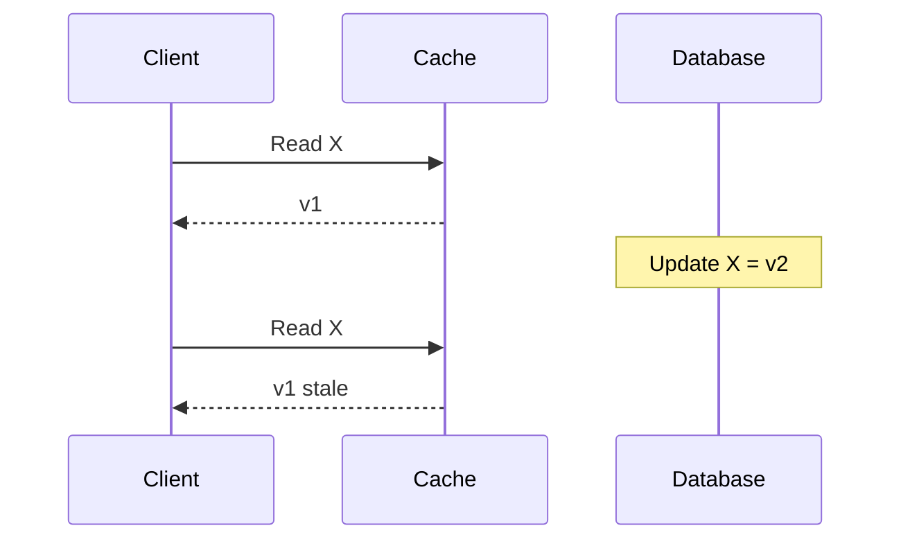

The database says the price is `$19`. Redis still says `$29`. The user sees `$29`. **Cache consistency** is the struggle to keep the cache and the source of truth aligned — or to bound how long they disagree. Stale cache is not a theoretical edge case; it is the default once you put a second store in the path.

## Intuition

Two notebooks: the ledger (DB) and the whiteboard (cache). Every write updates the ledger. If nobody erases the whiteboard, readers trust the wrong number. Patterns differ mainly in *when* you update or erase the whiteboard relative to the ledger write — and what you do if one of those steps fails.

:::key
You almost never get perfect cache–DB consistency for free; you choose a staleness budget and a write path that respects it.
:::

## How it works

**Why staleness happens.** A read fills the cache with `v1`. Another path updates the DB to `v2` without touching the cache. Until TTL or invalidation, hits return `v1`.



**Common strategies.**

| Pattern | Behavior | Trade-off |
| --- | --- | --- |
| TTL only | Stale up to TTL | Simple; may be wrong for TTL window |
| Invalidate on write | Delete key after DB write | Next read refills; race if order wrong |
| Write-through | Write DB and cache together | More write latency; cache stays warmer |
| Write-behind | Write cache, flush DB async | Fast writes; durability risk |

**Invalidate-on-write (cache-aside companion).** After a successful DB update, `DELETE` the cache key. Next read misses and loads fresh data. Preferred for many APIs because the DB remains source of truth and the cache stays optional.

**Ordering races.** If you update cache *before* DB commit, a concurrent reader can refill from old DB and re-poison the cache. Safer common order: commit DB, then delete cache key (accept a tiny window of stale hits), or use versioned keys (`product:42:v7`).

**Read-your-writes.** After a user updates their profile, they expect to see the new name immediately. Options: invalidate their key, write-through their key, or bypass cache for that user’s next read.

## In code

FastAPI update with SQL commit then Redis invalidation; read path is cache-aside.

```python
import json
from fastapi import FastAPI
import redis

app = FastAPI()
r = redis.Redis(decode_responses=True)


@app.put("/products/{product_id}")
async def update_product(product_id: int, name: str, price_cents: int):
    async with app.state.pool.acquire() as conn:
        async with conn.transaction():
            await conn.execute(
                """
                UPDATE products
                SET name = $2, price_cents = $3
                WHERE id = $1
                """,
                product_id, name, price_cents,
            )
    # After commit: drop stale copy. Prefer delete over silent overwrite races.
    r.delete(f"product:{product_id}")
    return {"id": product_id, "name": name, "price_cents": price_cents}


@app.get("/products/{product_id}")
async def get_product(product_id: int):
    key = f"product:{product_id}"
    if raw := r.get(key):
        return json.loads(raw)
    row = await app.state.pool.fetchrow(
        "SELECT id, name, price_cents FROM products WHERE id = $1", product_id
    )
    data = dict(row)
    r.setex(key, 120, json.dumps(data))
    return data
```

Write-through variant (set cache after commit with same payload):

```python
payload = {"id": product_id, "name": name, "price_cents": price_cents}
r.setex(f"product:{product_id}", 120, json.dumps(payload))
```

## What goes wrong

- **Forgot invalidation path** — admin tools, batch SQL, or a second service update the DB and leave Redis stale until TTL.
- **Delete-then-write race** — invalidate, another request refills from DB before your write commits, then you commit — cache holds old data with a fresh TTL.
- **Partial multi-key updates** — product and inventory keys; you invalidate one and not the other.
- **Write-behind loss** — process dies before flush; cache said success, DB never saw it.
- **Cross-region lag** — local cache invalidated, remote replica still serving old DB row into its cache.

:::warn
For money and inventory, prefer short TTL, strong invalidation, or skip caching on the critical read after a write.
:::

## One-line summary

Keep the DB authoritative; invalidate or refresh the cache on write, and treat TTL as a backstop — not the only plan.

## Key terms

- **Stale cache** — cache value that no longer matches the source of truth
- **Invalidation** — deleting or marking a cache entry so the next read reloads
- **Cache-aside** — app manages reads/writes to cache around the DB
- **Write-through** — updates go to cache and DB in the write path
- **Write-behind** — cache accepts write; DB updated asynchronously
- **Read-your-writes** — a client sees its own updates without waiting for TTL
