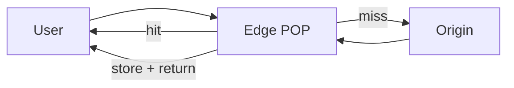

A user in Singapore should not download your logo from a single origin in Virginia on every page load. A **CDN (Content Delivery Network)** places copies of content at **edge** points of presence (POPs) near users. Hits never touch your origin; misses fetch once, store, and serve locally. Latency drops, origin load drops, and big static assets stop melting your app tier.

## Intuition

Think of airport bookstores versus one warehouse. The warehouse is origin — complete and authoritative. Airport stores stock bestsellers. Most travelers grab a local copy; restock happens when a title sells out. Edge caches are those airport stores for bytes: HTML, JS, images, and sometimes cacheable API GETs.

:::key
Put immutable or slowly changing content at the edge; keep personalized or security-sensitive responses on origin (or cache carefully with vary keys).
:::

## How it works

**Path.** DNS (or anycast) sends the client to a nearby POP. On hit, the edge returns bytes. On miss, the edge requests origin, stores according to headers, and responds.



**What belongs at the edge.**

| Content | Typical policy |
| --- | --- |
| JS, CSS, images, fonts | Long TTL + fingerprint in filename (`app.a1b2c3.js`) |
| Public marketing pages | Medium TTL, purge on publish |
| Cacheable GET APIs | Short `s-maxage`, careful `Vary` |
| Authenticated private data | Usually `private, no-store` — skip shared edge |

**Cache-Control.** Origin (or your FastAPI app) sets headers the CDN honors:

- `public, max-age=3600` — browsers may cache ~1 hour
- `s-maxage=86400` — shared caches/CDNs may keep longer than browsers
- `private` — only the end-user browser, not CDN
- `no-store` — do not cache
- `stale-while-revalidate` — serve stale briefly while refreshing

**Invalidation / purge.** When you ship a blog edit without content-hashed URLs, purge the path (or use surrogate keys). Fingerprinted static assets avoid purges: new deploy = new URL = cache naturally cold.

**API caching caveats.** Only cache GETs that are identical for all users (or vary correctly on headers like `Accept-Language`). Never put `Authorization` responses in a shared edge cache unless you know the CDN keys include auth and your threat model allows it.

## In code

Emit CDN-friendly headers from FastAPI for public assets and a cacheable public catalog GET.

```python
from fastapi import FastAPI
from fastapi.responses import JSONResponse, FileResponse

app = FastAPI()


@app.get("/static/app.js")
async def app_js():
    # Fingerprinted filename in real apps; long immutable cache
    return FileResponse(
        "static/app.a1b2c3.js",
        headers={
            "Cache-Control": "public, max-age=31536000, immutable",
        },
    )


@app.get("/api/public/catalog")
async def public_catalog():
    items = [{"sku": "tee-1", "name": "Tee", "price_cents": 2000}]
    return JSONResponse(
        content=items,
        headers={
            # Browsers: 60s; CDN shared cache: 10 minutes
            "Cache-Control": "public, max-age=60, s-maxage=600",
            "Vary": "Accept-Encoding",
        },
    )


@app.get("/api/me")
async def me():
    return JSONResponse(
        content={"email": "user@example.com"},
        headers={"Cache-Control": "private, no-store"},
    )
```

Purge is usually a CDN API call (pseudocode):

```python
def purge_catalog(cdn_client):
    cdn_client.purge_paths(["/api/public/catalog"])
```

## What goes wrong

- **Caching personalized pages as `public`** — User A sees User B’s account snippet. Always mark private responses `private` or `no-store`.
- **Long TTL without fingerprinting** — Users stuck on old JS after deploy; “hard refresh” support tickets.
- **Ignoring `Vary`** — Compressed vs uncompressed, or language variants, collide in one cache entry.
- **Purging everything on every deploy** — Origin thunders; prefer hashed assets.
- **Caching error pages** — A 500 from origin gets stuck at the edge; set short TTL on errors or bypass cache for 5xx.

:::tip
For SPAs: long-cache fingerprinted bundles; `index.html` short TTL or always revalidate so users pick up new bundle names.
:::

## One-line summary

CDNs cache bytes near users — use Cache-Control, fingerprinting, and careful rules so the edge speeds you up without serving the wrong person the wrong content.

## Key terms

- **CDN** — network of edge servers caching content near users
- **Edge / POP** — point of presence that terminates nearby client requests
- **Origin** — your source servers the CDN fetches from on miss
- **Cache-Control** — HTTP header directing browser and shared-cache behavior
- **s-maxage** — max age specifically for shared caches (CDNs)
- **Purge / invalidation** — explicitly removing edge entries before TTL
