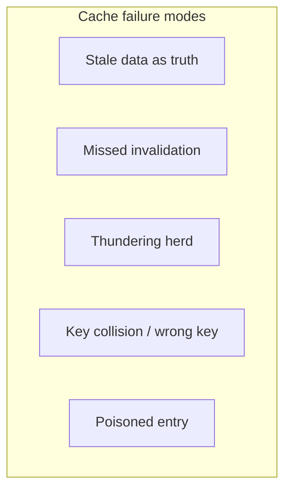

Caching is a performance win that quietly changes correctness. The database can be right, the code can be right, and users still see wrong balances, ghost inventory, or another user’s cart — because a **cache lied**. Understanding failure modes is how you keep the speed without shipping “works on my machine” consistency bugs.

## Intuition

A cache is an optimized rumor. Most of the time the rumor matches reality. Under retries, partial invalidation, bad keys, or expiry stampedes, the rumor diverges — and your API will confidently return it. Systems go “wrong” not because Redis is evil, but because you treated a hint as truth.

:::key
Never cache what must be exact unless you also design the read-after-write and failure paths for that exactness.
:::

## How it works

**Main failure modes.**



1. **Stale as truth** — Balance updated to 100; cache serves 50; UI allows a purchase that should fail.
2. **Missed invalidation** — Batch job updates SQL; app only invalidates on the FastAPI write path; cache stays wrong until TTL.
3. **Thundering herd** — Hot key expires; 2,000 pods miss together; DB CPU spikes; cascading timeouts.
4. **Wrong key** — Key is `cart` instead of `cart:{user_id}`; cross-user data leak.
5. **Poisoned cache** — A bug writes `null` or an error payload into Redis with a long TTL; every hit is broken until purge.

**Mitigations that actually work.**

- Correct, complete keys (tenant, user, locale, version).
- Invalidate on every write path (including admin/jobs) or use short TTL + versions.
- Single-flight / request coalescing on miss for hot keys.
- Do not cache post-mutation critical reads (or bypass cache for that user briefly).
- Soft TTL + background refresh; serve stale only when safe.
- Monitor hit rate, stale-error reports, and purge tooling.

## In code

Dangerous vs safer patterns in FastAPI + Redis: keying, single-flight lock, and refusing to cache balances for checkout.

```python
import json
import time
import redis
from fastapi import FastAPI, HTTPException

app = FastAPI()
r = redis.Redis(decode_responses=True)


def cache_key(user_id: int, name: str) -> str:
    # Always include user (and tenant if multi-tenant)
    return f"u:{user_id}:{name}"


# --- Wrong: shared key -> data leak ---
# r.set("cart", json.dumps(cart))

# --- Right: per-user key ---
def save_cart(user_id: int, cart: dict) -> None:
    r.setex(cache_key(user_id, "cart"), 600, json.dumps(cart))


def get_product_singleflight(product_id: int, load_fn):
    """Coalesce stampedes: one loader, others wait briefly."""
    key = f"product:{product_id}"
    if cached := r.get(key):
        return json.loads(cached)

    lock = f"lock:product:{product_id}"
    got_lock = r.set(lock, "1", nx=True, ex=5)
    if got_lock:
        try:
            data = load_fn(product_id)
            r.setex(key, 60 + (product_id % 15), json.dumps(data))  # TTL jitter
            return data
        finally:
            r.delete(lock)
    # Someone else is loading — brief wait then re-read
    time.sleep(0.05)
    if cached := r.get(key):
        return json.loads(cached)
    return load_fn(product_id)  # fallback


@app.get("/checkout/balance/{user_id}")
async def checkout_balance(user_id: int):
    # Critical path: hit source of truth, skip cache
    row = await app.state.pool.fetchrow(
        "SELECT balance_cents FROM accounts WHERE user_id = $1 FOR SHARE",
        user_id,
    )
    if not row:
        raise HTTPException(404)
    return {"balance_cents": row["balance_cents"], "source": "db"}
```

## What goes wrong

- **Caching authorization decisions** too long — revoked users keep access until TTL.
- **Negative caching without care** — caching 404 for a product that is then created; still 404.
- **Multi-layer disagreement** — CDN has v1, Redis has v2, DB has v3; debugging becomes archaeology.
- **Silent fallback** — cache down -> every request hits DB -> outage that looks like a DB incident.
- **Security via obscurity of keys** — predictable keys plus open Redis = data breach.

:::warn
A cache bug can look like a Heisenbug: only some pods, only some users, only until TTL. Always log `source=cache|db` in suspicious paths while debugging.
:::

## One-line summary

Caches trade freshness for speed — design keys, invalidation, and critical paths so speed never silently becomes wrong answers.

## Key terms

- **Stale read** — serving outdated cached data as if current
- **Thundering herd / stampede** — many clients missing the same key at once
- **Single-flight** — only one miss loader runs; others wait for the result
- **Cache poisoning** — storing bad values that subsequent hits reuse
- **Key collision** — distinct data mapped to the same cache key
- **TTL jitter** — varying expiry to desynchronize stampedes
