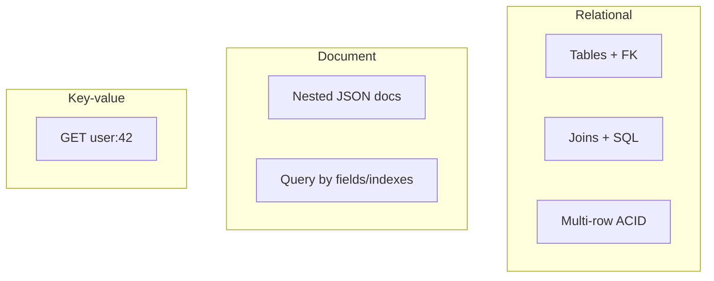

Your first feature is a user table with orders and payments. Someone says “just use Mongo, schema-less is faster to ship.” Six months later you need multi-row money transfers and reporting joins — and you reinvent transactions in application code. **SQL vs NoSQL** is not fashion; it is about data shape, consistency, and the queries you will actually run.

## Intuition

**SQL / relational** databases (PostgreSQL, MySQL, SQLite) store rows in tables with schemas, foreign keys, and a powerful query language. They shine when relationships are real, constraints matter, and you want ACID transactions across multiple rows.

**NoSQL** is a marketing umbrella:

- **Document** (MongoDB) — JSON-like documents, flexible fields
- **Key-value** (Redis, DynamoDB style) — get/set by key, extreme speed
- **Wide-column** (Cassandra) — write-heavy, partition-oriented
- **Graph** (Neo4j) — relationships as first-class edges

Pick the model that matches access patterns. Many production systems are **polyglot**: Postgres for core business data, Redis for cache/sessions, a search index for text.

## How it works



| Question | Lean SQL | Lean NoSQL |
| --- | --- | --- |
| Need joins & constraints? | Yes | Rarely |
| Multi-document money move? | Transactions | Harder / limited |
| Schema changes weekly? | Migrations | Flexible docs help |
| Huge write scale, simple keys? | Possible but heavier | Often easier |
| Ad-hoc analytics? | SQL excels | Export/ETL often |

Document DBs are not “schemaless” in practice — your app still assumes fields exist. The difference is **when** the schema is enforced (DB vs application).

## In code

Same “user + orders” idea in SQLite (SQL) and a document-shaped JSON store, plus a FastAPI sketch that might use either.

```python
import json
import sqlite3
from pathlib import Path
from fastapi import FastAPI, HTTPException
from pydantic import BaseModel, EmailStr

app = FastAPI()

# --- SQL: normalized tables ---
def sql_db():
    c = sqlite3.connect("shop.db")
    c.row_factory = sqlite3.Row
    c.execute("PRAGMA foreign_keys=ON")
    return c

def init_sql():
    with sql_db() as db:
        db.executescript(
            """
            CREATE TABLE IF NOT EXISTS users (
              id INTEGER PRIMARY KEY, email TEXT UNIQUE NOT NULL);
            CREATE TABLE IF NOT EXISTS orders (
              id INTEGER PRIMARY KEY,
              user_id INTEGER NOT NULL REFERENCES users(id),
              total_cents INTEGER NOT NULL);
            """
        )

class OrderIn(BaseModel):
    email: EmailStr
    total_cents: int

@app.post("/sql/orders")
def create_order_sql(body: OrderIn):
    with sql_db() as db:
        u = db.execute("SELECT id FROM users WHERE email=?", (body.email,)).fetchone()
        if not u:
            cur = db.execute("INSERT INTO users (email) VALUES (?)", (body.email,))
            user_id = cur.lastrowid
        else:
            user_id = u["id"]
        cur = db.execute(
            "INSERT INTO orders (user_id, total_cents) VALUES (?, ?)",
            (user_id, body.total_cents),
        )
        db.commit()
        order_id = cur.lastrowid
        # Relational power: join
        row = db.execute(
            "SELECT o.id, u.email, o.total_cents FROM orders o "
            "JOIN users u ON u.id=o.user_id WHERE o.id=?",
            (order_id,),
        ).fetchone()
    return dict(row)

# --- Document-style: one JSON file per user (Mongo intuition) ---
DOC_DIR = Path("docs")
DOC_DIR.mkdir(exist_ok=True)

@app.post("/doc/orders")
def create_order_doc(body: OrderIn):
    path = DOC_DIR / f"{body.email}.json"
    if path.exists():
        doc = json.loads(path.read_text())
    else:
        doc = {"email": body.email, "orders": []}
    order = {"id": len(doc["orders"]) + 1, "total_cents": body.total_cents}
    doc["orders"].append(order)
    path.write_text(json.dumps(doc, indent=2))
    return doc

@app.get("/doc/users/{email}")
def get_user_doc(email: str):
    path = DOC_DIR / f"{email}.json"
    if not path.exists():
        raise HTTPException(404)
    return json.loads(path.read_text())
```

The document version embeds orders — great for “load whole user profile,” awkward for “sum all orders last week across users” without a secondary index or scan. SQL makes that `SUM` trivial.

## What goes wrong

- **NoSQL for ledger money** without careful transaction design — lost updates and partial writes.
- **SQL as a document dump** — stuffing unvalidated JSON blobs everywhere loses relational benefits.
- **Ignoring access patterns** — choosing Mongo then joining in the app across twenty collections.
- **Assuming NoSQL means no schema work** — broken producers still ship missing fields.
- **One database ideology** — refusing Redis cache or Postgres when the problem needs both.

## One-line summary

Use SQL when relationships, constraints, and multi-row transactions dominate; use a specific NoSQL type when its access pattern (documents, keys, graph) clearly fits — polyglot is normal.

## Key terms

- **Relational / SQL:** tables, schemas, joins, declarative queries.
- **Document store:** JSON-like documents, often nested.
- **Key-value store:** primary access by key.
- **Schema:** agreed structure of data (enforced by DB or app).
- **Polyglot persistence:** multiple storage technologies in one system.
- **Access pattern:** how you read/write data in real features.
- **Migration:** versioned change to a relational schema.
