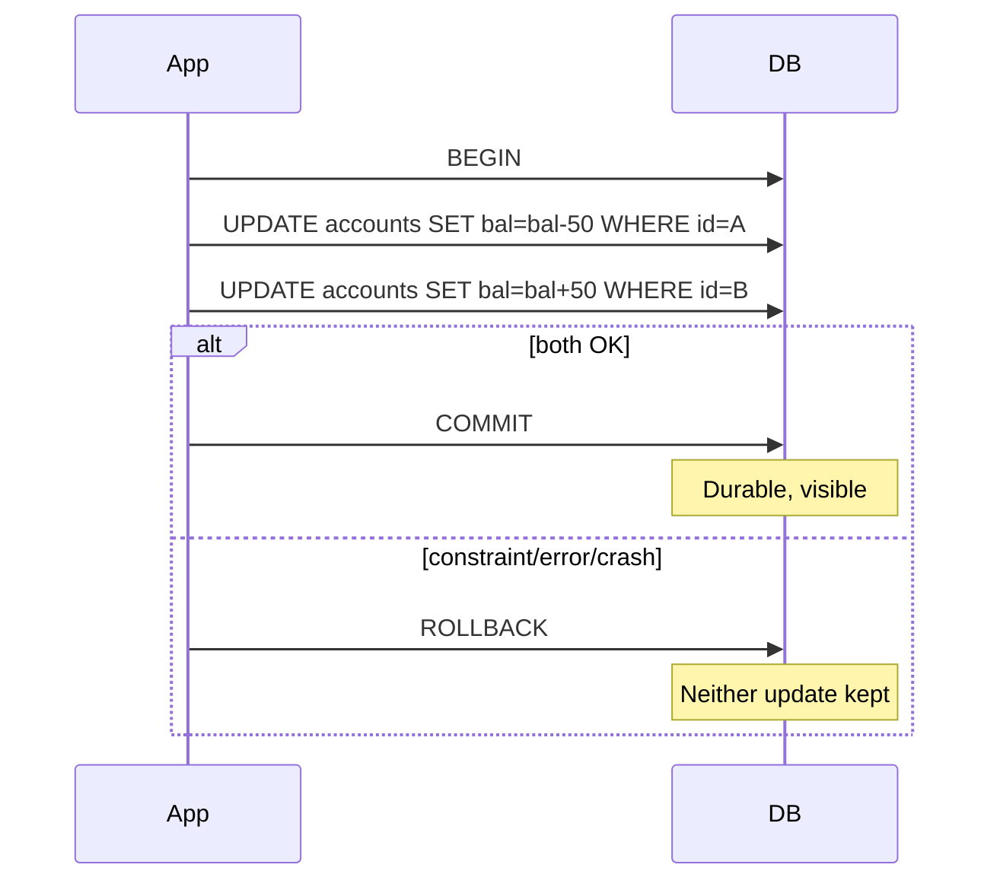

You transfer $50 from account A to B: debit A, credit B. The server crashes after the debit. Without transactions, money vanished. **ACID** is the contract relational databases give you so multi-step updates become one all-or-nothing unit — the foundation of ledgers, inventory, and booking systems.

## Intuition

**ACID** expands to:

- **Atomicity** — all statements in a transaction commit, or none do (rollback).
- **Consistency** — committed data obeys constraints (FK, UNIQUE, CHECK); the DB won’t accept a half-valid state.
- **Isolation** — concurrent transactions do not see each other’s dirty intermediate states (to a level you configure).
- **Durability** — after commit, data survives power loss (WAL/fsync).

Think of a transaction as a shopping basket: either you pay for everything or you put it all back. Partial checkout is the bug.

## How it works



In Postgres/SQLite, a transaction groups statements. Autocommit mode (one statement = one transaction) is not enough for multi-step business rules. Isolation levels (next lesson) tune how strict concurrent visibility is; atomicity/durability still apply on commit.

Consistency here means **database constraints**, not “your business always makes sense.” If you forget a CHECK, the DB won’t invent it.

## In code

Atomic transfer with FastAPI + SQLite; failure paths roll back.

```python
import sqlite3
from fastapi import FastAPI, HTTPException
from pydantic import BaseModel, Field

app = FastAPI()

def connect():
    c = sqlite3.connect("bank.db")
    c.row_factory = sqlite3.Row
    c.execute("PRAGMA foreign_keys=ON")
    # Durability: FULL is safer; NORMAL is faster (SQLite trade-off)
    c.execute("PRAGMA synchronous=FULL")
    return c

@app.on_event("startup")
def init():
    with connect() as db:
        db.executescript(
            """
            CREATE TABLE IF NOT EXISTS accounts (
              id INTEGER PRIMARY KEY,
              name TEXT NOT NULL,
              balance_cents INTEGER NOT NULL CHECK (balance_cents >= 0)
            );
            INSERT OR IGNORE INTO accounts (id, name, balance_cents) VALUES
              (1, 'Alice', 10000), (2, 'Bob', 10000);
            """
        )

class Transfer(BaseModel):
    from_id: int
    to_id: int
    amount_cents: int = Field(gt=0)

@app.post("/transfer")
def transfer(body: Transfer):
    if body.from_id == body.to_id:
        raise HTTPException(400, "Same account")
    db = connect()
    try:
        db.execute("BEGIN IMMEDIATE")  # acquire write lock early
        debited = db.execute(
            "UPDATE accounts SET balance_cents = balance_cents - ? "
            "WHERE id=? AND balance_cents >= ?",
            (body.amount_cents, body.from_id, body.amount_cents),
        )
        if debited.rowcount != 1:
            raise HTTPException(400, "Insufficient funds or missing account")
        credited = db.execute(
            "UPDATE accounts SET balance_cents = balance_cents + ? WHERE id=?",
            (body.amount_cents, body.to_id),
        )
        if credited.rowcount != 1:
            raise HTTPException(404, "Destination missing")
        db.commit()  # durability point
    except HTTPException:
        db.rollback()
        raise
    except Exception:
        db.rollback()
        raise
    finally:
        db.close()

    with connect() as db:
        rows = db.execute(
            "SELECT id, balance_cents FROM accounts WHERE id IN (?, ?)",
            (body.from_id, body.to_id),
        ).fetchall()
    return {"balances": {r["id"]: r["balance_cents"] for r in rows}}
```

The `CHECK (balance_cents >= 0)` is **Consistency**. `BEGIN`/`COMMIT`/`ROLLBACK` are **Atomicity**. Surviving after `commit()` is **Durability**. Concurrent transfers need isolation (locking or snapshot) so two debits cannot both succeed on the same $50.

ACID is per database (or tightly coupled cluster). A FastAPI handler that writes Postgres **and** sends Stripe **and** publishes Kafka is **not** one ACID transaction across all three. Use an outbox table in the same DB transaction, then a worker for side effects — or accept compensating actions when a later step fails. Do not confuse “I called `commit()`” with “the whole business process is atomic.”

## What goes wrong

- **Multiple statements without a transaction** — crash leaves partial updates.
- **Catching errors but still committing** — empty `except: pass` is an atomicity killer.
- **Assuming autocommit is enough** for multi-step workflows.
- **Turning off fsync for speed** — gains throughput, risks lost “committed” data on power failure.
- **Business rules only in app memory** — race conditions bypass checks the DB never saw.

## One-line summary

ACID transactions make multi-step database changes atomic, constraint-safe, isolated from peers, and durable after commit — essential for money and inventory.

## Key terms

- **ACID:** Atomicity, Consistency, Isolation, Durability.
- **Transaction:** unit of work ended by COMMIT or ROLLBACK.
- **Commit:** make transaction changes permanent and visible.
- **Rollback:** undo uncommitted changes.
- **Constraint:** DB rule (PK, FK, UNIQUE, CHECK).
- **WAL:** write-ahead log used for durability/recovery.
- **Autocommit:** each statement is its own transaction.
