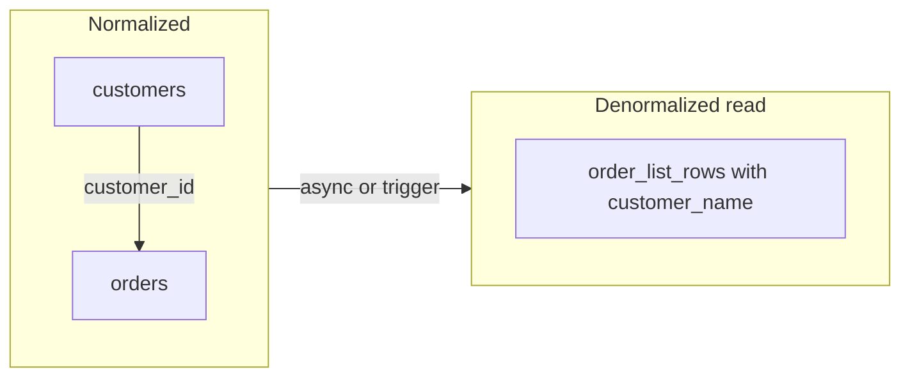

You store `customer_name` on every order row so the orders list is one query. Marketing renames a company; half the historical orders still show the old name. That is the **denormalization** tax. Normalize to avoid update anomalies; denormalize on purpose when read models need speed — and plan how stale copies catch up.

## Intuition

**Normalization** structures relational data so each fact lives in one place. Classic aims (1NF/2NF/3NF): no repeating groups, attributes depend on the whole key, no transitive dependencies. Result: smaller writes, consistent updates, more joins on read.

**Denormalization** intentionally duplicates or pre-joins data to make hot reads cheap: store `customer_email` on `orders`, maintain a `user_stats` table, build a JSON document for a feed. Result: faster reads, careful invalidation on writes.

Neither is virtue. OLTP systems often keep a normalized **source of truth** and denormalized **read models** (CQRS-lite).

## How it works



| Approach | Wins | Costs |
| --- | --- | --- |
| Normalized | Single update, integrity | Joins, more queries |
| Denormalized | Fast reads, simple queries | Duplicate updates, drift |
| Hybrid | Best of both | Sync pipeline complexity |

3NF is a good default for transactional schemas. Warehouse star schemas are deliberately denormalized for analytics. Document DBs often embed child arrays — denormalization by culture.

## In code

Normalized schema + a denormalized listing table updated in the same transaction (simple sync).

```python
import sqlite3
from fastapi import FastAPI, HTTPException
from pydantic import BaseModel, EmailStr

app = FastAPI()

def db():
    c = sqlite3.connect("shop.db")
    c.row_factory = sqlite3.Row
    c.execute("PRAGMA foreign_keys=ON")
    return c

@app.on_event("startup")
def init():
    with db() as conn:
        conn.executescript(
            """
            CREATE TABLE IF NOT EXISTS customers (
              id INTEGER PRIMARY KEY,
              email TEXT UNIQUE NOT NULL,
              name TEXT NOT NULL
            );
            CREATE TABLE IF NOT EXISTS orders (
              id INTEGER PRIMARY KEY,
              customer_id INTEGER NOT NULL REFERENCES customers(id),
              total_cents INTEGER NOT NULL
            );
            -- Denormalized projection for fast admin list
            CREATE TABLE IF NOT EXISTS order_list (
              order_id INTEGER PRIMARY KEY,
              customer_name TEXT NOT NULL,
              customer_email TEXT NOT NULL,
              total_cents INTEGER NOT NULL
            );
            """
        )

class CustomerIn(BaseModel):
    email: EmailStr
    name: str

class OrderIn(BaseModel):
    customer_id: int
    total_cents: int

@app.post("/customers", status_code=201)
def create_customer(body: CustomerIn):
    with db() as conn:
        cur = conn.execute(
            "INSERT INTO customers (email, name) VALUES (?, ?)",
            (body.email, body.name),
        )
        conn.commit()
        return {"id": cur.lastrowid}

@app.post("/orders", status_code=201)
def create_order(body: OrderIn):
    with db() as conn:
        conn.execute("BEGIN")
        cust = conn.execute(
            "SELECT name, email FROM customers WHERE id=?", (body.customer_id,)
        ).fetchone()
        if not cust:
            conn.execute("ROLLBACK")
            raise HTTPException(404, "Customer not found")
        cur = conn.execute(
            "INSERT INTO orders (customer_id, total_cents) VALUES (?, ?)",
            (body.customer_id, body.total_cents),
        )
        order_id = cur.lastrowid
        # Keep denormalized copy in sync in the same transaction
        conn.execute(
            "INSERT INTO order_list (order_id, customer_name, customer_email, total_cents) "
            "VALUES (?, ?, ?, ?)",
            (order_id, cust["name"], cust["email"], body.total_cents),
        )
        conn.commit()
    return {"id": order_id}

@app.patch("/customers/{cid}")
def rename(cid: int, name: str):
    with db() as conn:
        conn.execute("BEGIN")
        conn.execute("UPDATE customers SET name=? WHERE id=?", (name, cid))
        # Must update copies or list drifts
        conn.execute(
            "UPDATE order_list SET customer_name=? WHERE customer_email=("
            "SELECT email FROM customers WHERE id=?)",
            (name, cid),
        )
        conn.commit()
    return {"ok": True}

@app.get("/order-list")
def order_list():
    """Denormalized fast path — no join."""
    with db() as conn:
        rows = conn.execute(
            "SELECT order_id, customer_name, total_cents FROM order_list "
            "ORDER BY order_id DESC LIMIT 50"
        ).fetchall()
    return [dict(r) for r in rows]

@app.get("/orders/{oid}/normalized")
def order_joined(oid: int):
    """Normalized source of truth via join."""
    with db() as conn:
        row = conn.execute(
            "SELECT o.id, o.total_cents, c.name, c.email "
            "FROM orders o JOIN customers c ON c.id=o.customer_id "
            "WHERE o.id=?",
            (oid,),
        ).fetchone()
    if not row:
        raise HTTPException(404)
    return dict(row)
```

If rename forgot to update `order_list`, the UI would lie. Denormalization without an update path is just a future bug.

## What goes wrong

- **Accidental denormalization** — copy-paste columns with no sync story.
- **Join fear** — premature denorm before measuring; modern DBs join small tables cheaply with indexes.
- **Huge embedded documents** — rewriting a 2MB doc to add one comment.
- **Analytics on 3NF OLTP** — heavy reports lock production; use replicas/warehouses.
- **Partial updates to copies** — some denormalized fields updated, others stale.

## One-line summary

Normalize so each fact has one home; denormalize deliberately for read performance and keep duplicates consistent via the same transaction, triggers, or async projections.

## Key terms

- **Normalization:** organizing tables to reduce redundancy and anomalies.
- **3NF:** third normal form — common target for OLTP schemas.
- **Denormalization:** intentional duplication for read speed.
- **Update anomaly:** changing a fact in one place but not all copies.
- **Read model / projection:** derived table optimized for queries.
- **CQRS:** separate write model from read models.
- **Join:** combining rows from related tables via keys.
