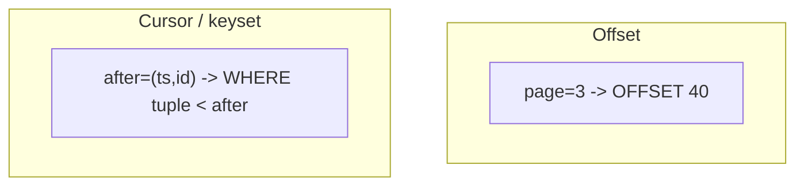

Page 1 of the feed looks fine. Page 50 is slow. Page 200 duplicates items because new rows were inserted while the user scrolled. **Offset pagination** is simple and breaks under deep pages and concurrent writes. **Cursor pagination** scales and stays stable — at the cost of “jump to page 17.”

## Intuition

**Offset/limit:** `LIMIT 20 OFFSET 2000` means “skip 2000 rows, then take 20.” Databases often still walk those 2000 rows. Also, if a new row inserts at the top, your offsets shift — users see duplicates or skips.

**Cursor (keyset):** remember the last item you saw (`created_at`, `id`) and ask for rows **after** that key: `WHERE (created_at, id) < (?, ?) ORDER BY ... LIMIT 20`. The database seeks the index; concurrent inserts above the cursor do not reshuffle what you already viewed.

Use offset for admin UIs with tiny tables and page numbers. Use cursors for infinite scroll, mobile feeds, and large datasets.

## How it works



Stable cursors need a **unique, total order** — usually `(created_at DESC, id DESC)` so ties on timestamps do not skip rows. Encode the cursor as opaque base64 for clients; do not let them invent SQL.

Return `next_cursor` only when a full page was returned. Optional `prev_cursor` is harder; many APIs only go forward.

## In code

FastAPI listing with both styles against SQLite.

```python
import base64
import json
import sqlite3
from fastapi import FastAPI, HTTPException, Query

app = FastAPI()

def db():
    c = sqlite3.connect("feed.db")
    c.row_factory = sqlite3.Row
    return c

@app.on_event("startup")
def init():
    with db() as conn:
        conn.executescript(
            """
            CREATE TABLE IF NOT EXISTS posts (
              id INTEGER PRIMARY KEY,
              created_at TEXT NOT NULL,
              body TEXT NOT NULL
            );
            CREATE INDEX IF NOT EXISTS idx_posts_created_id
              ON posts (created_at DESC, id DESC);
            """
        )

@app.get("/posts/offset")
def offset_page(page: int = Query(1, ge=1), page_size: int = Query(20, ge=1, le=100)):
    offset = (page - 1) * page_size
    with db() as conn:
        rows = conn.execute(
            "SELECT id, created_at, body FROM posts "
            "ORDER BY created_at DESC, id DESC LIMIT ? OFFSET ?",
            (page_size, offset),
        ).fetchall()
        total = conn.execute("SELECT COUNT(*) AS c FROM posts").fetchone()["c"]
    return {
        "items": [dict(r) for r in rows],
        "page": page,
        "page_size": page_size,
        "total": total,  # COUNT(*) gets expensive on huge tables
    }

def encode_cursor(created_at: str, id_: int) -> str:
    raw = json.dumps({"c": created_at, "i": id_}).encode()
    return base64.urlsafe_b64encode(raw).decode()

def decode_cursor(token: str) -> tuple[str, int]:
    try:
        data = json.loads(base64.urlsafe_b64decode(token.encode()))
        return data["c"], int(data["i"])
    except Exception:
        raise HTTPException(400, "Invalid cursor")

@app.get("/posts")
def cursor_page(
    limit: int = Query(20, ge=1, le=100),
    cursor: str | None = None,
):
    params: list = []
    where = ""
    if cursor:
        created_at, id_ = decode_cursor(cursor)
        # Keyset: rows strictly after the last seen in DESC order
        where = "WHERE (created_at, id) < (?, ?)"
        params.extend([created_at, id_])
    params.append(limit)
    sql = (
        f"SELECT id, created_at, body FROM posts {where} "
        "ORDER BY created_at DESC, id DESC LIMIT ?"
    )
    with db() as conn:
        rows = conn.execute(sql, params).fetchall()
    items = [dict(r) for r in rows]
    next_cursor = None
    if len(items) == limit:
        last = items[-1]
        next_cursor = encode_cursor(last["created_at"], last["id"])
    return {"items": items, "next_cursor": next_cursor}
```

For Postgres, the same keyset predicate applies. Avoid `OFFSET` beyond small admin pages; metrics will show latency climbing linearly with page number.

## What goes wrong

- **Deep OFFSET** — page 5000 becomes a full table walk.
- **Ordering by non-unique columns** — ties cause skipped/duplicated rows; always add `id`.
- **COUNT(*) on every request** — expensive; approximate or omit totals for feeds.
- **Letting clients send raw SQL offsets** without caps — easy DoS.
- **Changing sort order while cursors exist** — old cursors become nonsense; version them or document breakage.

## One-line summary

Offset pagination is simple but slow and unstable on large changing data; cursor/keyset pagination scales by seeking an indexed `(sort_key, id)` pair.

## Key terms

- **Offset pagination:** `LIMIT` + `OFFSET` / page numbers.
- **Cursor / keyset pagination:** continue from the last seen sort key.
- **Stable sort:** unique ordering guaranteeing deterministic pages.
- **Opaque cursor:** encoded token clients pass back unchanged.
- **Infinite scroll:** UI pattern that fits cursors naturally.
- **Seek:** index lookup vs scanning skipped rows.
