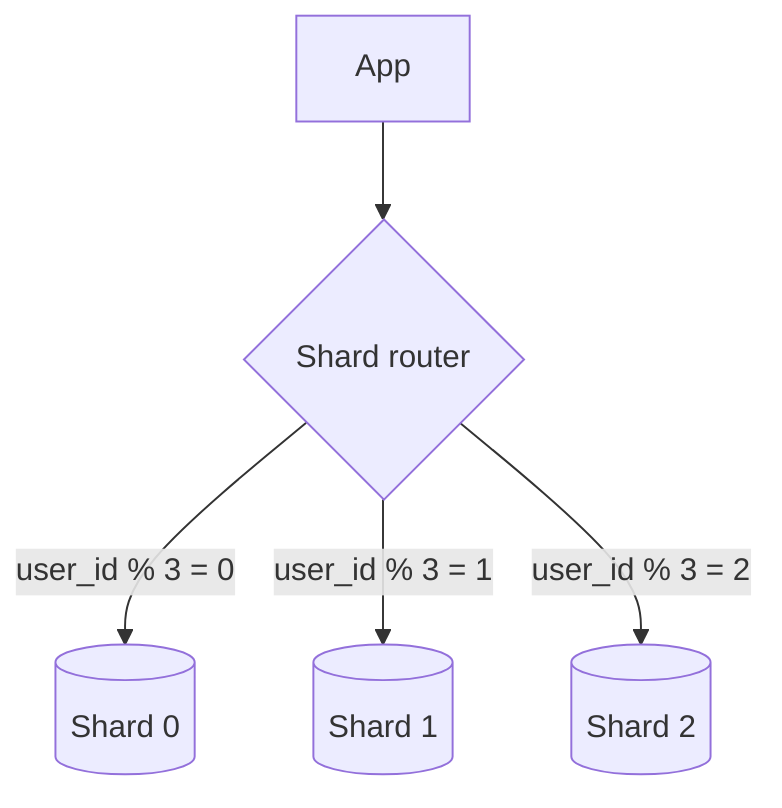

One Postgres primary with a multi-terabyte `events` table starts failing vacuums and backups. You split data by month or by `tenant_id` across nodes. **Partitioning** and **sharding** both mean “don’t put everything in one heap” — but one usually stays inside a single database engine, while the other spreads across servers and rewrites your application.

## Intuition

**Partitioning (e.g. Postgres declarative partitions):** one logical table, physically split (by range, list, or hash). The planner **prunes** partitions so a query for January does not read December. Great for time-series and retention (`DROP` old partition).

**Sharding:** split data across **separate databases/servers** by a shard key (`user_id % N`, tenant id). Each shard is its own primary. Cross-shard joins and transactions become application problems. Used when a single primary cannot hold write throughput or data size.

Related: **vertical split** (users DB vs billing DB by domain) vs **horizontal shard** (same schema, different key ranges).

## How it works



Partitioning example (conceptual SQL):

```sql
CREATE TABLE events (
  id BIGINT, tenant_id INT, created_at TIMESTAMPTZ, payload JSONB
) PARTITION BY RANGE (created_at);

CREATE TABLE events_2026_07 PARTITION OF events
  FOR VALUES FROM ('2026-07-01') TO ('2026-08-01');
```

Shard key choice dominates success:

- Hot key (celebrity tenant) -> one shard melts (**hotspot**)
- Missing shard key in query -> scatter-gather all shards
- Changing shard count -> rebalancing pain (consistent hashing helps)

## In code

SQLite cannot replace real distributed shards, but you can model shard routing in FastAPI — the same idea as Vitess/Citus/app-level sharding.

```python
import sqlite3
from pathlib import Path
from fastapi import FastAPI, HTTPException
from pydantic import BaseModel

app = FastAPI()
SHARD_COUNT = 3
DATA = Path("shards")
DATA.mkdir(exist_ok=True)

def shard_for(user_id: int) -> int:
    return user_id % SHARD_COUNT

def connect(shard: int):
    path = DATA / f"shard_{shard}.db"
    c = sqlite3.connect(path)
    c.row_factory = sqlite3.Row
    c.execute(
        "CREATE TABLE IF NOT EXISTS orders ("
        "id INTEGER PRIMARY KEY, user_id INTEGER NOT NULL, total_cents INTEGER)"
    )
    return c

class OrderIn(BaseModel):
    user_id: int
    total_cents: int

@app.post("/orders")
def create_order(body: OrderIn):
    shard = shard_for(body.user_id)
    with connect(shard) as db:
        cur = db.execute(
            "INSERT INTO orders (user_id, total_cents) VALUES (?, ?)",
            (body.user_id, body.total_cents),
        )
        db.commit()
        order_id = cur.lastrowid
    return {"shard": shard, "id": order_id}

@app.get("/users/{user_id}/orders")
def list_orders(user_id: int):
    shard = shard_for(user_id)
    with connect(shard) as db:
        rows = db.execute(
            "SELECT id, total_cents FROM orders WHERE user_id=? ORDER BY id DESC LIMIT 50",
            (user_id,),
        ).fetchall()
    return {"shard": shard, "items": [dict(r) for r in rows]}

@app.get("/admin/orders/{order_id}")
def get_order_unknown_shard(order_id: int):
    """Bad access pattern: no user_id -> fan-out."""
    for shard in range(SHARD_COUNT):
        with connect(shard) as db:
            row = db.execute(
                "SELECT id, user_id, total_cents FROM orders WHERE id=?", (order_id,)
            ).fetchone()
            if row:
                return {"shard": shard, **dict(row)}
    raise HTTPException(404)

# Time partitioning intuition (single DB): archive by month table
"""
-- App writes to events_current; nightly job moves old rows
-- or uses native PARTITION BY RANGE (created_at)
SELECT * FROM events WHERE created_at >= '2026-07-01'
  AND created_at < '2026-08-01';  -- partition prune
"""
```

Note global `order_id` uniqueness across shards needs snowflake IDs or per-shard sequences with a shard prefix — autoincrement alone collides.

## What goes wrong

- **Sharding too early** — operational complexity dwarfs the gain; try indexes, partitioning, replicas first.
- **Bad shard key** — sequential ids all land on one shard if you shard by time incorrectly, or one tenant dominates.
- **Cross-shard transactions** — money between users on different shards needs sagas, not a local `BEGIN`.
- **Secondary indexes globally** — “find order by email” becomes a scatter query or a lookup service.
- **Forgetting partition bounds** — inserts into no matching partition error out.

## One-line summary

Partition inside one database to prune large tables; shard across databases when a single primary cannot scale — and design every query around the shard/partition key.

## Key terms

- **Partitioning:** splitting one table into segments inside a DB cluster/engine.
- **Sharding:** horizontal split across separate database instances.
- **Shard key:** column that determines data placement.
- **Partition pruning:** skipping irrelevant partitions at plan time.
- **Hotspot:** uneven load on one shard/partition.
- **Scatter-gather:** query all shards and merge results.
- **Rebalancing:** moving data when shard count or load changes.
