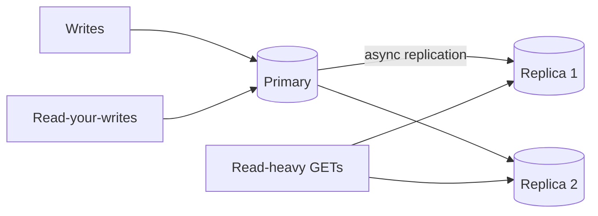

Your API is 90% reads. The primary CPU is pegged on `SELECT`s while writes wait. You add **read replicas** and route GETs there — until a user updates their profile and immediately GETs stale data from a replica that is 2 seconds behind. Read scaling is easy; **read-your-writes** consistency is the product detail that bites.

## Intuition

Most relational systems scale reads with **asynchronous replicas**: the primary accepts writes; replicas replay the WAL/binlog stream. You can put many replicas behind a reader endpoint. Writes still hit **one primary** (unless you adopt multi-primary, which is a different beast).

**Write scaling** is harder: vertical upgrade, batching, sharding, queues that absorb spikes, or separating write-heavy workloads. Replicas do **not** multiply write capacity.



## How it works

Routing rules common in production:

- `POST/PUT/PATCH/DELETE` → primary
- `GET` → replica pool
- After a write in the same session → primary for a short window (sticky)
- Very stale-tolerant analytics → replica is fine

Lag metrics matter: `replay_lag` seconds. If lag grows under load, replicas are not free capacity — they are delayed mirrors.

Write scaling levers:

- Better indexes / fewer writes (don’t update rows that did not change)
- Connection pooling (PgBouncer)
- Batch inserts, async workers
- Shard or CQRS outbox when a single primary is the ceiling

## In code

Simulate primary + lagging replica with two SQLite files and FastAPI routing (illustrative of the consistency trap).

```python
import sqlite3
import time
import threading
from fastapi import FastAPI, Header, HTTPException
from pydantic import BaseModel

app = FastAPI()
PRIMARY = "primary.db"
REPLICA = "replica.db"
lag_seconds = 1.5  # artificial replication delay

def connect(path: str):
    c = sqlite3.connect(path, check_same_thread=False)
    c.row_factory = sqlite3.Row
    return c

@app.on_event("startup")
def init():
    for path in (PRIMARY, REPLICA):
        with connect(path) as db:
            db.execute(
                "CREATE TABLE IF NOT EXISTS profiles ("
                "user_id INTEGER PRIMARY KEY, bio TEXT NOT NULL)"
            )
            db.execute(
                "INSERT OR IGNORE INTO profiles (user_id, bio) VALUES (1, 'hello')"
            )
            db.commit()

def replicate_async(user_id: int, bio: str):
    def work():
        time.sleep(lag_seconds)
        with connect(REPLICA) as db:
            db.execute(
                "INSERT INTO profiles (user_id, bio) VALUES (?, ?) "
                "ON CONFLICT(user_id) DO UPDATE SET bio=excluded.bio",
                (user_id, bio),
            )
            db.commit()
    threading.Thread(target=work, daemon=True).start()

class BioIn(BaseModel):
    bio: str

@app.put("/profiles/{user_id}")
def write_profile(user_id: int, body: BioIn):
    with connect(PRIMARY) as db:
        db.execute(
            "INSERT INTO profiles (user_id, bio) VALUES (?, ?) "
            "ON CONFLICT(user_id) DO UPDATE SET bio=excluded.bio",
            (user_id, body.bio),
        )
        db.commit()
    replicate_async(user_id, body.bio)
    return {"ok": True, "served_by": "primary"}

@app.get("/profiles/{user_id}")
def read_profile(
    user_id: int,
    x_read_your_writes: str | None = Header(default=None),
):
    # Session sticky: after edit, client sends header to force primary
    path = PRIMARY if x_read_your_writes == "1" else REPLICA
    with connect(path) as db:
        row = db.execute(
            "SELECT user_id, bio FROM profiles WHERE user_id=?", (user_id,)
        ).fetchone()
    if not row:
        raise HTTPException(404)
    return {**dict(row), "served_by": "primary" if path == PRIMARY else "replica"}

# psycopg-style dual DSNs:
"""
PRIMARY_DSN = "postgresql://.../primary"
REPLICA_DSN = "postgresql://.../replica"

def get_conn(write: bool = False):
    return psycopg.connect(PRIMARY_DSN if write else REPLICA_DSN)
"""
```

Try `PUT` then immediate `GET` without the header — you may see the old bio until replication catches up. That is replica lag, not a cache bug.

## What goes wrong

- **Blindly routing all reads to replicas** — broken read-your-writes, flaky tests, confused users.
- **Using replicas for write scale** — they cannot accept the app’s writes (usually).
- **Ignoring lag alerts** — serving minutes-old data during incidents.
- **Heavy analytical queries on the primary** — starve OLTP; use replicas or a warehouse.
- **Connection storms** — each app replica opens huge pools to primary; use a pooler.

## One-line summary

Read replicas scale read throughput with async lag; writes still need a primary (or sharding) — route carefully when users must see their own writes immediately.

## Key terms

- **Primary / leader:** database node accepting writes.
- **Read replica / follower:** copy serving reads, usually async.
- **Replication lag:** delay between primary commit and replica visibility.
- **Read-your-writes:** a client sees its own updates without stale reads.
- **WAL / binlog:** log stream used to replicate changes.
- **Connection pooler:** middleware multiplexing many app conns to fewer DB conns.
- **Write scaling:** increasing capacity for inserts/updates (harder than reads).
