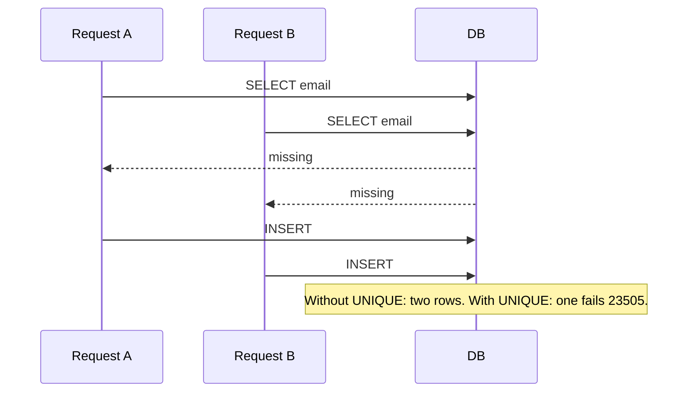

Two “sign up” clicks create two users with the same email. Two webhook deliveries create two invoices. Your CRM shows three “Acme Inc” accounts. **Duplicates** come from races, missing constraints, fuzzy real-world identity, and retries — fix prevention first, then merge tools for the mess you already have.

## Intuition

Three layers:

1. **Prevent** — database uniqueness, idempotency keys, upserts
2. **Detect** — periodic jobs finding near-matches (`lower(email)`, normalized phone)
3. **Resolve** — merge records, re-point foreign keys, keep an audit trail

Application checks like “select then insert” are not enough under concurrency. Two requests both see “no row” and both insert. The database **UNIQUE** constraint is the source of truth.

## How it works



Sources of duplicates:

- Double submit / retry without idempotency
- Case/format variants (`A@x.com` vs `a@x.com`)
- Separate systems importing the same customer
- Soft identity (same person, different emails) — cannot be solved by UNIQUE alone

Natural keys (`email`, `external_id`, `idempotency_key`) should be unique. Surrogate `id` integers do not protect you.

## In code

FastAPI registration with normalized unique email, upsert for webhooks, and a simple merge.

```python
import sqlite3
from fastapi import FastAPI, Header, HTTPException
from pydantic import BaseModel, EmailStr, field_validator

app = FastAPI()

def db():
    c = sqlite3.connect("crm.db")
    c.row_factory = sqlite3.Row
    return c

@app.on_event("startup")
def init():
    with db() as conn:
        conn.executescript(
            """
            CREATE TABLE IF NOT EXISTS users (
              id INTEGER PRIMARY KEY,
              email_norm TEXT NOT NULL UNIQUE,
              email_display TEXT NOT NULL,
              name TEXT NOT NULL
            );
            CREATE TABLE IF NOT EXISTS invoices (
              id INTEGER PRIMARY KEY,
              provider_event_id TEXT NOT NULL UNIQUE,
              user_id INTEGER NOT NULL,
              amount_cents INTEGER NOT NULL
            );
            CREATE TABLE IF NOT EXISTS orders (
              id INTEGER PRIMARY KEY,
              user_id INTEGER NOT NULL REFERENCES users(id)
            );
            """
        )

class Register(BaseModel):
    email: EmailStr
    name: str

    @field_validator("email")
    @classmethod
    def strip(cls, v: str) -> str:
        return v.strip()

def norm_email(email: str) -> str:
    return email.strip().lower()

@app.post("/register", status_code=201)
def register(body: Register):
    email_norm = norm_email(body.email)
    with db() as conn:
        try:
            cur = conn.execute(
                "INSERT INTO users (email_norm, email_display, name) VALUES (?, ?, ?)",
                (email_norm, body.email, body.name),
            )
            conn.commit()
            return {"id": cur.lastrowid}
        except sqlite3.IntegrityError:
            raise HTTPException(409, "Email already registered")

class WebhookInvoice(BaseModel):
    event_id: str
    user_id: int
    amount_cents: int

@app.post("/webhooks/invoice")
def invoice_webhook(
    body: WebhookInvoice,
    idempotency_key: str | None = Header(default=None, alias="Idempotency-Key"),
):
    # Prefer provider event id as natural idempotency key
    key = body.event_id or idempotency_key
    if not key:
        raise HTTPException(400, "Missing event id")
    with db() as conn:
        try:
            cur = conn.execute(
                "INSERT INTO invoices (provider_event_id, user_id, amount_cents) "
                "VALUES (?, ?, ?)",
                (key, body.user_id, body.amount_cents),
            )
            conn.commit()
            return {"invoice_id": cur.lastrowid, "duplicate": False}
        except sqlite3.IntegrityError:
            row = conn.execute(
                "SELECT id FROM invoices WHERE provider_event_id=?", (key,)
            ).fetchone()
            return {"invoice_id": row["id"], "duplicate": True}

@app.post("/admin/merge-users")
def merge_users(keep_id: int, drop_id: int):
    if keep_id == drop_id:
        raise HTTPException(400)
    with db() as conn:
        conn.execute("BEGIN")
        drop = conn.execute("SELECT * FROM users WHERE id=?", (drop_id,)).fetchone()
        keep = conn.execute("SELECT * FROM users WHERE id=?", (keep_id,)).fetchone()
        if not drop or not keep:
            conn.execute("ROLLBACK")
            raise HTTPException(404)
        conn.execute("UPDATE orders SET user_id=? WHERE user_id=?", (keep_id, drop_id))
        conn.execute("UPDATE invoices SET user_id=? WHERE user_id=?", (keep_id, drop_id))
        conn.execute("DELETE FROM users WHERE id=?", (drop_id,))
        conn.commit()
    return {"kept": keep_id, "removed": drop_id}

# Upsert pattern (Postgres):
"""
INSERT INTO users (email_norm, email_display, name)
VALUES (%s, %s, %s)
ON CONFLICT (email_norm) DO UPDATE
SET name = EXCLUDED.name
RETURNING id;
"""
```

Normalize before uniqueness. For fuzzy company names, you need a matching service (Levenshtein, clearbit, etc.), not only SQL UNIQUE.

## What goes wrong

- **App-only duplicate checks** — races create doubles under load.
- **Case-sensitive unique emails** — `A@x.com` and `a@x.com` both exist.
- **Hard delete without merge** — orphan FKs or silent data loss.
- **Retrying webhooks without natural keys** — double charges/invoices.
- **Merging without re-pointing FKs** — “duplicate gone” but history split across ids.

## One-line summary

Prevent duplicates with normalized unique constraints and idempotent writes; detect and merge the rest with explicit FK re-pointing and an audit trail.

## Key terms

- **Natural key:** business identifier that should be unique (email, external id).
- **Surrogate key:** database `id` with no business meaning.
- **Upsert:** insert or update on conflict.
- **Idempotent webhook:** redelivery does not create a second entity.
- **Normalization (data quality):** canonical form before compare/store.
- **Merge:** combine duplicate entities into one survivor row.
- **IntegrityError / unique_violation:** DB rejecting a duplicate key.
