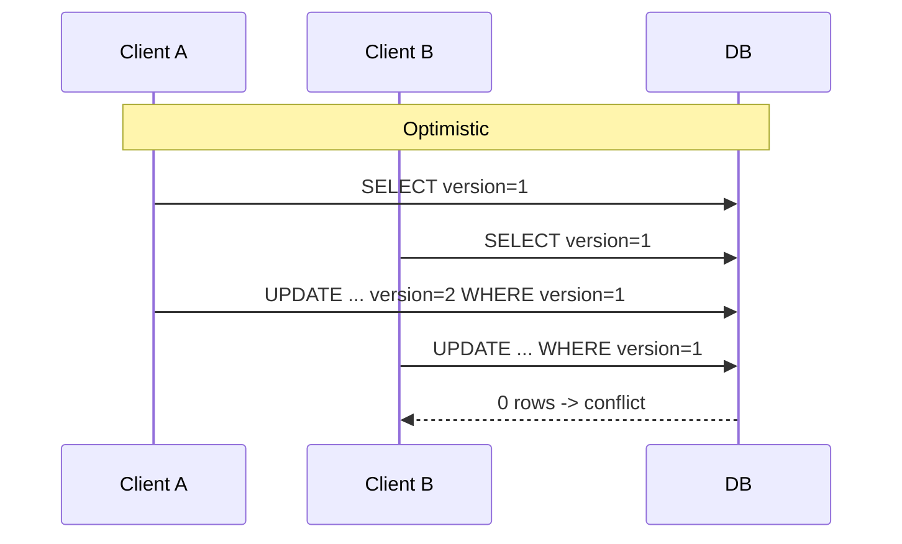

Two editors open the same document. Both save. Last write wins and one author’s paragraph disappears. **Pessimistic locking** would have blocked the second editor at open/edit time. **Optimistic locking** lets both edit, then rejects the second save if the version changed — common in web APIs where holding DB locks across user think-time is impossible.

## Intuition

**Pessimistic:** “Lock now so nobody else can change this until I’m done.” `SELECT ... FOR UPDATE` inside a short transaction. Great for high-contention inventory when the critical section is milliseconds.

**Optimistic:** “Assume conflict is rare; check a version/ETag at write.” `UPDATE ... WHERE id=? AND version=?`. If `rowcount=0`, someone else won — reload and retry. Great for HTTP APIs and forms.

Holding a pessimistic lock while waiting for a human is a deadlock factory. Optimistic fits request/response; pessimistic fits tight server-side critical sections.

## How it works



| | Pessimistic | Optimistic |
| --- | --- | --- |
| Mechanism | Row/table locks | Version / timestamp / hash |
| Conflict | Waiter blocks | Writer fails fast |
| Best when | High contention, short txn | Low contention, long user think time |
| Risk | Deadlocks, lock waits | Retry storms if contention spikes |

HTTP maps nicely to optimistic locking via `ETag` / `If-Match` headers.

## In code

Both styles with FastAPI + SQLite (optimistic) and Postgres-shaped `FOR UPDATE` (pessimistic).

```python
import sqlite3
from fastapi import FastAPI, HTTPException, Header
from pydantic import BaseModel

app = FastAPI()

def db():
    c = sqlite3.connect("docs.db")
    c.row_factory = sqlite3.Row
    return c

@app.on_event("startup")
def init():
    with db() as conn:
        conn.execute(
            "CREATE TABLE IF NOT EXISTS documents ("
            "id INTEGER PRIMARY KEY, body TEXT NOT NULL, version INTEGER NOT NULL)"
        )
        conn.execute(
            "INSERT OR IGNORE INTO documents (id, body, version) VALUES (1, 'v1', 1)"
        )
        conn.commit()

@app.get("/documents/{doc_id}")
def get_doc(doc_id: int):
    with db() as conn:
        row = conn.execute(
            "SELECT id, body, version FROM documents WHERE id=?", (doc_id,)
        ).fetchone()
    if not row:
        raise HTTPException(404)
    # Expose version as ETag for clients
    from fastapi.responses import JSONResponse
    return JSONResponse(
        content=dict(row),
        headers={"ETag": f'W/"{row["version"]}"'},
    )

class DocPatch(BaseModel):
    body: str

@app.patch("/documents/{doc_id}")
def patch_doc(
    doc_id: int,
    body: DocPatch,
    if_match: str | None = Header(default=None, alias="If-Match"),
):
    if not if_match:
        raise HTTPException(428, "If-Match required")  # Precondition Required
    try:
        version = int(if_match.strip().strip('W/').strip('"'))
    except ValueError:
        raise HTTPException(400, "Bad ETag")

    with db() as conn:
        cur = conn.execute(
            "UPDATE documents SET body=?, version=version+1 "
            "WHERE id=? AND version=?",
            (body.body, doc_id, version),
        )
        conn.commit()
        if cur.rowcount != 1:
            raise HTTPException(412, "Precondition Failed — reload and retry")
        row = conn.execute(
            "SELECT id, body, version FROM documents WHERE id=?", (doc_id,)
        ).fetchone()
    return dict(row)

# --- Pessimistic: short critical section (inventory) ---
@app.post("/inventory/{sku}/reserve")
def reserve(sku: str, qty: int = 1):
    conn = db()
    try:
        conn.execute("BEGIN IMMEDIATE")  # SQLite write lock
        row = conn.execute(
            "SELECT stock FROM inventory WHERE sku=?", (sku,)
        ).fetchone()
        if not row or row["stock"] < qty:
            conn.execute("ROLLBACK")
            raise HTTPException(409, "Insufficient stock")
        conn.execute(
            "UPDATE inventory SET stock = stock - ? WHERE sku=?", (qty, sku)
        )
        conn.commit()
    finally:
        conn.close()
    return {"ok": True}

# Postgres pessimistic sketch:
"""
with conn.transaction():
    cur.execute(
        "SELECT stock FROM inventory WHERE sku=%s FOR UPDATE",
        (sku,),
    )
    ...
"""
```

Optimistic conflicts should return **412** or **409** with a clear “reload” signal. Blindly retrying without re-reading can loop forever if another writer keeps winning.

## What goes wrong

- **Last-write-wins with no version** — silent data loss.
- **Pessimistic locks across HTTP round-trips** — locks held for seconds/minutes; system grinds.
- **Incrementing version in the app without WHERE** — race still loses updates.
- **No retry UX** — API returns 412; UI overwrites blindly on next save.
- **Huge transactions with FOR UPDATE** — deadlocks; keep critical sections tiny.

## One-line summary

Use pessimistic locks for short, high-contention server critical sections; use optimistic versions/ETags for concurrent edits over HTTP where conflicts are rare and retries are acceptable.

## Key terms

- **Optimistic locking:** detect conflicts at commit/update via version check.
- **Pessimistic locking:** prevent conflicts by locking rows early.
- **Version column:** integer/timestamp incremented on each successful write.
- **ETag / If-Match:** HTTP headers carrying optimistic concurrency tokens.
- **412 Precondition Failed:** update rejected because version did not match.
- **Lost update:** concurrent writes drop one change.
- **SELECT FOR UPDATE:** pessimistic row lock until transaction ends.
