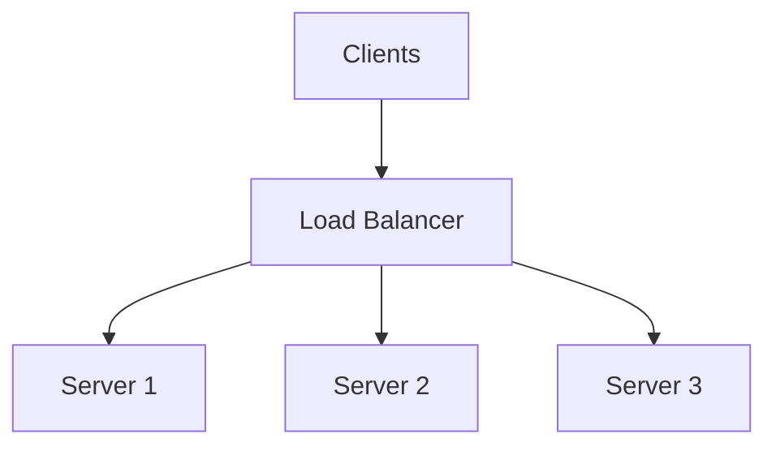

One FastAPI process cannot absorb Black Friday alone. A **load balancer** sits in front of many identical (or similar) backends and spreads requests so no single node melts. The **algorithm** — round-robin, least connections, hashing, weighted — decides *which* replica handles each request, shaping latency, stickiness, and failure behavior.

## Intuition

Picture a supermarket with many cashiers. A greeter sending every next shopper to the next open lane is round-robin. Sending people to the shortest line is least-connections. Always sending the same loyalty-card holder to the same cashier (so their “tab” stays local) is hashing for stickiness. The greeter is your LB; the cashiers are app pods.

:::key
Load balancing multiplies capacity only if backends are interchangeable for the requests you route — which pushes you toward stateless apps and shared stores.
:::

## How it works

**Where it sits.** Clients hit a VIP / reverse proxy (NGINX, Envoy, cloud ALB/NLB, Kubernetes Service). The LB health-checks backends and removes bad nodes from rotation.



**Algorithms.**

| Algorithm | Behavior | Use when |
| --- | --- | --- |
| Round-robin | Cycle S1, S2, S3, ... | Stateless, similar cost |
| Least connections | Fewest active conns | Long or uneven requests |
| Hash (IP, cookie, user id) | Same key -> same server | Sticky sessions, local cache |
| Weighted | Bias toward stronger nodes | Mixed capacity |

**L4 vs L7.** L4 (TCP) balances connections without reading HTTP. L7 understands paths and headers — route `/api/payments` to a specialized pool, terminate TLS, add retries for idempotent GETs.

**Consistent hashing.** Plain `hash(key) % N` reshuffles almost everyone when N changes. Consistent hashing moves only a fraction of keys when nodes are added/removed — important for cache-friendly routing.

**Health and connection draining.** On deploy, stop sending new traffic, finish in-flight requests, then kill the pod. Without draining, users see spikes of 502s.

**Layers of balancing.** You often have more than one LB: a cloud load balancer in front of Kubernetes, then a Service/Ingress distributing to pods, then maybe a client-side library doing retries across upstreams. Keep retry policy in *one* place when possible — double retries at edge and mesh multiply load during outages.

**Practical defaults.** Stateless FastAPI replicas -> round-robin or least-conn. Need session stickiness temporarily -> cookie affinity while you migrate sessions to Redis. Heterogeneous instance sizes -> weighted targets. Always pair the algorithm with active health checks and a readiness endpoint so brand-new or dying pods stay out of rotation.

## In code

Teaching model of algorithms, plus a FastAPI health endpoint the LB can probe.

```python
import itertools
import hashlib
from collections import defaultdict


class RoundRobin:
    def __init__(self, servers: list[str]):
        self._cycle = itertools.cycle(servers)

    def pick(self, _key: str | None = None) -> str:
        return next(self._cycle)


class LeastConnections:
    def __init__(self, servers: list[str]):
        self.conns = {s: 0 for s in servers}

    def pick(self) -> str:
        return min(self.conns, key=self.conns.get)

    def acquire(self, s: str) -> None:
        self.conns[s] += 1

    def release(self, s: str) -> None:
        self.conns[s] -= 1


class StickyHash:
    def __init__(self, servers: list[str]):
        self.servers = servers

    def pick(self, key: str) -> str:
        h = int(hashlib.sha256(key.encode()).hexdigest(), 16)
        return self.servers[h % len(self.servers)]


# FastAPI side — LB checks this
from fastapi import FastAPI
app = FastAPI()

@app.get("/healthz")
def healthz():
    return {"status": "ok"}
```

NGINX-style sketch (not Python, but what you deploy in front):

```nginx
upstream api {
    least_conn;
    server 10.0.0.1:8000;
    server 10.0.0.2:8000;
}
```

## What goes wrong

- **Sticky sessions as a crutch** — in-memory sessions force hashing; node death logs users out. Prefer Redis-backed sessions and round-robin.
- **Uneven hashes** — poor key choice (almost-constant IP behind corporate NAT) piles traffic on one node.
- **Ignoring health** — LB keeps routing to a wedged process that accepts TCP but never answers.
- **Retry storms** — L7 retries on timeout multiply load when the fleet is already sick.
- **Cross-AZ imbalance** — all traffic pinned to one zone’s backends.

:::tip
Prefer stateless app tiers + shared Redis/DB so you can use simple round-robin or least-conn and scale freely.
:::

## One-line summary

A load balancer spreads traffic across replicas; pick the algorithm for your stickiness and request-cost mix, and keep backends healthy and drainable.

## Key terms

- **Load balancer (LB)** — proxy that distributes requests across backends
- **Round-robin** — rotate through backends in order
- **Least connections** — prefer the backend with fewest active connections
- **Sticky session / affinity** — route the same client to the same backend
- **Consistent hashing** — hashing scheme that minimizes remapping when nodes change
- **Health check** — probe used to remove unhealthy backends from rotation
