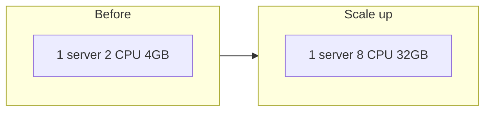
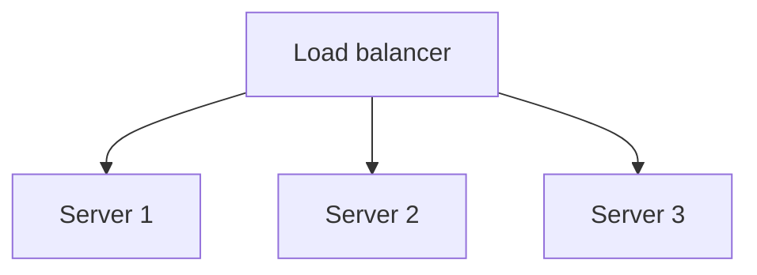

Traffic doubles. You have two knobs: buy a bigger box (**vertical scaling / scale up**) or add more boxes (**horizontal scaling / scale out**). Both raise capacity; they fail differently, cost differently, and demand different application design. Most production web APIs eventually scale out — but vertical scaling is still the right first move in many early systems.

## Intuition

One powerful laptop versus a room of laptops. The powerful laptop is simple: one machine, one process, upgrade RAM. The room needs a greeter (load balancer), shared notes (Redis/DB), and agreement on who does what. Vertical is “make the hero stronger.” Horizontal is “hire a team.”

:::key
Horizontal scale buys headroom and redundancy only if your app can run as multiple interchangeable replicas.
:::

## How it works

**Vertical.** Increase CPU, RAM, disk, or network on one node. App code often unchanged. Ceiling: largest instance type, single point of failure, diminishing returns, noisy-neighbor and blast-radius risk.



**Horizontal.** Add replicas behind a load balancer. Requires: mostly **stateless** app processes, externalized session/cache, and a data layer that can take the aggregate load (replicas, sharding later).



| Aspect | Vertical | Horizontal |
| --- | --- | --- |
| Change | Bigger node | More nodes |
| Limit | Hardware ceiling, SPOF | Much higher; ops complexity |
| App design | Often none | Stateless + shared state |
| Failure | Node down = outage | Survive single-node loss |
| Cost shape | Premium large instances | Commodity + orchestration |

**What usually bottlenecks first.** App CPU -> scale app horizontally. DB CPU/IO -> vertical DB, then read replicas, then shard. Redis memory -> bigger Redis or cluster. Don’t scale the wrong tier.

**Elasticity.** Horizontal pairs with auto-scaling: add pods when CPU or RPS rises, remove when calm. Vertical changes are clumsier (resize = often restart).

**Cost and risk.** A larger instance can be the cheapest fix for a week-long crunch. Long term, a single fat DB or app node concentrates blast radius: one failure, one AZ issue, one noisy neighbor. Horizontal scale spreads risk but introduces coordination cost — load balancers, service discovery, rolling deploys, and careful connection pooling so 20 new pods do not open 20 x N database connections and flatten Postgres.

**Hybrid reality.** Most mature systems do both: vertically size the database within reason, horizontally scale the app and workers, then add read replicas or shards only when metrics prove the data tier is the constraint. Scale the bottleneck you measured, not the tier that is easiest to click “upgrade” on.

## In code

Design for horizontal scale: no in-process session affinity; store sessions in Redis; expose multiple uvicorn workers/replicas.

```python
# BAD for horizontal scale — sticky memory dies with the pod
# sessions = {}  # in-process

# GOOD — shared session store
import redis
from fastapi import FastAPI, Response, Cookie
import uuid
import json

app = FastAPI()
r = redis.Redis(decode_responses=True)


@app.post("/login")
def login(response: Response, user_id: int):
    sid = str(uuid.uuid4())
    r.setex(f"sess:{sid}", 3600, json.dumps({"user_id": user_id}))
    response.set_cookie("session_id", sid, httponly=True)
    return {"ok": True}


@app.get("/me")
def me(session_id: str | None = Cookie(default=None)):
    if not session_id:
        return {"user_id": None}
    raw = r.get(f"sess:{session_id}")
    return json.loads(raw) if raw else {"user_id": None}
```

Run multiple replicas (ops sketch):

```bash
# same image, N tasks behind a load balancer
uvicorn app:app --host 0.0.0.0 --port 8000
# scale: replica count 1 -> 8 when RPS rises
```

## What goes wrong

- **Scaling app out into a hot DB** — more API pods amplify query load; DB falls over first.
- **Local disk / local cache assumptions** — file uploads on pod filesystem vanish on reschedule.
- **Vertical forever** — one giant DB becomes an irreplaceable snowflake; migrations terrify everyone.
- **Chatty cross-replica state** — trying to synchronize in-memory structures across nodes reinventing Redis badly.
- **Auto-scale flapping** — thresholds too tight; constant churn and cold-start latency.

:::tip
Default path: vertical until painful, then make the app stateless and scale horizontally; scale the data tier with a deliberate plan (replicas -> partition).
:::

## One-line summary

Scale up for simple capacity; scale out for elastic capacity and redundancy — but only after state lives outside the app process.

## Key terms

- **Vertical scaling** — add resources to a single machine
- **Horizontal scaling** — add more machines/replicas
- **Stateless app** — request handling does not depend on local process memory
- **SPOF** — single point of failure
- **Auto-scaling** — automatically changing replica count from load signals
- **Shared state** — sessions/cache/files kept in external stores all replicas can reach
