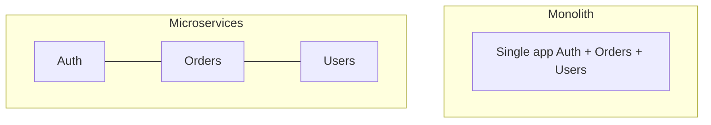

A **monolith** ships as one deployable unit: auth, orders, catalog, and billing in one codebase and process boundary. **Microservices** split those domains into separately deployable services talking over the network. Neither is morally superior — they optimize for different team sizes, scale shapes, and consistency needs. Choosing microservices too early is a common way to buy distributed-systems pain before you need the benefits.

## Intuition

A food truck (monolith) has one kitchen, one menu, one cash register. A food hall (microservices) has many kitchens; you can renovate tacos without closing sushi — but now you need hall rules, shared seating, and someone to coordinate when an order spans two stalls. Small team + unclear domain boundaries -> food truck. Large org with independent release cadence and wildly different scale -> food hall.

:::key
Microservices trade deployment independence for network failure, eventual consistency, and operational complexity.
:::

## How it works



| Aspect | Monolith | Microservices |
| --- | --- | --- |
| Deploy | One artifact | Per-service |
| Scale | Whole app | Hot services only |
| Consistency | Single DB transactions | Sagas / eventual consistency |
| Ops | Simpler | Discovery, mesh, tracing, many pipelines |
| Team | Coordinated releases | Service ownership |

**When monolith wins.** Early product, small team, heavy transactional workflows, one primary datastore, need to move fast with simple debugging (one stack trace).

**When microservices win.** Clear bounded contexts, teams that must ship independently, heterogeneous scale (search vs billing), regulatory isolation, polyglot needs that justify the tax.

**Modular monolith middle path.** One deployable, strict internal module boundaries (packages), separate DB schemas *owned* by modules — extract a service later when a boundary hurts. Often the best of year-one architecture.

**Distributed data.** Each service owning its data avoids shared-DB coupling but breaks `BEGIN TRANSACTION` across orders + inventory. You will need outbox patterns, sagas, and idempotency (reliability chapter).

## In code

Same business capability as a modular monolith router vs an HTTP call to another service.

```python
# --- Modular monolith: in-process call (simple, transactional) ---
from fastapi import FastAPI
import asyncpg

app = FastAPI()


async def reserve_inventory(conn, sku: str, qty: int) -> None:
    result = await conn.execute(
        """
        UPDATE inventory SET qty = qty - $2
        WHERE sku = $1 AND qty >= $2
        """,
        sku, qty,
    )
    if result == "UPDATE 0":
        raise ValueError("out of stock")


@app.post("/orders")
async def create_order(sku: str, qty: int, user_id: int):
    async with app.state.pool.acquire() as conn:
        async with conn.transaction():
            await reserve_inventory(conn, sku, qty)
            order_id = await conn.fetchval(
                """
                INSERT INTO orders (user_id, sku, qty)
                VALUES ($1, $2, $3) RETURNING id
                """,
                user_id, sku, qty,
            )
    return {"order_id": order_id}
```

```python
# --- Microservice style: network call (failure + partial success possible) ---
import httpx
from fastapi import FastAPI, HTTPException

app = FastAPI()


@app.post("/orders")
async def create_order(sku: str, qty: int, user_id: int):
    async with httpx.AsyncClient(timeout=2.0) as client:
        inv = await client.post(
            "http://inventory:8001/reserve",
            json={"sku": sku, "qty": qty},
        )
    if inv.status_code != 200:
        raise HTTPException(409, "could not reserve inventory")
    # If we crash after reserve but before insert — orphan reservation (need saga/compensation)
    order_id = await app.state.pool.fetchval(
        "INSERT INTO orders (user_id, sku, qty) VALUES ($1,$2,$3) RETURNING id",
        user_id, sku, qty,
    )
    return {"order_id": order_id}
```

## What goes wrong

- **Distributed monolith** — many repos, still one release train and a shared DB; worst of both worlds.
- **Chatty sync meshes** — every click fans out to 15 HTTP calls; latency multiplies, failure multiplies.
- **Shared database between “services”** — no independence; schema changes couple teams.
- **Premature split** — boundaries cut across transactions; sagas everywhere for a five-person team.
- **No observability** — without tracing, “which service broke checkout?” becomes guesswork.

:::tip
Start modular monolith; split a service when a team or scaling boundary is *painful and clear*, not because a blog post said so.
:::

## One-line summary

Monoliths optimize simplicity and consistency; microservices optimize independent deploy and scale — pay the distributed tax only when those benefits matter.

## Key terms

- **Monolith** — single deployable application spanning many features
- **Microservice** — small, independently deployable service with a clear domain
- **Bounded context** — domain boundary that owns its model and data
- **Modular monolith** — one deployable with enforced internal module boundaries
- **Service ownership** — team responsible for a service’s code, data, and on-call
- **Distributed monolith** — microservice topology without real independence
