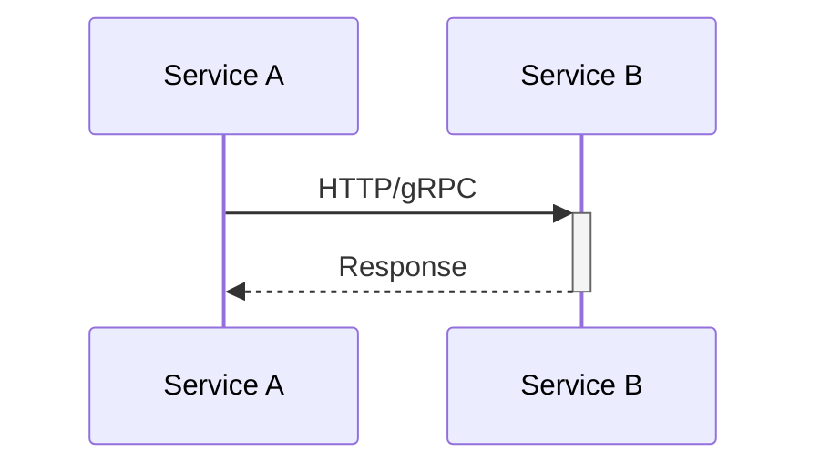
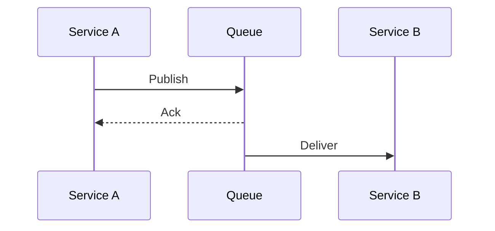

Once you have more than one service, they must talk. **Synchronous** calls (HTTP, gRPC) wait for an answer. **Asynchronous** messaging (queues, event buses) hands work off and continues. The choice controls coupling, latency, failure cascades, and how hard checkout is to reason about at 3 a.m.

## Intuition

Phone call vs voicemail. A phone call (sync) blocks you until the other person answers — great when you need a yes/no to proceed, brittle when they are unavailable. Voicemail (async) lets you drop a message and move on; they process when ready, and you need another channel if you require a reply. Good architectures mix both: sync for “am I allowed?”, async for “send the receipt email.”

:::key
Use sync when the caller cannot continue without the result; use async to absorb load and decouple lifecycles.
:::

## How it works

**Sync request–response.** Service A calls B and blocks (with a timeout). Simple mental model; B must be up. Failures propagate unless you add retries, bulkheads, and circuit breakers.



**Async messaging.** A publishes to a queue/topic; B consumes later. A acknowledges publish and continues. Natural backpressure buffer; eventual consistency; harder end-to-end tracing and UX (“processing...”).



| Aspect | Sync | Async |
| --- | --- | --- |
| Coupling | Needs callee up | Decoupled via broker |
| Latency | Caller waits | Caller returns early |
| Failure | Timeouts, cascades | Retries in broker; poison messages |
| UX fit | Immediate answer | Eventual confirmation |

**Patterns.** Sync: REST JSON, gRPC for low-latency internal RPC. Async: command queues (do this), event streams (this happened). Avoid sync call chains deeper than you can afford in p99 budget (each hop adds latency and failure probability).

**Timeouts are mandatory.** A sync call without a timeout is a latent deadlock when the peer hangs.

**Choosing under real product pressure.** Login and price quote usually stay sync — the UI cannot continue without the answer. Receipt email, search indexing, fraud scoring that is advisory, and “notify analytics” almost always belong on a queue. A useful rule: if the user would accept “we’ll confirm shortly” and a webhook or refresh later, prefer async. If a failure must surface as an immediate HTTP 4xx/5xx to the client, prefer sync with a tight timeout and a clear error.

**Partial failure is normal.** In sync meshes, design each hop for timeouts, retries only where idempotent, and fallbacks. In async flows, design for delayed visibility: the order exists before the email sends; your API should return `accepted` and expose a status resource when users need to poll.

## In code

FastAPI sync HTTP call with timeout vs async publish to a Redis list used as a simple queue.

```python
import json
import httpx
import redis
from fastapi import FastAPI, HTTPException

app = FastAPI()
r = redis.Redis(decode_responses=True)


@app.get("/profile/{user_id}")
async def profile(user_id: int):
    # SYNC: need user record to render response
    async with httpx.AsyncClient(timeout=1.5) as client:
        try:
            resp = await client.get(f"http://users:8001/users/{user_id}")
        except httpx.TimeoutException:
            raise HTTPException(504, "users service timeout")
    if resp.status_code != 200:
        raise HTTPException(502, "users service error")
    return resp.json()


@app.post("/orders")
async def create_order(order_id: int, email: str):
    # Persist order locally (omitted), then ASYNC notify
    r.lpush(
        "queue:email",
        json.dumps({"type": "order_confirm", "order_id": order_id, "email": email}),
    )
    return {"order_id": order_id, "status": "accepted"}


# Worker process (separate):
def email_worker():
    while True:
        _, raw = r.brpop("queue:email")
        msg = json.loads(raw)
        send_email(msg["email"], f"Order {msg['order_id']} confirmed")
```

gRPC-shaped sync (conceptual):

```python
# stub.GetUser(GetUserRequest(id=user_id), timeout=1.5)
```

## What goes wrong

- **Sync everything** — email, analytics, webhooks on the request path; one slow dependency tanks checkout.
- **Async without idempotency** — redelivery doubles charges or double-emails.
- **No timeouts / huge timeouts** — thread or connection pools exhaust; cascading failure.
- **Chatty sync** — N+1 HTTP calls per page; fix with BFF aggregation or coarser APIs.
- **Assuming ordering** — parallel consumers reorder events unless you design for it.

:::warn
A sync dependency is a hard dependency. If it is not on the critical path for the user’s answer, make it async.
:::

## One-line summary

Sync when you need the answer now; async when you need decoupling and load buffering — always with timeouts and clear failure semantics.

## Key terms

- **Synchronous communication** — caller waits for a response
- **Asynchronous communication** — caller hands off work without waiting for completion
- **Timeout** — max wait before treating a sync call as failed
- **Backpressure** — slowing producers when consumers/queues cannot keep up
- **Command vs event** — “do X” message vs “X happened” notification
- **Cascading failure** — one slow/down service tipping over its callers
