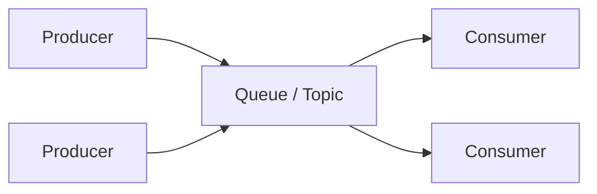

A **message queue** sits between producers and consumers: producers enqueue work or events; consumers process asynchronously. Queues decouple deploy cycles, smooth traffic spikes, and enable retries. Kafka, RabbitMQ, and SQS all move messages, but they optimize for different models — log replay vs flexible routing vs managed cloud queues.

## Intuition

A ticket counter drop-box. Cashiers (producers) drop tickets; kitchen staff (consumers) pull when ready. If lunch rush arrives, the box grows instead of blocking the cashier. If a cook burns a dish, the ticket can return for retry. Different venues: a conveyor belt that keeps history (Kafka), labeled mail slots with routing rules (RabbitMQ), a managed Amazon drop-box (SQS).

:::key
Queues buy time and decoupling; they do not remove the need for idempotent consumers and dead-letter handling.
:::

## How it works



| System | Model | Strengths |
| --- | --- | --- |
| Kafka | Append log, partitions, consumer offsets | High throughput, replay, event streaming |
| RabbitMQ | Exchanges + queues, ack/nack | Task queues, routing keys, flexible topologies |
| SQS | Managed pull queues (standard / FIFO) | Simple ops on AWS, serverless workers |

**Kafka ideas.** Topics split into partitions for parallelism. A consumer group splits partitions among members. Retention lets you replay. Great for event sourcing-style pipelines and many independent consumer groups reading the same stream.

**RabbitMQ ideas.** Publishers send to an exchange; bindings route to queues. Workers ack after success; nack/requeue on failure. Good for classic job queues and RPC-ish patterns.

**SQS ideas.** Fully managed; standard queue = at-least-once, best-effort ordering; FIFO = ordered per message group with dedup IDs. Pairs well with Lambda or EC2 workers.

**Delivery semantics.** Most queues are **at-least-once**: after a crash mid-process, the message returns. Design consumers to be idempotent. Dead-letter queues (DLQ) capture poison messages after N failures.

**Backpressure and visibility.** When consumers lag, queue depth and consumer lag metrics are your early warning — not CPU on the API pods. Scale consumers, slow producers, or shed low-priority topics before disk fills. For SQS, visibility timeout must exceed worst-case processing time or another worker will grab an in-flight message and you will double-process. For Kafka, lag per partition tells you whether to add consumers in the group (up to the partition count).

**Choosing quickly.** Need replay and many independent readers of the same facts → Kafka (or similar log). Need classic job queue with routing and per-message ack → RabbitMQ. Want minimal ops inside AWS → SQS (+ SNS for fan-out). Do not pick Kafka only because it is popular if you truly need a work queue with simple ack semantics.

## In code

Producer from FastAPI into Redis list (stand-in queue), plus a consumer loop. Then sketches for SQS/Rabbit-style ack patterns.

```python
import json
import time
import redis
from fastapi import FastAPI

app = FastAPI()
r = redis.Redis(decode_responses=True)
QUEUE = "jobs:resize_image"


@app.post("/images")
def enqueue_resize(image_id: str):
    msg = {"image_id": image_id, "ts": time.time()}
    r.lpush(QUEUE, json.dumps(msg))
    return {"queued": True, "image_id": image_id}


def worker_once():
    """BRPOP blocks until work arrives; process then 'ack' by not re-pushing."""
    item = r.brpop(QUEUE, timeout=5)
    if not item:
        return
    _, raw = item
    job = json.loads(raw)
    try:
        resize(job["image_id"])  # must be idempotent
    except Exception:
        # dead-letter
        r.lpush("jobs:resize_image:dlq", raw)
        raise


# SQS-shaped pseudocode
def sqs_worker(sqs):
    resp = sqs.receive_message(QueueUrl=URL, WaitTimeSeconds=20, MaxNumberOfMessages=5)
    for m in resp.get("Messages", []):
        body = json.loads(m["Body"])
        handle(body)
        sqs.delete_message(QueueUrl=URL, ReceiptHandle=m["ReceiptHandle"])  # ack
```

Kafka consumer sketch (offsets = progress):

```python
# for message in consumer:
#     process(message)
#     consumer.commit()  # advance offset after success
```

## What goes wrong

- **Non-idempotent consumers** — retries double-charge or double-ship.
- **No DLQ** — poison message blocks a partition/queue forever.
- **Unbounded queues** — producers outrun consumers; latency balloons; disk fills.
- **Using Kafka as a job queue without care** — awkward ack patterns; retention vs delete semantics confuse teams.
- **Ignoring ordering** — assuming global order when only per-partition/group order exists.
- **Giant messages** — put blobs in object storage; queue the pointer.

:::tip
Write the consumer first mentally: “What if this message runs twice?” If the answer is painful, fix idempotency before you celebrate the architecture diagram.
:::

## One-line summary

Message queues decouple producers from consumers; pick Kafka for replayable streams, RabbitMQ for routed work queues, SQS for managed cloud simplicity — and always plan for duplicates and DLQs.

## Key terms

- **Producer / consumer** — sender and processor of messages
- **Queue / topic** — buffer or log where messages land
- **Ack** — consumer signal that a message is done (safe to forget/advance)
- **Dead-letter queue (DLQ)** — holding area for repeatedly failing messages
- **Consumer group** — Kafka set of consumers that share partition work
- **At-least-once delivery** — each message processed one or more times under retries
