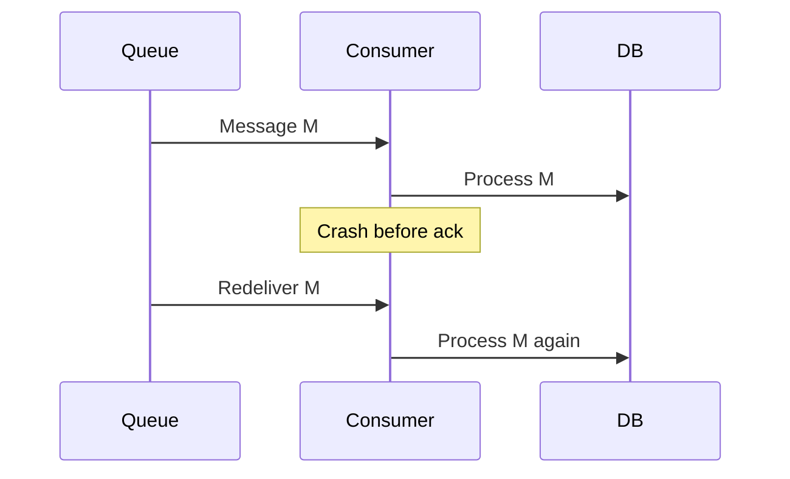

Networks drop packets. Workers crash after doing work but before acknowledging. Brokers therefore **redeliver**. **At-least-once** means each message is processed one or more times — nothing silently lost if you retry until success. **Exactly-once** means side effects happen once — no duplicates, no drops. Pure exactly-once across independent systems is famously hard; practical systems usually deliver at-least-once and make handlers **idempotent** so duplicates are harmless.

## Intuition

You text a friend “pay the invoice” and do not get a read receipt, so you text again. They might pay twice — unless they check an invoice ID and ignore the second text. At-least-once is the double text. Exactly-once effect is the invoice-ID check. Brokers rarely give you magic; your data model does.

:::key
Design for at-least-once delivery and idempotent consumers; add stronger dedup where double side effects are unacceptable (payments).
:::

## How it works

**At-least-once path.** Deliver -> process -> ack. If ack is lost, redeliver -> process again.



**Effectively once.** Store a processed message ID (or business key) in the same DB transaction as the side effect. On duplicate, skip. Or use a transactional outbox: write business row + outbox row atomically; a relay publishes; consumers dedupe.

| Semantic | Guarantee | Reality check |
| --- | --- | --- |
| At-most-once | No dupes; may lose | Rarely OK for money |
| At-least-once | No loss; may dup | Default for queues |
| Exactly-once | Once | Needs idempotency / txn tricks |

**Kafka “exactly-once”.** Useful inside Kafka Streams / transactional produce-consume loops; it does not automatically make your HTTP call to Stripe run once. End-to-end exactly-once still needs idempotency keys at the edges.

**At-most-once** is the opposite trade: fire and forget, or ack before processing — you may lose messages under failure. It is acceptable for lossy metrics; it is unacceptable for ledger updates. Teams sometimes accidentally implement at-most-once by acking in `finally` before the DB commit finishes.

**Operational checklist.** (1) Stable message/business ID from the producer. (2) Dedup table or unique constraint aligned with the side effect. (3) Ack only after commit. (4) DLQ after N failures. (5) Metrics for duplicates skipped vs first-time applies. When two systems must agree (your DB and a payment provider), use *their* idempotency API plus your own processed-key store.

## In code

Idempotent consumer with a processed-ids table; FastAPI endpoint that enqueues with a business key.

```python
import json
import redis
from fastapi import FastAPI

app = FastAPI()
r = redis.Redis(decode_responses=True)


@app.post("/charges")
async def enqueue_charge(invoice_id: str, amount_cents: int):
    # Producers should also use stable IDs
    r.lpush(
        "queue:charges",
        json.dumps({"invoice_id": invoice_id, "amount_cents": amount_cents}),
    )
    return {"queued": True}


async def handle_charge(msg: dict, pool) -> None:
    invoice_id = msg["invoice_id"]
    async with pool.acquire() as conn:
        async with conn.transaction():
            inserted = await conn.fetchval(
                """
                INSERT INTO processed_messages (id)
                VALUES ($1)
                ON CONFLICT (id) DO NOTHING
                RETURNING id
                """,
                f"charge:{invoice_id}",
            )
            if inserted is None:
                return  # duplicate delivery — already applied
            await conn.execute(
                """
                UPDATE invoices
                SET status = 'paid', amount_cents = $2
                WHERE id = $1 AND status = 'open'
                """,
                invoice_id, msg["amount_cents"],
            )
            # side effect inside same txn boundary as the dedupe row
```

Stripe-style idempotency key on the outbound edge:

```python
import httpx

async def charge_card(invoice_id: str, amount_cents: int):
    async with httpx.AsyncClient() as client:
        await client.post(
            "https://api.payments.example/v1/charges",
            json={"amount": amount_cents},
            headers={"Idempotency-Key": f"invoice-{invoice_id}"},
            timeout=5.0,
        )
```

## What goes wrong

- **Ack before side effect** — process crashes after ack; message lost (accidental at-most-once).
- **Side effect outside the dedupe transaction** — duplicate sneaks in between check and write.
- **Weak keys** — deduping on a random UUID generated each publish never collapses retries.
- **Believing the broker brochure** — “exactly-once” inside the log != exactly-once money movement.
- **No DLQ** — poison messages retry forever, blocking the partition.

:::tip
Ask: “What is the natural business key?” Invoice ID, order ID, `(transfer_id, attempt)` — use that for dedup, not an ephemeral consumer offset alone.
:::

## One-line summary

Assume at-least-once; make processing idempotent with business keys so duplicates do not double-apply side effects.

## Key terms

- **At-least-once** — delivery guarantee that allows duplicates under retry
- **Exactly-once** — side effects applied once end-to-end
- **Idempotent consumer** — processing the same message twice leaves the same state
- **Deduplication** — recording seen IDs to skip duplicates
- **Transactional outbox** — atomically store state + outbound event for reliable publish
- **Idempotency key** — client-supplied key so retries reuse one server-side result
