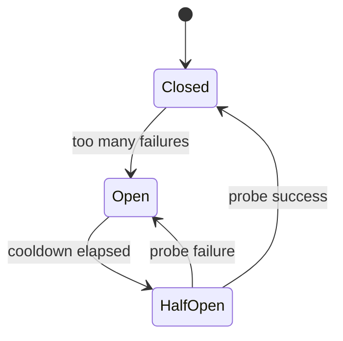

Remote calls fail in boring ways: slow peers, blips, overloaded dependencies. Blind retries can turn a blip into an outage. The resilience toolkit is three pieces that work together: **timeouts** (stop waiting), **retries** (try again carefully), and **circuit breakers** (stop calling a sick dependency so it can recover — and so you fail fast).

## Intuition

You call a pharmacy. No answer after 20 seconds — hang up (timeout). Try again later with backoff (retry). If they have been closed all afternoon, stop dialing every minute and put a “closed” sign on your own desk (circuit breaker) so you can tell customers quickly instead of hanging forever.

:::key
Every sync dependency needs a timeout; retries need backoff and idempotency; breakers protect both you and the dependency.
:::

## How it works

**Timeouts.** Bound how long you wait for connect and read. Without them, thread/connection pools exhaust. Set budgets from your p99 SLA (inbound 2s => outbound call maybe 300–500 ms).

**Retries.** Retry *transient* failures (timeouts, 503, connection reset) on **idempotent** operations (GET, or PUT with idempotency key). Use exponential backoff + jitter so you do not synchronize a thundering herd. Cap attempts. Do not blindly retry POSTs that create orders unless idempotent.

**Circuit breaker states.** Closed = normal calls. Open = fail fast without calling. Half-open = allow a probe; success closes, failure re-opens.



**Bulkheads.** Separate connection pools per dependency so one hung service cannot eat all workers.

**How the three fit together.** Timeout is the first line: fail a single slow call. Retry is the second: absorb blips when safe. The breaker is the third: after a streak of failures, stop paying the timeout cost on every request and return a fast error (or degraded response). When the breaker is open, your graceful-degradation path can serve cached data instead of waiting 800 ms x 3 retries for a dead dependency.

**Budget math.** If the client waits 2 seconds and you have two sequential downstream calls, you cannot give each a 2-second timeout. Split the budget, leave margin for your own work, and prefer failing one hop early over letting the whole request pile up until the load balancer cuts you off with a generic 502.

## In code

Timeouts + exponential backoff with jitter, and a tiny circuit breaker around an HTTP dependency from FastAPI.

```python
import asyncio
import random
import time
import httpx
from fastapi import FastAPI, HTTPException

app = FastAPI()


class CircuitBreaker:
    def __init__(self, failure_threshold=5, recovery_seconds=30):
        self.failure_threshold = failure_threshold
        self.recovery_seconds = recovery_seconds
        self.failures = 0
        self.open_until = 0.0

    def before_call(self) -> None:
        if time.time() < self.open_until:
            raise HTTPException(503, "circuit open for payments")

    def record_success(self) -> None:
        self.failures = 0
        self.open_until = 0.0

    def record_failure(self) -> None:
        self.failures += 1
        if self.failures >= self.failure_threshold:
            self.open_until = time.time() + self.recovery_seconds
            self.failures = 0


payments_cb = CircuitBreaker()


async def call_with_retries(url: str, *, attempts: int = 3) -> dict:
    payments_cb.before_call()
    delay = 0.1
    last_exc: Exception | None = None
    async with httpx.AsyncClient(timeout=httpx.Timeout(0.8)) as client:
        for i in range(attempts):
            try:
                resp = await client.get(url)
                if resp.status_code in (429, 503):
                    raise httpx.HTTPStatusError("transient", request=resp.request, response=resp)
                resp.raise_for_status()
                payments_cb.record_success()
                return resp.json()
            except (httpx.TimeoutException, httpx.HTTPStatusError, httpx.TransportError) as e:
                last_exc = e
                payments_cb.record_failure()
                if i == attempts - 1:
                    break
                await asyncio.sleep(delay * (0.5 + random.random()))
                delay *= 2
    raise HTTPException(502, f"payments unavailable: {last_exc}")


@app.get("/quote")
async def quote():
    data = await call_with_retries("http://payments:8002/rates")
    return {"rate": data["rate"]}
```

## What goes wrong

- **Retry storms** — every instance retries at once; multiply traffic into a dying dependency.
- **Retrying non-idempotent POSTs** — duplicate orders/charges.
- **Timeouts longer than the caller’s timeout** — work continues after the client gave up (wasted load).
- **No jitter** — synchronized retries amplify load spikes.
- **Breaker flapping** — thresholds too sensitive; constant open/close.
- **Retrying 400s** — application errors will not heal with time.

:::warn
Align timeout budgets end-to-end: client < edge < service < dependency, with margin — never the reverse.
:::

## One-line summary

Timeouts bound waits, retries carefully reattempt transient idempotent failures, and circuit breakers stop hammering a sick dependency.

## Key terms

- **Timeout** — maximum time allowed for a remote call
- **Retry** — re-attempting a failed call
- **Exponential backoff** — increasing delay between retries
- **Jitter** — randomness added to backoff to avoid sync herds
- **Circuit breaker** — fail-fast switch that trips after repeated failures
- **Bulkhead** — isolation of resources per dependency
