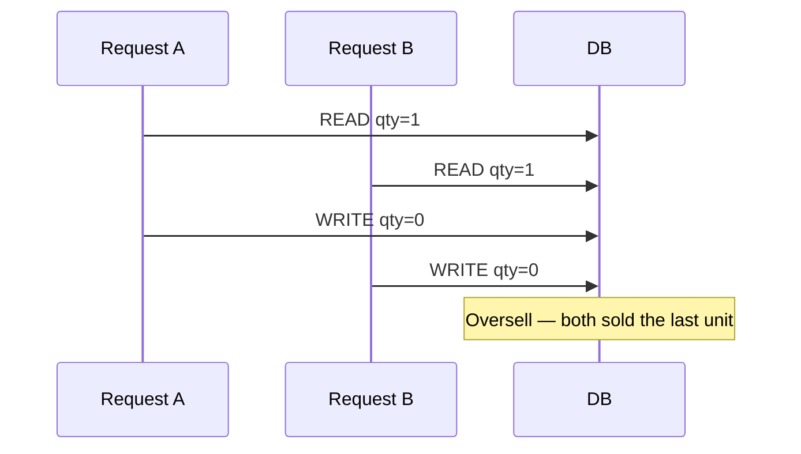

Two requests check “inventory > 0”, both see 1, both sell the last item. Separately each looks correct; together they corrupt reality. A **race condition** happens when outcome depends on interleaving of concurrent operations without proper coordination. In backends they show up as double spends, duplicate rows, lost updates, and “works in staging, fails in prod” under load.

## Intuition

Two people grab the last seat on a train because both looked at an empty seat before either sat. The fix is not “look harder” — it is a reservation protocol: atomic claim, row lock, or compare-and-swap version. Concurrency bugs are timing bugs; tests that always run single-threaded will not find them.

:::key
If two requests can touch the same row, design an atomic check-and-update — never check in Python and update later without a concurrency control.
:::

## How it works

**Lost update.** Read balance 100, read balance 100, write 100−30, write 100−20 → final 80 instead of 50.

**Check-then-act.** `if not exists: insert` races to unique violations or duplicates without a constraint.

**Tools.**

| Tool | Idea |
| --- | --- |
| DB unique constraints | Last line of defense for duplicates |
| `UPDATE … WHERE` version/condition | Optimistic concurrency |
| `SELECT … FOR UPDATE` | Pessimistic row lock |
| Serializability | Strong isolation (costly) |
| Distributed lock | Cross-service mutex (next lesson) |

**Optimistic vs pessimistic (preview).** Optimistic: assume rare conflict; bump version; retry on conflict. Pessimistic: lock row while you decide. High contention → pessimistic or queue serialization; low contention → optimistic.



## In code

Unsafe Python check vs safe SQL conditional update; FastAPI endpoint.

```python
# UNSAFE — race between check and write
async def buy_unsafe(conn, sku: str):
    qty = await conn.fetchval("SELECT qty FROM inventory WHERE sku=$1", sku)
    if qty < 1:
        raise ValueError("out of stock")
    await conn.execute("UPDATE inventory SET qty=qty-1 WHERE sku=$1", sku)


# SAFE — atomic condition in SQL
async def buy_safe(conn, sku: str) -> bool:
    result = await conn.execute(
        """
        UPDATE inventory
        SET qty = qty - 1
        WHERE sku = $1 AND qty >= 1
        """,
        sku,
    )
    return result != "UPDATE 0"


# Optimistic locking with version column
async def update_profile(conn, user_id: int, name: str, version: int) -> bool:
    result = await conn.execute(
        """
        UPDATE users
        SET name = $2, version = version + 1
        WHERE id = $1 AND version = $3
        """,
        user_id, name, version,
    )
    return result != "UPDATE 0"


from fastapi import FastAPI, HTTPException
app = FastAPI()


@app.post("/buy/{sku}")
async def buy(sku: str):
    async with app.state.pool.acquire() as conn:
        async with conn.transaction():
            ok = await buy_safe(conn, sku)
            if not ok:
                raise HTTPException(409, "out of stock")
            order_id = await conn.fetchval(
                "INSERT INTO orders(sku) VALUES ($1) RETURNING id", sku
            )
    return {"order_id": order_id}
```

Pessimistic variant:

```python
async with conn.transaction():
    row = await conn.fetchrow(
        "SELECT qty FROM inventory WHERE sku=$1 FOR UPDATE", sku
    )
    if row["qty"] < 1:
        raise HTTPException(409, "out of stock")
    await conn.execute("UPDATE inventory SET qty=qty-1 WHERE sku=$1", sku)
```

## What goes wrong

- **Fixing races only in app memory** — multiple pods; local locks do nothing across machines.
- **Missing unique constraints** — application “if not exists” is not enough.
- **Long transactions holding `FOR UPDATE`** — lock contention, latency spikes, deadlocks.
- **Retry without bound** — optimistic conflicts under hot keys loop forever.
- **Reading replicas for check-and-act** — replica lag makes checks lie; use primary for reservations.

:::tip
Start with a DB constraint + single-statement conditional update; add explicit locks only when the business logic cannot fit in one statement.
:::

## One-line summary

Race conditions come from non-atomic check-then-act; fix them with atomic SQL, versions, locks, and constraints — not hope.

## Key terms

- **Race condition** — bug from unsafe interleaving of concurrent operations
- **Lost update** — concurrent writes overwrite each other’s changes
- **Optimistic locking** — version check on write; retry on conflict
- **Pessimistic locking** — lock rows before reading/updating
- **Check-then-act** — separate validation and mutation (often racy)
- **Unique constraint** — database enforcement against duplicate keys
