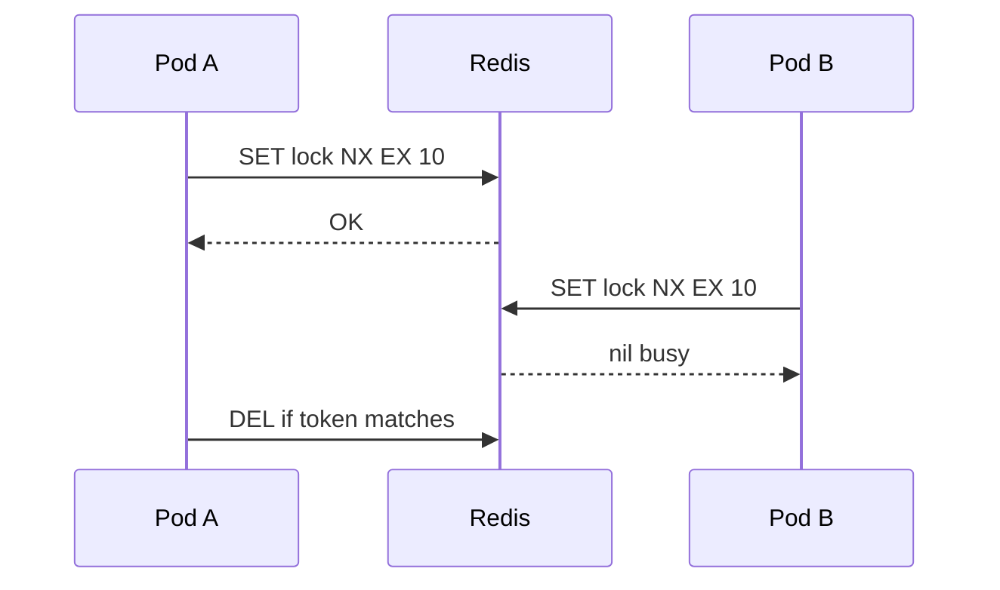

When multiple app replicas must ensure only one of them runs a critical section — cron jobs, leader election, single-flight cache fills, “only one refund for this order” across services — you need a **distributed lock**. Unlike a threading lock inside one process, this lock lives in Redis, ZooKeeper, etcd, or the database so every node sees it. Used well, it serializes danger. Used poorly, it deadlocks clusters or gives a false sense of safety while two holders run.

## Intuition

A single bathroom key at a shared office. Whoever holds the key enters; others wait. If someone pockets the key and goes home (process crash without release), you need a spare rule: keys expire (TTL) so the door is not locked forever. Distributed locks are that key with a timer and careful identity checks when unlocking.

:::key
A lock is not a transaction. Prefer database constraints and atomic updates when they solve the problem; use distributed locks for cross-process coordination you cannot express in one DB.
:::

## How it works

**Basic Redis pattern.** `SET lock_key token NX EX ttl` — set only if not exists, with expiry. Do work. Delete only if token still matches (avoid deleting someone else’s new lock after your TTL expired).

**TTL is mandatory.** Without expiry, a crashed holder blocks forever. With expiry, your critical section must finish before TTL or you must renew (lock extension) carefully — otherwise two holders overlap.

**Fencing tokens.** Safer designs return a monotonic token; storage rejects writes with older tokens so a zombie holder cannot corrupt state after losing the lock.

**Redlock debate (brief).** Multi-node Redis locking is subtle under partitions. For many product use cases, a single Redis primary + short critical sections + DB uniqueness is enough; for strong correctness, prefer DB locks or consensus systems.

**When not to use a lock.** If a unique constraint or `UPDATE … WHERE status = 'open'` already makes double-processing harmless or impossible, skip the lock — less moving parts. Locks shine for *leader-only* periodic jobs (“only one pod runs the nightly reconcile”), single-flight cache recomputation, or coordinating files in object storage where the DB cannot help.

**Keep sections tiny.** Acquire → mutate quickly → release. Do not hold a lock while calling a slow payment API; instead take the lock to claim a row (`status = processing`), release, then call the API using idempotency keys. That way a stuck HTTP call does not freeze the whole cluster’s lock.



## In code

Redis lock helper and a FastAPI-protected critical section; also a Postgres advisory lock alternative.

```python
import time
import uuid
import redis
from fastapi import FastAPI, HTTPException

app = FastAPI()
r = redis.Redis(decode_responses=True)

RELEASE_LUA = """
if redis.call("get", KEYS[1]) == ARGV[1] then
  return redis.call("del", KEYS[1])
else
  return 0
end
"""


class RedisLock:
    def __init__(self, client, name: str, ttl_seconds: int = 10):
        self.client = client
        self.name = f"lock:{name}"
        self.ttl = ttl_seconds
        self.token = str(uuid.uuid4())

    def acquire(self, wait_seconds: float = 2.0) -> bool:
        deadline = time.time() + wait_seconds
        while time.time() < deadline:
            if self.client.set(self.name, self.token, nx=True, ex=self.ttl):
                return True
            time.sleep(0.05)
        return False

    def release(self) -> None:
        self.client.eval(RELEASE_LUA, 1, self.name, self.token)


@app.post("/jobs/nightly-report")
def nightly_report():
    lock = RedisLock(r, "nightly-report", ttl_seconds=60)
    if not lock.acquire():
        raise HTTPException(409, "report already running")
    try:
        generate_report()  # keep shorter than TTL or renew
    finally:
        lock.release()
    return {"ok": True}


# Postgres advisory lock — great when DB is already in the path
async def with_pg_lock(conn, key: int):
    got = await conn.fetchval("SELECT pg_try_advisory_lock($1)", key)
    if not got:
        raise HTTPException(409, "busy")
    try:
        yield
    finally:
        await conn.execute("SELECT pg_advisory_unlock($1)", key)
```

## What goes wrong

- **Critical section longer than TTL** — second holder starts; both mutate.
- **Unlock without token check** — delete a lock you no longer own.
- **Using locks instead of idempotency** — still get duplicates under retries; combine both.
- **Holding locks during slow HTTP** — lock contention becomes your bottleneck; redesign.
- **Assuming lock = correctness under all partitions** — clocks, pauses, and split brains bite exotic setups.

:::warn
Never `DEL lock` blindly. Always compare the ownership token (Lua/transaction) before release.
:::

## One-line summary

Distributed locks coordinate who runs a critical section across replicas — always with TTL, safe release, and a preference for DB-level atomicity when possible.

## Key terms

- **Distributed lock** — mutual exclusion shared across processes/machines
- **NX / EX** — Redis set-if-not-exists with expiry
- **Lock TTL** — automatic expiry so crashed holders do not block forever
- **Fencing token** — monotonic ID that prevents zombie writers
- **Advisory lock** — application-level lock primitive in PostgreSQL
- **Critical section** — code that must not run concurrently for correctness
