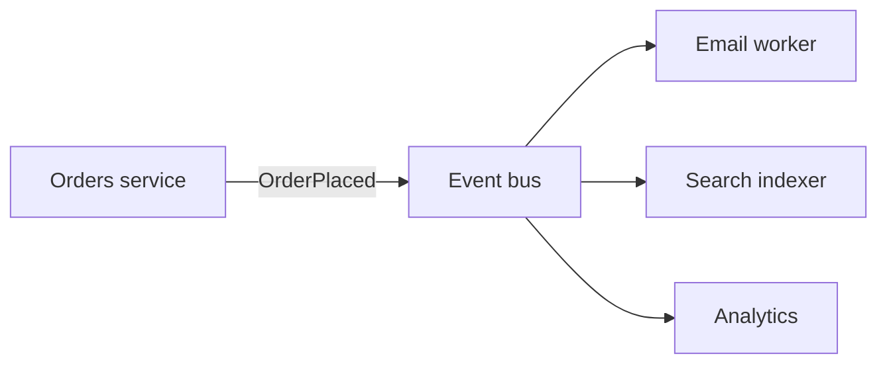

In **event-driven architecture (EDA)**, services react to **events** — facts about what happened (“OrderPlaced”, “PaymentCaptured”) — instead of calling each other for every side effect. Producers publish; many consumers can subscribe independently. That decoupling scales teams and traffic, and it shifts you into a world of eventual consistency, replay, and careful schema evolution.

## Intuition

A town loudspeaker: “Fireworks at 9.” Anyone who cares — food trucks, traffic cops, residents — reacts without the announcer knowing the full guest list. Contrast with the announcer phoning each party synchronously. EDA is the loudspeaker (plus a recording, if you use a log like Kafka): new listeners can show up tomorrow and still catch up.

:::key
Events are past-tense facts for others to react to; they are not a substitute for a clear source of truth owned by a service.
:::

## How it works

**Commands vs events.** A command (`ReserveInventory`) is a request to do work, usually aimed at one owner. An event (`InventoryReserved`) is a broadcast fact. Confusing them leads to “who is supposed to act?” ambiguity.

**Topology.** Producers → broker (Kafka topic, SNS/SQS, Rabbit exchange) → consumers. Fan-out lets notifications, analytics, and search indexers all listen to `OrderPlaced` without the order service importing their clients.



**Consistency.** The write that commits order state and the publish can diverge if you publish-after-commit without an outbox (crash window) or publish-before-commit (phantom events). **Transactional outbox** or change-data-capture (CDC) closes the gap.

**Schema evolution.** Version events; add fields optionally; avoid renaming meaning in place. Consumers must tolerate unknown fields.

**Choreography vs orchestration.** Choreography: each service listens and emits next events. Orchestration: a workflow engine/saga director tells participants what to do. Choreography is lighter; orchestration is clearer for long business processes.

**What EDA is good at.** Notifying many followers of a domain fact, smoothing write spikes into async workers, integrating new consumers without editing the producer, and rebuilding read models (search index, analytics) by replaying a log. **What it is bad at.** Request/response UX that needs an immediate authoritative answer, tightly coupled workflows where you secretly still need sync calls after every event, and teams that lack tracing — failures become “someone’s consumer is stuck” mysteries.

**Contract discipline.** Publish a schema (JSON Schema / Avro / Protobuf), document compatibility rules, and version topics or event types when breaking changes land. Consumers should ignore unknown fields so producers can add data safely. Include `event_id`, `occurred_at`, and `aggregate_id` on every payload so idempotency and ordering debates have handles.

## In code

FastAPI publishes an event after commit via outbox poller pattern (simplified with Redis stream).

```python
import json
import time
import redis
from fastapi import FastAPI

app = FastAPI()
r = redis.Redis(decode_responses=True)
STREAM = "events:orders"


@app.post("/orders")
async def create_order(user_id: int, sku: str):
    async with app.state.pool.acquire() as conn:
        async with conn.transaction():
            order_id = await conn.fetchval(
                """
                INSERT INTO orders(user_id, sku, status)
                VALUES ($1, $2, 'placed') RETURNING id
                """,
                user_id, sku,
            )
            await conn.execute(
                """
                INSERT INTO outbox(aggregate_id, event_type, payload)
                VALUES ($1, 'OrderPlaced', $2)
                """,
                order_id,
                json.dumps({"order_id": order_id, "user_id": user_id, "sku": sku}),
            )
    return {"order_id": order_id}


def outbox_relay(pool_sync_fetch_pending):
    """Background: publish pending outbox rows to the stream, then mark sent."""
    for row in pool_sync_fetch_pending():
        r.xadd(
            STREAM,
            {"type": row["event_type"], "payload": row["payload"]},
            id="*",
        )
        mark_outbox_sent(row["id"])


def email_consumer():
    last_id = "0-0"
    while True:
        msgs = r.xread({STREAM: last_id}, block=5000, count=10)
        for _, entries in msgs or []:
            for msg_id, fields in entries:
                if fields["type"] == "OrderPlaced":
                    payload = json.loads(fields["payload"])
                    send_email(payload["user_id"], f"Order {payload['order_id']}")
                last_id = msg_id
```

## What goes wrong

- **Dual writes without outbox** — DB committed, event never published (or the reverse).
- **Fat events vs chatty events** — huge payloads couple consumers to internals; tiny events force sync callbacks for details (balance carefully).
- **Unclear ownership** — multiple services “handle” the same command-like event and double-apply.
- **No idempotency** — replaying the topic doubles emails and charges.
- **Debugging spaghetti** — without correlation IDs and tracing, choreography is archaeology.

:::tip
Name events as past-tense nouns/verbs (`OrderPlaced`). If you are tempted to name `DoThing`, you probably want a command API or queue.
:::

## One-line summary

Event-driven systems publish facts so many consumers can react independently — use outbox/CDC, idempotency, and clear event contracts to stay correct.

## Key terms

- **Event** — immutable fact that something happened
- **Event bus / stream** — infrastructure that transports events to consumers
- **Fan-out** — multiple consumers receiving the same event type
- **Transactional outbox** — reliably publish by storing events with the DB write
- **Choreography** — workflow emerges from services reacting to each other’s events
- **Orchestration** — central coordinator drives multi-step workflows
