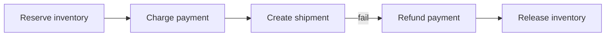

You cannot wrap “reserve inventory + charge card + create shipment” in one ACID transaction once those steps live in different services and databases. The **saga pattern** breaks a distributed business transaction into a sequence of local transactions, each with a **compensating action** if a later step fails — so the system converges to a consistent-enough outcome without 2PC across the fleet.

## Intuition

Booking a trip: reserve flight, reserve hotel, charge card. If the hotel fails, you cancel the flight and reverse the hold — you do not pretend a global undo log exists across three companies. Each step is real and committed; compensation is an explicit reverse business action, not a DB `ROLLBACK` across services.

:::key
Sagas trade atomicity for explicit compensations and eventual consistency — every step must be idempotent, including the undo.
:::

## How it works

**Happy path.** T1 → T2 → T3 each commit locally and emit progress.

**Failure.** T3 fails → run C2 then C1 (compensations) to undo prior effects.



**Choreography saga.** Each service listens for events and emits the next. Lightweight; can become a hard-to-see web of reactions.

**Orchestration saga.** A coordinator (workflow worker) tells participants `Reserve`, `Charge`, `Ship`, and triggers compensations. Easier to observe and test; coordinator must be highly available and idempotent.

**What compensation is not.** It may not return you to the exact prior state (a sent email cannot be unsent — send an apology). Model business reality.

**Idempotency.** Retries will re-enter steps. Keys like `saga_id + step` prevent double charges and double refunds.

**Time and state.** Sagas often run for seconds to days (waiting on human approval or a slow 3PL). Persist saga state explicitly: current step, completed steps, and deadlines. Time out reservations (“hold inventory 15 minutes”) so a stuck saga cannot warehouse-lock forever. Expose status to the API (`pending_payment`, `compensating`, `failed`) so clients and support tools are not guessing.

**Compared with 2PC.** Two-phase commit tries to keep a global atomic commit across resources; it couples availability (all participants must be up) and is rarely used across microservices. Sagas accept intermediate states visible to users and optimize for autonomy. If you truly need single-DB atomicity, keep those tables in one service and one transaction — do not invent a saga for a problem a monolith module still owns cleanly.

## In code

Orchestrated saga sketch with FastAPI + Redis queue for steps (teaching model).

```python
import json
import redis
from enum import Enum
from fastapi import FastAPI

app = FastAPI()
r = redis.Redis(decode_responses=True)


class Step(str, Enum):
    RESERVE = "reserve"
    CHARGE = "charge"
    SHIP = "ship"
    DONE = "done"
    COMPENSATE = "compensate"


@app.post("/checkout")
def start_checkout(order_id: str, amount_cents: int, sku: str):
    state = {
        "order_id": order_id,
        "amount_cents": amount_cents,
        "sku": sku,
        "step": Step.RESERVE,
        "done": [],
    }
    r.set(f"saga:{order_id}", json.dumps(state))
    r.lpush("queue:saga", order_id)
    return {"saga": order_id}


def run_step(order_id: str) -> None:
    state = json.loads(r.get(f"saga:{order_id}"))
    step = state["step"]
    try:
        if step == Step.RESERVE:
            reserve_inventory(state["sku"], idem_key=f"{order_id}:reserve")
            state["done"].append("reserve")
            state["step"] = Step.CHARGE
        elif step == Step.CHARGE:
            charge(state["amount_cents"], idem_key=f"{order_id}:charge")
            state["done"].append("charge")
            state["step"] = Step.SHIP
        elif step == Step.SHIP:
            create_shipment(state["order_id"], idem_key=f"{order_id}:ship")
            state["step"] = Step.DONE
        elif step == Step.COMPENSATE:
            compensate(state)
            state["step"] = Step.DONE
    except Exception:
        state["step"] = Step.COMPENSATE
    r.set(f"saga:{order_id}", json.dumps(state))
    if state["step"] != Step.DONE:
        r.lpush("queue:saga", order_id)


def compensate(state: dict) -> None:
    # reverse in opposite order; each compensation idempotent
    if "charge" in state["done"]:
        refund(state["amount_cents"], idem_key=f"{state['order_id']}:refund")
    if "reserve" in state["done"]:
        release_inventory(state["sku"], idem_key=f"{state['order_id']}:release")
```

## What goes wrong

- **Non-idempotent compensations** — double refunds on retry.
- **Missing compensation** — payment captured, inventory reserved forever.
- **Long-lived locks across saga steps** — hold inventory for minutes without timeouts; stock starvation.
- **Choreography spaghetti** — nobody can draw the full graph; incidents drag.
- **Assuming immediate consistency** — UI must handle “payment pending” intermediate states.

:::tip
Write the failure story first: for each step, name the compensation and the idempotency key before coding the happy path.
:::

## One-line summary

Sagas sequence local transactions with compensations so multi-service workflows can succeed or unwind without distributed ACID.

## Key terms

- **Saga** — sequence of local transactions with compensations for rollback
- **Compensation** — business action that undoes a prior local transaction
- **Orchestration** — central coordinator drives saga steps
- **Choreography** — saga progresses via peer event reactions
- **Eventual consistency** — state converges over time after steps/compensations
- **Idempotency key** — ensures step/compensation applies once under retries
