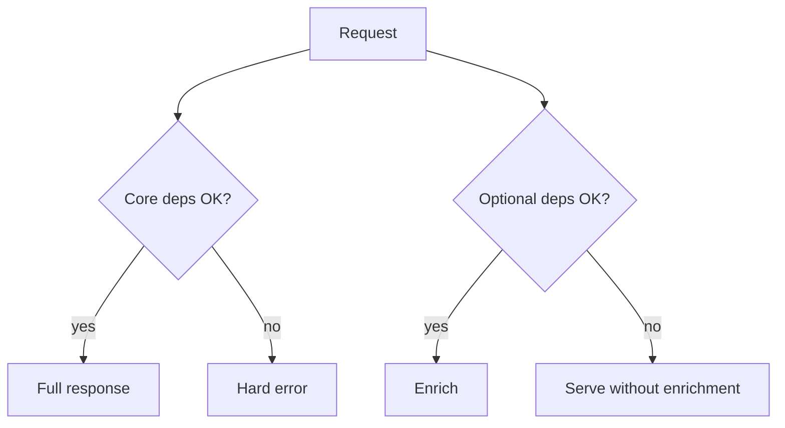

When recommendations are down, users should still check out. **Graceful degradation** means the system sheds non-critical features and returns a useful subset of behavior under partial failure or overload — instead of a total red screen. It is product design as much as infrastructure: you decide what “good enough” looks like when dependencies burn.

## Intuition

A storm knocks out the elevator; the stairs still work. Closing the whole building because the elevator failed would be ungraceful. In APIs: if the personalization service times out, serve a cached popular list; if search is sick, allow browsing by category; if payments are down, let users save a cart and pay later — if the business allows it.

:::key
Degrade on purpose along prepared paths; do not wait for cascading timeouts to invent a UX at runtime.
:::

## How it works

**Critical vs optional.** Map dependencies: auth + catalog + cart + pay might be critical; recommendations, social proof, analytics, fancy search ranking are optional.

**Techniques.**

| Technique | Behavior under failure |
| --- | --- |
| Fallbacks | Cached/default content when live service fails |
| Feature flags | Turn off expensive features quickly |
| Partial responses | Return core fields; omit enrichment |
| Read-only mode | Disable writes when DB primary is unhealthy |
| Queue shedding | Drop/ defer low-priority jobs |
| Capacity shed | 503 with Retry-After on overload |



**Fail open vs fail closed.** For recommendations, fail open (show something). For authorization, fail closed (deny). Choosing wrong is a security or availability bug.

**SLOs drive choices.** Protect the checkout error budget; sacrifice the “similar items” widget first.

**Design the degraded UX.** Users tolerate a missing widget; they do not tolerate a spinner that dies into a blank page. Return 200 with partial payload and a `degraded: true` flag, or show a static banner (“recommendations temporarily unavailable”). For overload, prefer explicit `503` + `Retry-After` on non-critical routes over silently queueing forever. Document which features are shed first in a runbook so on-call is not inventing policy under pages.

**Dependency timeout discipline.** Optional calls get aggressive timeouts (hundreds of ms). Critical calls get budgets aligned with the user-facing SLO. Mixing them — waiting 3 seconds for a “nice to have” — turns optional into accidental critical and defeats degradation.

## In code

FastAPI endpoint that soft-fails recommendations and falls back to a Redis cache / static list.

```python
import json
import httpx
import redis
from fastapi import FastAPI

app = FastAPI()
r = redis.Redis(decode_responses=True)


async def fetch_recommendations(user_id: int) -> list[dict]:
    try:
        async with httpx.AsyncClient(timeout=0.4) as client:
            resp = await client.get(f"http://recs:8005/for/{user_id}")
            resp.raise_for_status()
            return resp.json()
    except Exception:
        cached = r.get("recs:global_popular")
        if cached:
            return json.loads(cached)
        return [{"sku": "tee-1", "reason": "fallback"}]  # last resort


@app.get("/home/{user_id}")
async def home(user_id: int):
    products = await load_products()  # critical — let exceptions surface
    recs = await fetch_recommendations(user_id)  # optional — never fails the page
    return {
        "products": products,
        "recommendations": recs,
        "recommendations_degraded": recs[0].get("reason") == "fallback" or True,
    }


@app.middleware("http")
async def shed_load(request, call_next):
    # Toy: if overload flag set, reject non-critical paths
    if r.get("shed:mode") == "1" and request.url.path.startswith("/recs"):
        from fastapi.responses import JSONResponse
        return JSONResponse({"error": "shed"}, status_code=503, headers={"Retry-After": "5"})
    return await call_next(request)
```

## What goes wrong

- **Silent wrong data** — fallback looks real; users trust a stale price. Label degradation in UI/metrics when it matters.
- **Failing open on authz** — availability win, security loss.
- **No rehearsal** — first degradation path is discovered in an incident.
- **Degrading the wrong thing** — killing checkout to save a dashboard.
- **Infinite fallback chains** — each fallback slower than the last; still times out.

:::tip
Add a metric `degraded_responses_total{feature=...}` so you see how often users get the stairs instead of the elevator.
:::

## One-line summary

Graceful degradation keeps core journeys alive by failing optional parts safely with planned fallbacks, flags, and load shedding.

## Key terms

- **Graceful degradation** — reduced but useful behavior under failure/load
- **Fallback** — alternate data or path when the primary fails
- **Fail open / fail closed** — allow vs deny when a check cannot complete
- **Feature flag** — runtime switch to disable functionality
- **Load shedding** — deliberately rejecting work to protect the core
- **Read-only mode** — serving reads while blocking mutating operations
