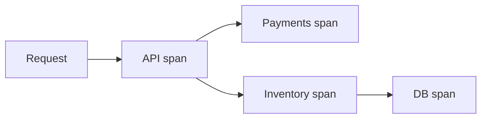

You cannot fix what you cannot see. **Observability** is the ability to ask new questions about a running system from its external outputs — chiefly **logs**, **metrics**, and **traces**. Monitoring tells you something is wrong; observability helps you explain why, across dozens of services and a spike that started six minutes ago.

## Intuition

A car dashboard (metrics) shows speed and temperature. The black box / trip computer (logs) records discrete events. A full GPS trail (traces) shows the path through every road segment. You want all three: dashboards for SLOs, logs for details, traces for “where did the 2 seconds go?”

:::key
Instrument golden signals and correlation IDs from day one — bolting observability on during an outage is too late.
:::

## How it works

**Metrics.** Numeric time series: RPS, latency histograms, error rate, saturation (CPU, queue depth). Cheap to aggregate; great for alerts (`p99 > 500ms for 5m`). Use RED (Rate, Errors, Duration) for services and USE (Utilization, Saturation, Errors) for resources.

**Logs.** Structured events (`json`): request_id, user_id, error stack. High cardinality detail. Avoid logging secrets. Sample or rate-limit hot paths.

**Traces.** A request becomes a **trace** of **spans** across services. Shows that checkout was slow because `inventory` waited on DB. Needs context propagation (`traceparent` / middleware).



**Correlation.** Put `request_id` / `trace_id` in logs and responses. Otherwise three systems tell three unrelated stories.

**SLIs / SLOs.** e.g. 99.9% of checkouts succeed in < 1s. Alerts on SLO burn, not on every CPU blip.

**What to instrument first.** For each externally facing route: request rate, error rate, latency histogram. For each dependency (DB, Redis, HTTP): pool wait time, timeout count, circuit-open count. For each queue: depth and consumer lag. That small set diagnoses most production pages without boiling the ocean. Add business SLIs next — checkout success, payment capture rate — so you notice “HTTP 200 but money broken.”

**Privacy and cost.** Scrub tokens, passwords, and PII from logs. Sample traces (e.g. 1–10% of success paths, 100% of errors). Metrics should use bounded label sets (`route`, `status_class`) rather than raw user IDs. Observability that bankrupts the logging bill will be turned off right when you need it.

## In code

Structured logging, simple metrics counters, and trace-ish middleware in FastAPI.

```python
import logging
import time
import uuid
from collections import defaultdict
from fastapi import FastAPI, Request

app = FastAPI()
logging.basicConfig(level=logging.INFO)
log = logging.getLogger("api")

# toy in-process metrics (use Prometheus client in production)
METRICS = defaultdict(float)


@app.middleware("http")
async def observability(request: Request, call_next):
    request_id = request.headers.get("x-request-id", str(uuid.uuid4()))
    start = time.perf_counter()
    response = None
    try:
        response = await call_next(request)
        return response
    finally:
        dur_ms = (time.perf_counter() - start) * 1000
        status = response.status_code if response else 500
        METRICS["requests_total"] += 1
        METRICS[f"status_{status}"] += 1
        METRICS["latency_ms_sum"] += dur_ms
        log.info(
            "request_done",
            extra={
                "request_id": request_id,
                "path": request.url.path,
                "status": status,
                "dur_ms": round(dur_ms, 2),
            },
        )
        if response is not None:
            response.headers["x-request-id"] = request_id


@app.get("/health/metrics")
def metrics_dump():
    return dict(METRICS)


@app.get("/items/{item_id}")
def get_item(item_id: int):
    # Child "span": time a dependency
    t0 = time.perf_counter()
    item = load_item(item_id)
    METRICS["db_ms_sum"] += (time.perf_counter() - t0) * 1000
    return item
```

Prometheus-style (production sketch):

```python
# from prometheus_client import Counter, Histogram
# REQUESTS = Counter("http_requests_total", "", ["path", "code"])
# LATENCY = Histogram("http_request_duration_seconds", "", ["path"])
```

## What goes wrong

- **Logs as a junk drawer** — unstructured strings, no IDs, cannot query.
- **High-cardinality labels** — user_id on every Prometheus metric explodes memory.
- **Alert fatigue** — paging on noisy thresholds; people ignore real pages.
- **Tracing without sampling strategy** — either blind or bankrupt on volume.
- **No RED for each dependency** — you see API slow, not which hop.

:::tip
Ship `x-request-id` from the edge through every service call and into every log line for that request.
:::

## One-line summary

Observability combines metrics, logs, and traces with correlation IDs so you can diagnose failures and latency across distributed systems.

## Key terms

- **Observability** — ability to infer internal state from outputs
- **Metric** — aggregated numeric time series for monitoring/alerting
- **Log** — discrete structured event record
- **Trace / span** — end-to-end request path broken into timed units
- **SLI / SLO** — indicator and objective for service reliability
- **Cardinality** — number of unique label combinations on a metric
