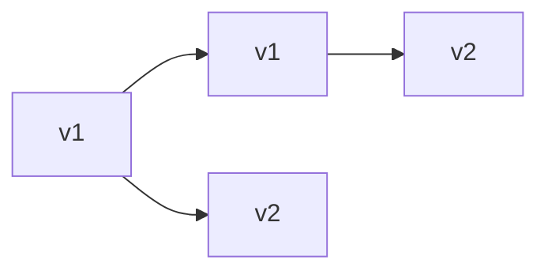

Shipping code is a reliability event. A bad deploy can outage you faster than any traffic spike. **Deployment strategies** — rolling, blue-green, canary — control how new versions replace old ones, how much blast radius you accept, and how quickly you can roll back when the error rate climbs.

## Intuition

Renovating a store while customers shop. **Rolling**: replace one checkout lane at a time. **Blue-green**: build a second store next door, then flip the sign. **Canary**: let a few customers into the new store first. All beat “close the building, hope the new layout works.”

:::key
Prefer small, reversible deploys with health checks and automatic rollback triggers over rare big-bang releases.
:::

## How it works

**Rolling deployment.** Gradually replace instances: N pods, update k at a time. Needs backward/forward compatibility while mixed versions run (APIs, DB migrations).



**Blue-green.** Two full environments. Green (new) warms up; switch load balancer from blue → green. Rollback = switch back. Cost: roughly 2× capacity during cutover. DB migrations still need care (both may touch data).

**Canary.** Send 1–5% of traffic to the new version; compare error/latency; ramp up. Best signal-to-risk ratio when you have good metrics.

**DB migrations.** Expand/contract pattern: deploy code that reads old+new → migrate data → deploy code that writes new → remove old. Never expand and contract in one scary step if you need zero downtime.

**Health and readiness.** Liveness ≠ readiness. Ready means “can take traffic” (deps up). Only ready instances enter the LB pool. Connection draining finishes in-flight requests before kill.

**Feature flags as deploy armor.** Ship dark code behind a flag, deploy widely while still serving old behavior, then flip the flag for 1% of users. If metrics tank, flip off without redeploying binaries — faster than baking a new image. Flags do not replace canaries, but they shrink the window where a bad code path is unavoidable.

**Rollback is a feature.** Practice it. Keep the previous artifact one click away. Prefer forward-fix only when you have truly irreversible data changes — and even then, write a compensating migration beforehand. The best deploy strategy still fails without a cultural habit of stopping the line when error budgets burn.

## In code

Readiness endpoint and a tiny feature-flag canary in FastAPI; rolling is mostly orchestrator config.

```python
import os
import redis
from fastapi import FastAPI, Request

app = FastAPI()
r = redis.Redis(decode_responses=True)
VERSION = os.getenv("APP_VERSION", "v1")
READY = True  # set False during draining if you control it


@app.get("/healthz")
def liveness():
    return {"status": "alive", "version": VERSION}


@app.get("/readyz")
def readiness():
    # fail readiness if critical dep is down → LB stops new traffic
    try:
        r.ping()
    except Exception:
        return {"status": "not ready"}, 503
    if not READY:
        return {"status": "draining"}, 503
    return {"status": "ready", "version": VERSION}


@app.get("/api/experience")
def experience(request: Request):
    # Canary by header or % of users
    force = request.headers.get("x-canary")
    user = request.headers.get("x-user-id", "0")
    use_new = force == "1" or (int(user) % 100) < int(r.get("canary_percent") or 0)
    if use_new:
        return {"template": "new_checkout", "version": VERSION}
    return {"template": "classic_checkout", "version": VERSION}
```

Kubernetes-shaped rolling (sketch):

```yaml
# rollingUpdate: maxUnavailable: 1, maxSurge: 1
# readinessProbe: httpGet path: /readyz
```

Blue-green switch is an LB/target-group change once green `/readyz` passes.

## What goes wrong

- **Incompatible mixed versions** — v2 writes fields v1 cannot read; rolling bricks half the fleet.
- **Migrating DB destructively first** — drop column before code stops reading it.
- **No readiness probe** — LB hits pods still connecting to the DB.
- **Canary without metrics** — you ramp a broken build because nobody compared error rates.
- **Manual-only rollback** — people freeze; automated rollback on SLO burn saves nights.

:::warn
Treat migrations as product code: review them, stage them, and never “fix forward only” without a tested escape hatch.
:::

## One-line summary

Rolling, blue-green, and canary deploys limit blast radius — pair them with readiness probes, compatible migrations, and fast rollback.

## Key terms

- **Rolling deploy** — gradually replace instances with the new version
- **Blue-green** — two environments; switch traffic at the balancer
- **Canary** — expose a small traffic fraction before full rollout
- **Readiness probe** — check that an instance may receive traffic
- **Drain / connection draining** — finish in-flight work before shutdown
- **Expand/contract migration** — compatible multi-step schema evolution
