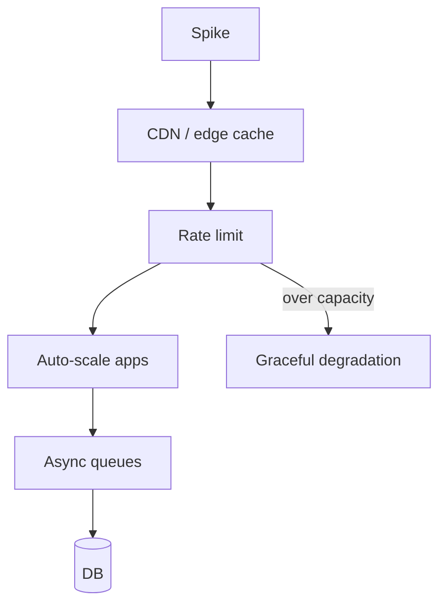

A launch email, a celebrity share, or a bot scrape can multiply traffic in minutes. **Traffic spikes** punish every weak assumption: sticky in-memory sessions, chatty DB queries, missing caches, sync email on the request path. Handling viral load is layered defense — absorb, limit, scale, queue, and degrade — practiced before the spike, not invented during it.

## Intuition

A stadium emptying onto one subway entrance. You need wider gates (scale), crowd control (rate limits), overflow holding areas (queues), and signs that say “use exit B” (CDN/cache). Closing the stadium because the entrance is jammed is the ungraceful failure mode your competitors will screenshot.

:::key
Stateless app tiers + caching + queues + rate limits beat heroically oversized single servers when fame arrives.
:::

## How it works

**Defense in depth.**



1. **CDN / edge** — serve static and cacheable GETs near users; origin barely sees them.
2. **Rate limiting / throttling** — fair share per IP/user/API key; `429` + `Retry-After`.
3. **Horizontal auto-scale** — add app replicas on RPS/CPU; warm pools if cold starts hurt.
4. **Cache hot keys** — product pages, config; protect DB from read storms.
5. **Queue non-critical work** — email, webhooks, thumbnails off the request path.
6. **Shed / degrade** — disable recommendations; read-only mode; return cached home.
7. **Protect the DB** — connection pools, statement timeouts, read replicas for heavy reads; avoid thundering migrations during launch windows.

**Load testing.** Replay expected peak (and 2×) with realistic cache hit rates. Include dependency latency. A test that only hits `/healthz` lies.

**Bot vs human.** Spikes may be scrapers. WAF rules, auth on expensive endpoints, and cheaper public caches help.

**Capacity planning vs elasticity.** Auto-scale helps, but cold starts, image pulls, and DB connection ramp take time. For known events (product launch at 09:00), pre-scale app replicas and warm caches an hour ahead; do not rely on reactive scale alone. Cap max replicas so a runaway scraper cannot create a bigger bill than an outage — combine with rate limits so scale and limits work together.

**Dependency budgets under spike.** Even if the API scales, Stripe, email, or a legacy SOAP service may not. Put those behind queues and circuit breakers so your user-facing tier returns quickly while workers absorb the surge at a sustainable rate. Measure queue lag as a first-class SLO during launches.

## In code

Token-bucket style rate limit in Redis, FastAPI middleware, and enqueue for async work during spikes.

```python
import time
import json
import redis
from fastapi import FastAPI, Request, HTTPException
from fastapi.responses import JSONResponse

app = FastAPI()
r = redis.Redis(decode_responses=True)


def allow_request(key: str, limit: int = 60, window_seconds: int = 60) -> bool:
    """Fixed window counter (simple). Prefer token bucket in production libs."""
    bucket = f"rl:{key}:{int(time.time()) // window_seconds}"
    n = r.incr(bucket)
    if n == 1:
        r.expire(bucket, window_seconds)
    return n <= limit


@app.middleware("http")
async def rate_limit(request: Request, call_next):
    client = request.client.host if request.client else "unknown"
    if not allow_request(client, limit=100, window_seconds=60):
        return JSONResponse(
            {"error": "rate limit"},
            status_code=429,
            headers={"Retry-After": "60"},
        )
    return await call_next(request)


@app.get("/products/{product_id}")
async def product(product_id: int):
    cache_key = f"product:{product_id}"
    if cached := r.get(cache_key):
        return json.loads(cached)
    row = await load_product(product_id)  # DB
    r.setex(cache_key, 30, json.dumps(row))  # short TTL under spike is OK
    return row


@app.post("/orders")
async def create_order(order_id: str, email: str):
    await save_order(order_id)  # critical path only
    r.lpush("queue:email", json.dumps({"order_id": order_id, "email": email}))
    return {"status": "accepted"}  # 202 semantics for heavy follow-up work
```

Auto-scale is platform config (CPU > 60% → +replicas); pair it with connection pool limits so scaled apps do not drown Postgres.

## What goes wrong

- **Scaling apps into an unscaled DB** — 50 pods × 20 connections = connection storm.
- **Cache stampede on popular keys** — use single-flight + TTL jitter (caching chapter).
- **Sync fan-out on write** — each order triggers 10 outbound HTTP calls inline.
- **No rate limits on expensive search** — one script takes you down.
- **Launch without load tests** — theoretical capacity ≠ measured capacity.

:::tip
Before a marketing launch: freeze risky migrations, pre-warm caches, raise rate-limit headroom for known partners, and staff an on-call war room with dashboards open.
:::

## One-line summary

Survive spikes by caching and shedding at the edge, rate-limiting fairly, scaling out stateless apps, queueing non-critical work, and protecting the database on purpose.

## Key terms

- **Traffic spike / viral load** — sudden large increase in requests
- **Rate limiting** — capping request rate per client/key
- **Auto-scaling** — adding/removing replicas from load signals
- **Load shedding** — dropping or deferring work to protect core paths
- **Backpressure** — slowing producers when consumers cannot keep up
- **Connection pool** — bounded set of DB connections per process/fleet
