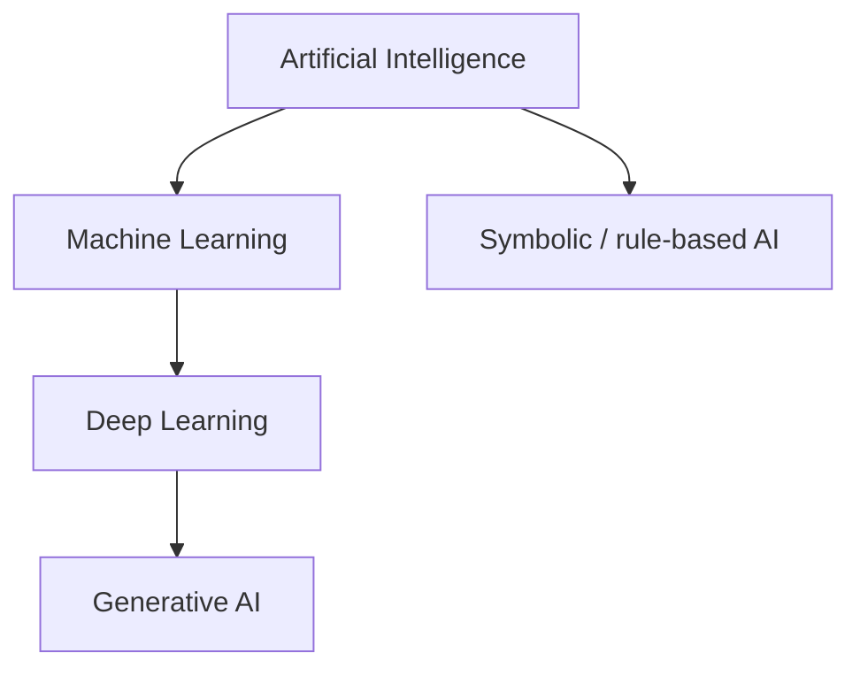

AI is the practice of building machines that pursue goals in complex environments — recognizing speech, routing packages, diagnosing images, writing code — without a human hand-coding every decision. Everything else in this track (ML, deep learning, GenAI) is a *way* of doing AI, not a separate universe. Getting the definition right early saves you from architecture debates that talk past each other (“Is ChatGPT AI?” vs “Is a rule engine AI?” — both can be, in different senses).

## Intuition

Imagine hiring an intern for customer support. One intern gets a thick binder of if-then rules: “If the user says refund and order age < 30 days, then approve.” Another intern watches a thousand past tickets and learns patterns. Both can look “smart.” The first is classical, rule-driven AI. The second is data-driven AI (machine learning). The field of AI includes both — and hybrids that use rules for policy and models for perception.

A useful mental model from Russell & Norvig: treat the system as a **rational agent**. An agent receives *observations*, chooses *actions*, and is judged by how well those actions advance a goal (utility, reward, loss). You do not need the agent to “think like a human”; you need it to act effectively under uncertainty. A warehouse robot that docks correctly is intelligent for its job even if it never passes a dinner-party conversation test.

:::key
AI is goal-directed behavior under uncertainty — not magic consciousness, and not only chatbots.
:::

## How it works

**Definition.** Artificial Intelligence is the science and engineering of systems that perform tasks that typically require intelligence: perception, language, planning, prediction, and decision-making. “Intelligence” here is operational — measured by task success — not a claim about subjective experience.

**Turing test (briefly).** In 1950 Alan Turing asked whether a machine could imitate a human well enough in text conversation that a judge cannot tell them apart. Passing that test is a *behavioral* bar for “acting humanly.” It is historically important, but it is a narrow yardstick: a system can fail the Turing test and still be extremely useful (a chess engine, a fraud detector), or pass conversationally and still lack reliable world knowledge. Modern chatbots blur the line because language fluency is now cheap; usefulness still depends on grounding, tools, and evaluation.

**Four classic framings** (human-like vs rational x thinking vs acting):

- Think humanly — model human cognition.
- Act humanly — behave like a person (Turing-style).
- Think rationally — formal logic and sound inference.
- Act rationally — choose actions that maximize expected success.

Most production systems aim at **acting rationally**: minimize error, maximize reward, meet SLAs. Mimicking human quirks is rarely the objective unless you are studying cognition itself.

**GOFAI -> modern ML.** Early AI (often called Good Old-Fashioned AI, or symbolic AI) encoded knowledge as symbols and rules: logic programs, expert systems, search over game trees. That worked for crisply defined domains (checkers, medical rule sets) and failed when the world was noisy, high-dimensional, or poorly formalized (vision, speech, open-ended language). Hand-writing features for every lighting condition or slang phrase does not scale.

**AI winters (briefly).** When expectations outran results — brittle expert systems, combinatorial explosion in search, overhyped timelines — funding and interest collapsed in cycles often called AI winters (notably mid-1970s and late 1980s). The field recovered as compute grew, data became abundant, and statistical learning methods started winning benchmarks. The lesson for builders: demo-friendly stories without a path to messy production data recreate winter dynamics inside a company.

**Where GenAI sits.** Generative AI is a *subset* of AI: models that sample new content (text, images, audio, code) from learned distributions. GenAI systems are usually built with deep learning, which is a subset of machine learning, which is a subset of AI. Plenty of valuable AI is *not* generative: ranking ads, detecting fraud, forecasting demand.



## In code

Contrast a hardcoded rule with a tiny “learned” decision from examples. No libraries required.

```python
# Hardcoded rules: behavior is whatever we wrote.
def is_spam_rules(subject: str) -> bool:
    banned = ("free money", "wire now", "lottery winner")
    s = subject.lower()
    return any(phrase in s for phrase in banned)


# Learning from examples: store labeled subjects, classify by nearest match.
# (Toy nearest-neighbor on word overlap — not production ML.)
TRAIN = [
    ("win a free lottery now", True),
    ("wire money to claim prize", True),
    ("team standup notes", False),
    ("invoice for March hosting", False),
]


def tokens(text: str) -> set[str]:
    return set(text.lower().split())


def is_spam_learned(subject: str) -> bool:
    q = tokens(subject)
    best_label, best_score = False, -1.0
    for text, label in TRAIN:
        score = len(q & tokens(text)) / max(1, len(q | tokens(text)))
        if score > best_score:
            best_score, best_label = score, label
    return best_label


print(is_spam_rules("Claim FREE MONEY today"))   # True
print(is_spam_learned("lottery prize claim"))    # True (from examples)
print(is_spam_learned("hosting invoice draft"))  # False
```

The rule version is transparent and cheap — until a new scam phrasing appears. The example-based version adapts when you add more labeled tickets, but it can fail on unfamiliar wording and needs data hygiene. Real systems often combine both: learned detectors plus hard policy rules (“never auto-refund above $X”).

## What goes wrong

- **Anthropomorphism.** Fluency != understanding. Agents that sound confident can still be wrong.
- **Brittle rules.** Symbolic systems break outside the scenarios their authors imagined.
- **Narrow metrics.** Optimizing one score (accuracy, engagement) can hurt fairness, safety, or long-term trust.
- **Hype cycles.** Overpromising recreates winter dynamics: disappointment after demos that do not survive messy production data.
- **Scope confusion.** Calling every automation “AI” muddies architecture reviews — a cron job with thresholds is not the same as a learned model.
- **Missing feedback loops.** Intelligence in deployment needs monitoring: drift, failures, and human overrides — not only a launch demo.

:::tip
When someone says “we use AI,” ask: Is it rules, classical ML, deep learning, or generative models — and what is the objective function?
:::

## One-line summary

AI builds goal-seeking systems; GenAI is one modern, generative branch inside the broader AI -> ML -> DL stack.

## Key terms

- **Artificial Intelligence (AI)** — field of building systems that perform intelligent tasks under uncertainty
- **Rational agent** — entity that chooses actions to maximize expected success given observations
- **Turing test** — conversational imitation benchmark for “acting humanly”
- **GOFAI / symbolic AI** — intelligence via hand-coded symbols, logic, and rules
- **Expert system** — knowledge base plus inference engine for a narrow domain
- **AI winter** — period of reduced funding/interest after overhyped methods stalled
- **Machine learning** — AI approach that improves behavior from data rather than fixed rules alone
- **Generative AI** — AI that samples new content from a learned distribution
