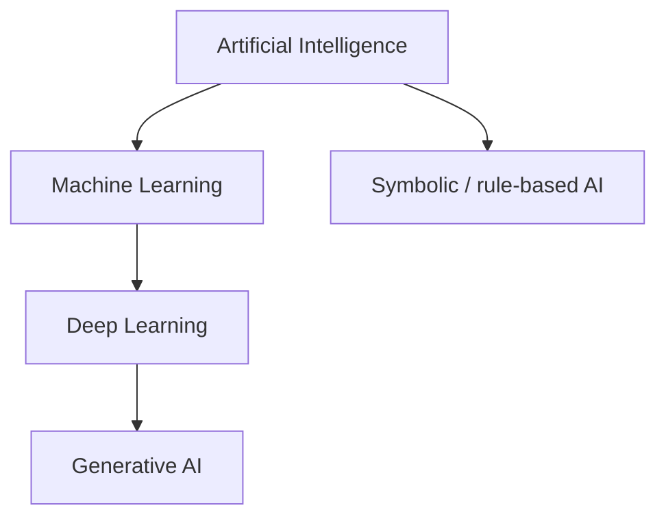

Artificial Intelligence (AI) is the field of building machines that can do tasks that usually need human intelligence — like reading, deciding, or planning. Researchers started AI to ask a simple question: can a machine act smart enough to be useful?

- AI is about **goal-directed behavior**, not about making a machine "feel" human.
- Early AI used **hand-written rules**; modern AI often **learns from data**.
- The **Turing Test** checks if a machine can chat well enough to fool a human judge.
- **Generative AI (GenAI)** is one branch of AI that creates new content — not the whole field.

## Intuition

Picture two interns for customer support. One gets a thick binder of if-then rules: "If the user says refund and the order is under 30 days, approve it." The other watches thousands of past tickets and picks up patterns. Both can look smart. The first is **classical, rule-based AI**. The second is **data-driven AI** (machine learning). AI includes both — and mixes of the two.

A helpful mental model: treat the system as a **rational agent**. An agent gets **observations**, picks **actions**, and is judged by how well those actions reach a goal. You do not need the agent to "think like a human." A warehouse robot that docks correctly is intelligent for its job, even if it would fail a dinner-party chat test.

:::key
AI is goal-directed behavior under uncertainty — not magic consciousness, and not only chatbots.
:::

## How it works

**What AI means.** Artificial Intelligence is the science and engineering of systems that handle tasks like perception, language, planning, prediction, and decision-making. "Intelligence" here means **task success** — not a claim about feelings or consciousness.

**The Turing Test.** In 1950, Alan Turing asked: can a machine chat in text so well that a human judge cannot tell it from a real person? Early systems like **ELIZA** could sound smart for short chats, even though they did not truly understand language. Passing the test is a **behavioral** bar for "acting humanly." It is historically important, but narrow: a chess engine can be very useful without passing it, and a chatty bot can pass conversationally and still be wrong about facts.

**Four classic ways to frame AI:**

| Plain-English idea | When to use it |
| --- | --- |
| Think humanly — model human cognition | Studying how minds work |
| Act humanly — behave like a person (Turing-style) | Conversational benchmarks |
| Think rationally — formal logic and sound inference | Symbolic reasoning systems |
| Act rationally — pick actions that maximize success | Most production systems |

Most real systems aim at **acting rationally**: minimize error, maximize reward, meet service targets.

**Classical AI (Good Old-Fashioned AI, GOFAI).** Early AI encoded knowledge as symbols and rules: logic programs, **expert systems**, and search over game trees. Example: **MYCIN**, a medical expert system, used rules like "if symptoms match a pattern, suggest a likely diagnosis." That worked for crisp, well-defined domains (checkers, narrow medical rules) and struggled when the world was noisy or high-dimensional (vision, speech, open-ended language).

**AI winters.** When hype outran results — brittle expert systems, search that blew up in size, overpromised timelines — funding and interest dropped in cycles called **AI winters** (notably mid-1970s and late 1980s). The field recovered as compute grew, data became abundant, and statistical learning started winning benchmarks. Lesson for builders: demos without a path to messy production data can recreate winter dynamics inside a company.

**Where GenAI sits.** Generative AI is a **subset** of AI: models that create new content (text, images, audio, code) from learned patterns. GenAI is usually built with deep learning, which sits inside machine learning, which sits inside AI. Plenty of valuable AI is **not** generative: ranking ads, detecting fraud, forecasting demand.



## In code

Here is a contrast between a hardcoded rule and a tiny "learned" decision from examples. No libraries needed.

```python
# Hardcoded rules: behavior is whatever we wrote.
def is_spam_rules(subject: str) -> bool:
    banned = ("free money", "wire now", "lottery winner")
    s = subject.lower()
    return any(phrase in s for phrase in banned)


# Learning from examples: store labeled subjects, classify by nearest match.
# (Toy nearest-neighbor on word overlap — not production ML.)
TRAIN = [
    ("win a free lottery now", True),
    ("wire money to claim prize", True),
    ("team standup notes", False),
    ("invoice for March hosting", False),
]


def tokens(text: str) -> set[str]:
    return set(text.lower().split())


def is_spam_learned(subject: str) -> bool:
    q = tokens(subject)
    best_label, best_score = False, -1.0
    for text, label in TRAIN:
        score = len(q & tokens(text)) / max(1, len(q | tokens(text)))
        if score > best_score:
            best_score, best_label = score, label
    return best_label


print(is_spam_rules("Claim FREE MONEY today"))   # True
print(is_spam_learned("lottery prize claim"))    # True (from examples)
print(is_spam_learned("hosting invoice draft"))  # False
```

The rule version is clear and cheap — until a new scam phrase appears. The example-based version adapts when you add more labeled tickets, but it can fail on unfamiliar wording. Real systems often combine both: learned detectors plus hard policy rules ("never auto-refund above $X").

## What goes wrong

- **Anthropomorphism.** Fluent speech does not equal understanding. Confident-sounding agents can still be wrong.
- **Brittle rules.** Symbolic systems break outside the scenarios their authors imagined.
- **Narrow metrics.** Optimizing one score (accuracy, engagement) can hurt fairness, safety, or long-term trust.
- **Hype cycles.** Overpromising recreates winter dynamics: disappointment after demos that do not survive messy production data.
- **Scope confusion.** Calling every automation "AI" muddies architecture reviews — a cron job with thresholds is not the same as a learned model.
- **Missing feedback loops.** Intelligence in deployment needs monitoring: drift, failures, and human overrides — not only a launch demo.

:::tip
When someone says "we use AI," ask: Is it rules, classical machine learning, deep learning, or generative models — and what is the objective?
:::

## One-line summary

AI builds goal-seeking systems; GenAI is one modern, generative branch inside the broader AI -> ML -> DL stack.

## Key terms

- **Artificial Intelligence (AI)** — field of building systems that perform intelligent tasks under uncertainty
- **Rational agent** — entity that chooses actions to maximize expected success given observations
- **Turing test** — conversational imitation benchmark for "acting humanly"
- **GOFAI / symbolic AI** — intelligence via hand-coded symbols, logic, and rules
- **Expert system** — knowledge base plus inference engine for a narrow domain
- **AI winter** — period of reduced funding or interest after overhyped methods stalled
- **Machine learning (ML)** — AI approach that improves behavior from data rather than fixed rules alone
- **Generative AI (GenAI)** — AI that creates new content from a learned distribution
