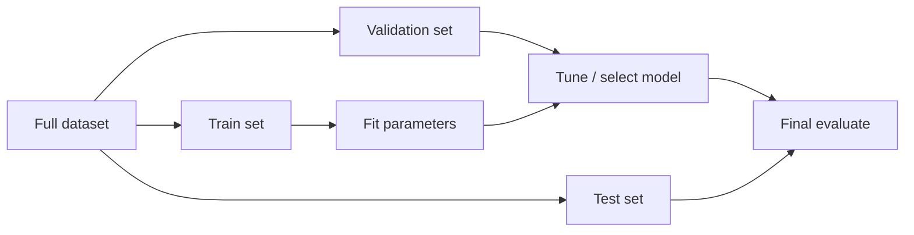

Machine learning is how most modern AI systems get their skills: instead of writing every rule, you collect examples (or feedback), fit a model, and let the machine generalize to new cases. If AI is the goal, ML is the dominant method for reaching it when the mapping from inputs to outputs is too complex to hand-author. Spam filters, demand forecasts, recommendation ranking, and many fraud detectors are ML long before anyone mentions Generative AI.

## Intuition

You already do a form of ML every day. After enough rainy mornings, you bring an umbrella without deriving meteorology from first principles. The brain updates from *experience*. In software, experience is data: features (inputs) and, often, labels (desired outputs).

Three questions organize almost every ML project:

1. What am I predicting or discovering?
2. What examples do I have?
3. How will I know the model works on data it has never seen?

If you cannot answer (3), you are not doing ML engineering — you are fitting a curve and hoping. The discipline shows up in splits, baselines, and metrics that match the real decision, not in the brand name of the algorithm.

## How it works

**Learning from data.** A model is a function `f_theta(x)` with adjustable parameters `theta`. Training searches for `theta` that make predictions match reality well — usually by minimizing a loss (squared error, cross-entropy, etc.). After training, you freeze (or carefully update) `theta` and run inference on new `x`. The same skeleton covers linear regression and billion-parameter nets; scale and architecture change, the loop does not.

**Three broad paradigms:**

| Paradigm | What you have | Goal |
| --- | --- | --- |
| Supervised | Inputs + labels | Predict labels for new inputs |
| Unsupervised | Inputs only | Find structure (clusters, compressions, anomalies) |
| Reinforcement | Actions + rewards over time | Learn a policy that maximizes cumulative reward |

Supervised learning powers spam filters, credit scoring, and medical image triage. Unsupervised learning powers customer segmentation, dimensionality reduction, and anomaly hints when labels are scarce. Reinforcement learning powers game-playing agents and some robotics and recommendation loops where delayed feedback matters. Semi-supervised and self-supervised methods blur the lines: they use unlabeled mass plus a pretext task (next token, masked image) to learn useful representations.

**Regression vs classification (supervised).**

- **Regression** predicts a continuous number: house price, temperature, latency.
- **Classification** predicts a discrete class: spam/ham, disease/no disease, which digit.

Same idea — map `x -> y` — different output type and usually different loss. Multi-label classification (several tags at once) and ranking problems are cousins; start by naming the output space clearly.

**Train / test split intuition.** If you grade a student only on questions they memorized, you overestimate skill. Likewise, if you evaluate a model on the same rows used to fit it, you overestimate generalization. Hold out a **test set** (and often a **validation set** for tuning) so metrics reflect performance on unseen data. Touch the test set once for final reporting; use validation for model selection.



## In code

Fit a line with the closed-form least-squares solution (stdlib only), then compare to a naive average baseline. No scikit-learn.

```python
# Predict y from x: y ~= a + b*x  (ordinary least squares, 1-D)
xs = [1.0, 2.0, 3.0, 4.0, 5.0]
ys = [2.1, 3.9, 6.2, 7.8, 10.1]

n = len(xs)
mean_x = sum(xs) / n
mean_y = sum(ys) / n

# Closed form: b = Cov(x,y) / Var(x); a = mean_y - b * mean_x
var_x = sum((x - mean_x) ** 2 for x in xs)
cov_xy = sum((x - mean_x) * (y - mean_y) for x, y in zip(xs, ys))
b = cov_xy / var_x
a = mean_y - b * mean_x

def predict(x: float) -> float:
    return a + b * x


# Average baseline: always predict mean_y (ignores x)
baseline = mean_y

# Hold out last point as a tiny "test" example
x_test, y_test = xs[-1], ys[-1]
err_model = (predict(x_test) - y_test) ** 2
err_base = (baseline - y_test) ** 2

print(f"fit: y = {a:.3f} + {b:.3f}*x")
print(f"test MSE model={err_model:.3f} baseline={err_base:.3f}")
```

Even this toy fit shows the ML loop: choose a hypothesis class (a line), fit on train-ish data, compare to a baseline, evaluate on held-out points. Real projects add more features, regularization, cross-validation, and careful splits — the skeleton stays the same. Always ship a baseline first; if a fancy model cannot beat “predict the mean” or “always predict the majority class,” stop and fix the data or the problem statement.

## What goes wrong

- **Data leakage.** Using future information or the label itself as a feature makes test scores look amazing and production fail.
- **Wrong split.** Random splits on time-ordered or grouped data (same user in train and test) inflate metrics.
- **Imbalanced classes.** 99% accuracy can hide a useless minority-class detector; pick metrics that match the decision (precision, recall, F1, calibration).
- **Overfitting.** A model that memorizes noise on the train set will not travel. Prefer simpler models, more data, or regularization when train >> test performance.
- **Paradigm mismatch.** Supervised labels may be expensive; unsupervised clusters may not match business labels; RL needs careful reward design or it will game the metric.
- **Silent distribution shift.** The world changes after launch; without monitoring, yesterday’s good model becomes tomorrow’s quiet failure.

## One-line summary

Machine learning fits models from data so systems generalize to new inputs — via supervised, unsupervised, or reinforcement paradigms, evaluated on held-out data.

## Key terms

- **Machine learning (ML)** — improving task performance by learning patterns from data or feedback
- **Supervised learning** — training with labeled examples
- **Unsupervised learning** — discovering structure without labels
- **Reinforcement learning** — learning actions from reward signals over time
- **Regression** — predicting continuous targets
- **Classification** — predicting discrete class labels
- **Train / validation / test split** — partitions for fitting, tuning, and unbiased evaluation
- **Baseline** — simple reference model used to judge whether learning is worthwhile
- **Generalization** — performance on data not seen during training
- **Loss function** — scalar objective that training tries to minimize
