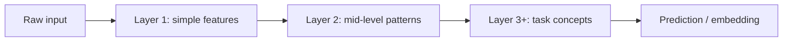

Deep learning is machine learning with *multi-layer* neural networks that learn their own features. Instead of hand-crafting “edges” or “bag-of-words” signals, the model transforms raw inputs through stacked layers until later layers hold task-ready representations. That shift unlocked modern vision, speech, and the large language models behind GenAI. If classical ML is “engineer features, then fit a model,” deep learning often collapses those steps into one trainable pipeline.

## Intuition

Classical ML often looks like: engineer features → train a shallow model (logistic regression, random forest). Deep learning folds feature engineering into the model. Early layers detect simple patterns; deeper layers recombine them into concepts — from pixels to textures to objects, or from tokens to phrases to discourse.

“Depth” means many successive nonlinear transforms. Each layer is usually a linear map (weights + bias) followed by a nonlinearity (ReLU, GELU, etc.). Without nonlinearities, stacking layers collapses to one big linear map — depth would buy nothing. With nonlinearities, composition can carve intricate decision regions and rich embeddings.

Why care as a practitioner? Because many GenAI components *are* deep nets: transformers, convolutional backbones, diffusion U-Nets. Understanding depth and representation learning clarifies why these models need large data, why fine-tuning works, and why a shallow model on raw pixels usually fails.

## How it works

**Neural networks.** A network is a composition of layers. For a vector `x`:


```
h1 = activation(W1 * x  + b1)
h2 = activation(W2 * h1 + b2)
...
y_hat = WL * h(L-1) + bL
```


Training adjusts all `W, b` with gradient-based optimization (backpropagation + SGD/Adam) to reduce a loss on labeled (or self-supervised) data. Modern stacks add normalization, residual skip connections, attention, and careful initialization so gradients can travel through dozens or hundreds of layers.

**Why depth helps.** A deep stack can approximate complex functions more *efficiently* than a single wide shallow layer for many structured problems: hierarchical composition matches how language and vision are organized. Empirically, with enough data and compute, deeper models keep improving where hand-built features plateau. Depth is not free — optimization gets harder, and overfitting risk rises — but for raw signals it is often the winning inductive bias.

**Relationship to neural networks.** Deep learning is not a different species from “neural nets” — it is the practice of training *deep* ones (many layers), often with modern tricks: better activations, normalization, residual connections, attention, large-scale data, and GPUs/TPUs. A single perceptron is a neural network; a 96-layer transformer is deep learning. Same family, different scale and architecture.

**When DL wins vs classical ML.**

| Prefer classical ML when… | Prefer deep learning when… |
| --- | --- |
| Tabular data is small/medium and well-featured | Inputs are raw and high-dimensional (images, audio, text) |
| You need strong interpretability and fast iteration | End-to-end accuracy dominates and you have data/compute |
| Baselines (GBMs) already crush the metric | Hierarchies / sequences / pixels matter |

Many strong systems are hybrids: classical models on engineered features *plus* deep embeddings from a neural net (for example, gradient boosting on tabular columns concatenated with a text embedding).



## In code

One forward pass of a tiny 2-layer network with NumPy — no training, just the computation graph you would later differentiate.

```python
import numpy as np

rng = np.random.default_rng(0)

# Input: batch of 4 examples, each with 3 features
x = rng.normal(size=(4, 3))

# Layer 1: 3 → 5, then ReLU
W1 = rng.normal(scale=0.5, size=(3, 5))
b1 = np.zeros(5)
h = np.maximum(0, x @ W1 + b1)  # ReLU

# Layer 2: 5 → 2 logits (e.g. 2-class scores)
W2 = rng.normal(scale=0.5, size=(5, 2))
b2 = np.zeros(2)
logits = h @ W2 + b2

# Softmax for probabilities (numerically stable)
logits = logits - logits.max(axis=1, keepdims=True)
probs = np.exp(logits)
probs = probs / probs.sum(axis=1, keepdims=True)

print("hidden shape:", h.shape)
print("probs:\n", np.round(probs, 3))
```

Training would add a loss (e.g. cross-entropy vs labels) and update `W1, b1, W2, b2` with gradients. The forward pass above is the core “what deep learning computes” before any optimizer enters the picture. Frameworks like PyTorch automate the backward pass; conceptually you are still chaining matrix multiplies and nonlinearities.

## What goes wrong

- **Data hunger.** Deep nets can underperform classical methods when labeled data is scarce and features are already good.
- **Overparameterization without discipline.** Huge capacity memorizes; you need regularization, early stopping, data augmentation, or more data.
- **Compute and ops cost.** Training and serving deep models need GPUs, careful batching, and monitoring — not free.
- **Opacity.** Learned features are powerful but harder to audit than a short decision list.
- **Wrong modality choice.** Flattening images into classical features or ignoring sequence structure throws away the inductive bias that makes DL work.
- **Unstable training.** Bad learning rates, missing normalization, or vanishing/exploding gradients can make a “deep” model fail to learn at all.

## One-line summary

Deep learning stacks nonlinear neural layers to learn hierarchical representations, excelling on raw high-dimensional data when classical feature engineering hits a wall.

## Key terms

- **Deep learning (DL)** — ML using multi-layer neural networks for representation learning
- **Neural network** — composition of parameterized layers mapping inputs to outputs
- **Layer** — linear transform plus nonlinearity (and often normalization)
- **Representation learning** — automatically discovering useful features from data
- **Activation / nonlinearity** — function that enables deep stacks to model non-linear maps
- **Forward pass** — computing outputs from inputs given current weights
- **Backpropagation** — algorithm for computing gradients of the loss w.r.t. weights
- **Inductive bias** — assumptions (hierarchy, locality, attention) that guide what a model learns easily
- **Embedding** — vector representation learned for an input (token, image, user, etc.)
