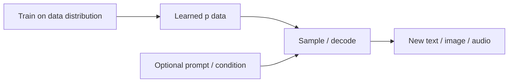

Generative AI systems create new artifacts — sentences, images, audio, code, molecules — by sampling from a model of how data is distributed. Chatbots feel magical because fluent text arrives instantly, but under the hood GenAI is still probabilistic modeling plus a lot of data and compute. Understanding that keeps expectations honest and designs safer: you optimize sampling, conditioning, and evaluation — not “intelligence” as a vague vibe.

## Intuition

A **discriminative** model answers: “Given this email, is it spam?” It learns `p(y | x)` or a decision boundary. A **generative** model answers: “What would a plausible email look like?” or jointly models `p(x, y)` / `p(x)`. Generation means drawing a new sample from that learned distribution — not retrieving a stored document (though retrieval can help ground generation).

Think of weather. Discriminative: given today’s sensors, will it rain? Generative: simulate tomorrow’s radar map consistent with climate statistics. Both are useful; they optimize different questions. Product teams often need both: generate a draft reply, then classify whether it is safe to send.

GenAI sits inside the AI → ML → DL nesting for most modern systems: deep networks learn a distribution; decoding samples from it. Older generative ideas (n-gram LMs, HMMs, classic topic models) share the *sampling* idea with far less capacity.

## How it works

**Discriminative vs generative (practical view).**

|  | Discriminative | Generative |
| --- | --- | --- |
| Typical question | What label fits this input? | What new example looks realistic? |
| Classic examples | Logistic regression, ResNet classifier | GANs, VAEs, diffusion, autoregressive LMs |
| Output | Class / score | Text, image, audio, structured object |

Many modern systems blend both: an LLM generates text (generative) while a separate classifier filters toxicity (discriminative). Choosing the wrong family wastes budget — do not sample essays when you only needed a calibrated yes/no.

**Sampling new content.** After training, you do not dump the entire distribution — you *sample*. Autoregressive language models generate one token at a time from `p(next_token | previous_tokens)`. Diffusion models iteratively denoise random noise toward an image. GANs push a generator to fool a discriminator. Different architectures, same idea: randomness + learned probabilities → novel outputs. Decoding choices (greedy, temperature, top-k, top-p) trade diversity against coherence.

**LLMs as generative models.** Large Language Models are (usually) deep neural nets trained to predict the next token on massive text. At inference they are generative: given a prompt, they sample a continuation. Instruction tuning and RLHF shape *which* continuations users prefer, but the core act remains sampling from a conditional distribution over tokens. Tools, RAG, and structured outputs are ways to steer that sampling toward usefulness and truthfulness — they do not turn the model into a database by themselves.

**Modalities.** GenAI is not only text:

- Text / code — LLMs, code models
- Images — diffusion, GANs, autoregressive vision
- Audio / speech — waveform or codec language models
- Multimodal — models that map text↔image, or take mixed inputs

**Not magic.** Generation can be wrong, biased, or insecure. Models invent plausible citations, leak training snippets, or follow adversarial prompts. Treat outputs as proposals to verify, especially for facts, law, medicine, and security-sensitive code. Cost and latency also matter: every token or denoising step burns compute.



## In code

Illustrate “generation” by sampling from a categorical distribution — the same conceptual step an LLM takes at each token, stripped to bare Python.

```python
import random

# Toy next-token distribution after the prompt "I love"
vocab = ["pizza", "coding", "rain", "meetings"]
probs = [0.40, 0.35, 0.15, 0.10]  # must sum to 1.0


def sample_categorical(items, probabilities, rng=random):
    r = rng.random()
    cumulative = 0.0
    for item, p in zip(items, probabilities):
        cumulative += p
        if r <= cumulative:
            return item
    return items[-1]


rng = random.Random(7)
samples = [sample_categorical(vocab, probs, rng) for _ in range(10)]
print("samples:", samples)

# Greedy "generation" always picks the mode — less diverse, more repetitive
greedy = vocab[probs.index(max(probs))]
print("greedy:", greedy)
```

Real LLMs use huge vocabularies and context-dependent probabilities, plus decoding strategies (temperature, top-k, top-p). The tiny loop above is the heart of it: **draw according to weights**, not look up a single stored answer. Raise temperature (sharpen or flatten the distribution in real systems) and you change how wild the samples feel — same model, different sampling policy.

## What goes wrong

- **Hallucinations.** Fluent samples can be false; probability ≠ correctness.
- **Mode collapse / blandness.** Poor training or overly greedy decoding yields repetitive, low-diversity outputs.
- **Prompt sensitivity.** Small wording changes can flip behavior; brittle UX without eval harnesses.
- **Data and IP risk.** Models may regurgitate sensitive or copyrighted material; policy and filtering matter.
- **Category error.** Using a generative model when you needed a calibrated classifier (or a database lookup) wastes money and adds failure modes.
- **Automation bias.** Users over-trust polished text; keep humans in the loop for high-stakes decisions.
- **Uncontrolled cost.** Open-ended generation can burn tokens (and money) without a clear stopping rule or cache strategy.

## One-line summary

Generative AI samples new content from learned distributions — LLMs are the text-native case — powerful for creation, never a substitute for verification.

## Key terms

- **Generative AI (GenAI)** — models that create new samples (text, images, audio, etc.) from learned distributions
- **Discriminative model** — model focused on predicting labels or decisions given inputs
- **Sampling / decoding** — drawing outputs from model probabilities (often token by token)
- **Autoregressive model** — generates a sequence by predicting the next element conditioned on the past
- **LLM (Large Language Model)** — large neural net trained primarily for next-token prediction on text
- **Modality** — type of data (text, image, audio, video, code)
- **Hallucination** — confident but incorrect or fabricated generated content
- **Conditional generation** — sampling outputs given a prompt, image, or other context
- **Temperature / top-p** — decoding controls that trade diversity against focus
