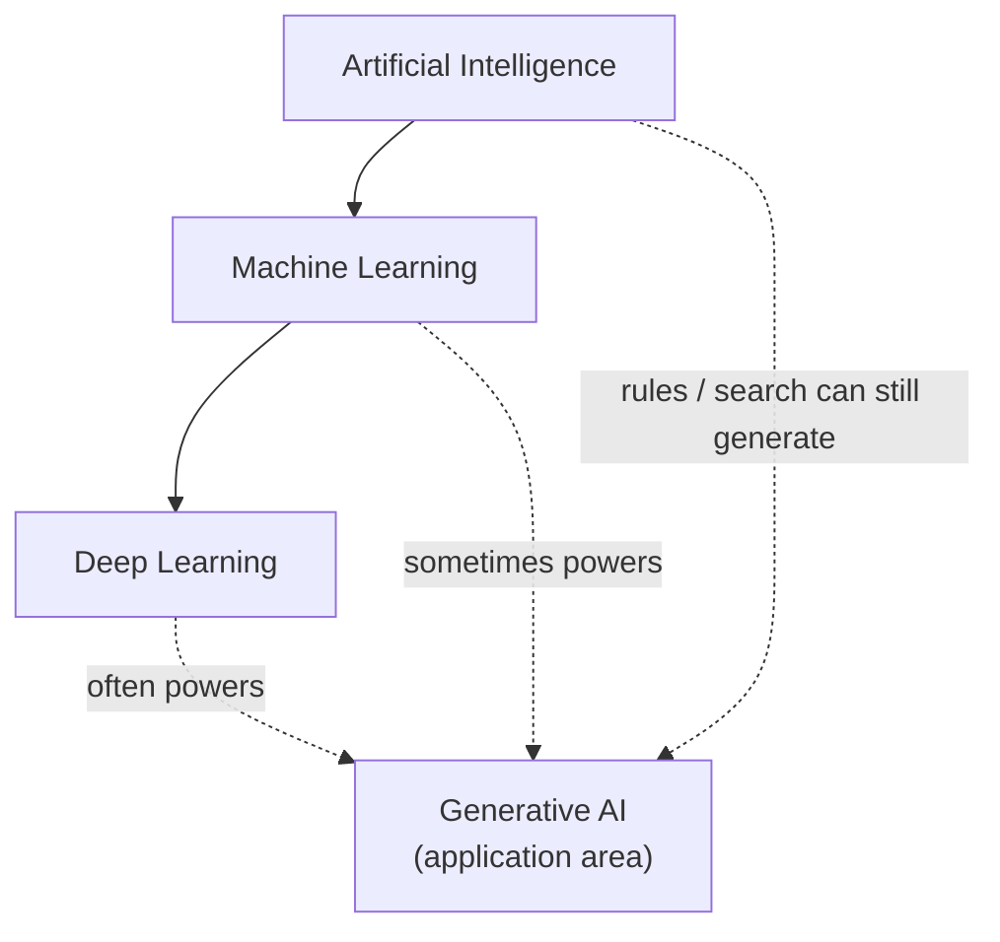

Job posts, product decks, and interview answers often mash **AI**, **ML**, **deep learning**, and **GenAI** into one vague blob. Using the wrong label is not pedantry — it changes what data you need, how you evaluate success, and whether a rule engine, a classifier, or a generative model is even the right tool.

- **AI** is the broadest term: any system that behaves intelligently for a task, including hand-coded rules.
- **ML** sits inside AI: systems that improve from data instead of only hand-written rules.
- **Deep learning (DL)** sits inside ML: models built from stacked neural layers.
- **GenAI** is an application style — creating new content — not a fourth nested circle.

## Intuition

Picture nested circles, then one overlapping blob on top:

- **AI** is the outer circle: any system that behaves intelligently enough for a task — including hard-coded rules.
- **ML** sits inside AI: systems that improve from data instead of only hand-written rules.
- **Deep learning (DL)** sits inside ML: models built from stacked neural layers that learn representations from raw-ish inputs.
- **Generative AI (GenAI)** is not a fourth nested circle. It is an *application style* — systems that create new content (text, images, code, audio). Most modern GenAI is deep learning, but GenAI can also use older generative tricks, and plenty of deep learning is *not* generative (e.g. image classifiers).



:::key
Accurate nesting: **AI includes ML includes DL**. GenAI **overlaps** those layers; it is not "the innermost ring."
:::

## How it works

### Definitions that survive a whiteboard

| Plain-English idea | When to use it |
| --- | --- |
| **AI** — goal-directed intelligent behavior by machine | Chess engine with hand-tuned heuristics; expert systems |
| **ML** — learn patterns from examples | Spam classifier trained on emails |
| **Deep learning** — multi-layer neural nets learn features from raw inputs | Face recognition from pixels; LLMs |
| **GenAI** — produce new samples that look like training data or prompts | Autocomplete a paragraph from a prompt |

### What each layer buys you

1. **AI without ML** — Expert systems, search, constraint solvers. Fast to explain, brittle outside the rule book.
2. **ML without deep learning** — Logistic regression, random forests, gradient boosting. Strong on tabular data; weaker when you must invent features for images or free text.
3. **Deep learning** — Learns features automatically when you have enough data and compute. Dominates vision, speech, and large language models.
4. **GenAI** — Shifts the product from "predict a class" to "produce an artifact." Evaluation gets harder: there is rarely one correct paragraph.

### Decision guide: which term is accurate?

Ask these in order:

1. **Is any intelligence claim involved?** If yes -> at least **AI**.
2. **Does it learn parameters from data?** If yes -> **ML** (and still AI). If no (pure rules) -> say AI, not ML.
3. **Is the learner a deep neural net?** If yes -> **deep learning**. If it is XGBoost on spreadsheet columns -> ML, not DL.
4. **Does the product primarily create new content?** If yes -> **GenAI** is fair. A fraud score of 0.87 is ML/DL, not GenAI — even if the team branded the dashboard "AI."

:::tip
In interviews, prefer the *most specific true* term. Calling a boosted tree "AI" is true but weak; calling a diffusion model "ML" is true but undersells what stakeholders care about.
:::

### How teams actually talk (and how to translate)

| They say | They might mean | Ask |
| --- | --- | --- |
| "Add AI to search" | Ranking / embeddings / GenAI answers | Predict relevance, generate an answer, or both? |
| "ML model for support" | Intent classifier *or* chatbot | Label tickets or draft replies? |
| "Deep learning for fraud" | Any ML, or specifically neural nets | Tabular boosting vs sequence/graph nets? |
| "GenAI for reports" | Summaries, charts, or full narrative | Who verifies numbers before publish? |

If you cannot answer those clarifying questions, you do not yet know which circle on the diagram you are building in.

### Discriminative vs generative (quick cut)

Inside ML you will also hear **discriminative** vs **generative** modeling. A discriminative spam filter outputs the probability of spam given an email. A generative system produces a new email that *looks like* support replies. GenAI products sit in the generative camp for *content*; many deep nets in production remain discriminative (detect, rank, classify). Confusing those two is how teams buy a chat API when they needed a calibrated score.

## Worked example

A payments team ships three features. Label them carefully:

| Feature | Mechanism | Accurate label |
| --- | --- | --- |
| Block transfers over $10k without manager approval | `if amount > 10000` | AI (rules), not ML |
| Flag likely fraud from historical transactions | Gradient-boosted trees on features | ML (not DL, not GenAI) |
| Draft a dispute email from a case summary | Large language model | GenAI powered by deep learning (hence also ML and AI) |

```python
def label_system(learns_from_data: bool, uses_deep_net: bool, creates_content: bool) -> str:
    tags = ["AI"]
    if learns_from_data:
        tags.append("ML")
    if uses_deep_net:
        tags.append("deep learning")
    if creates_content:
        tags.append("Gen AI")
    return " > ".join(tags) if not creates_content else " + ".join(tags)


print(label_system(False, False, False))
# AI

print(label_system(True, False, False))
# AI > ML

print(label_system(True, True, False))
# AI > ML > deep learning

print(label_system(True, True, True))
# AI + ML + deep learning + Gen AI
```

The last print uses `+` on purpose: GenAI is an overlapping capability, not a strict subset of deep learning forever — even though today's popular GenAI *is* deep learning.

Add one more feature and force a precise sentence for the design doc:

```python
cases = [
    ("rules_limit", False, False, False),
    ("fraud_boosting", True, False, False),
    ("vision_cnn_kyc", True, True, False),
    ("dispute_draft_llm", True, True, True),
]

for name, learn, deep, gen in cases:
    print(f"{name}: {label_system(learn, deep, gen)}")
```

Expected mental labels: rules = AI only; boosting = AI includes ML; KYC CNN = AI includes ML includes deep learning; dispute draft = all four tags with GenAI called out as the product shape.

## What goes wrong

- **Vendor inflation** — Every autocomplete is sold as "AI." Buyers cannot compare cost, latency, or risk when labels are mush.
- **Wrong architecture from wrong label** — Treating a GenAI chat as a SQL database ("the model knows our inventory") fails; you need retrieval or tools.
- **Wrong evaluation** — Accuracy fits classifiers; GenAI needs human review, rubrics, or task success rates.
- **Wrong data story** — Classic ML may need curated labels. GenAI pretraining needs huge corpora; fine-tuning needs carefully scoped examples. Mixing those budgets wastes months.
- **Hierarchy mistakes in diagrams** — Drawing GenAI *inside* deep learning as the only path forgets non-neural generators and non-generative deep nets.

:::warn
Saying "we use AI" in a design doc is almost useless. Name the learning method, the modality, and whether the system predicts or generates.
:::

## One-line summary

**AI** is the broad field; **ML** learns from data; **deep learning** is neural ML; **GenAI** is the content-creating application area that usually rides on deep learning but is not the innermost circle of the hierarchy.

## Key terms

- **Artificial Intelligence (AI)** — Machines performing tasks associated with intelligent behavior.
- **Machine Learning (ML)** — Systems that improve performance by learning from data.
- **Deep Learning (DL)** — ML using multi-layer neural networks that learn hierarchical representations.
- **Generative AI (GenAI)** — AI systems that synthesize new content rather than only classify or score.
- **Discriminative model** — Predicts labels or boundaries (e.g. spam vs not spam), opposite flavor from generative content models.
- **Representation learning** — Automatically discovering useful features from raw inputs, a hallmark of deep learning.
