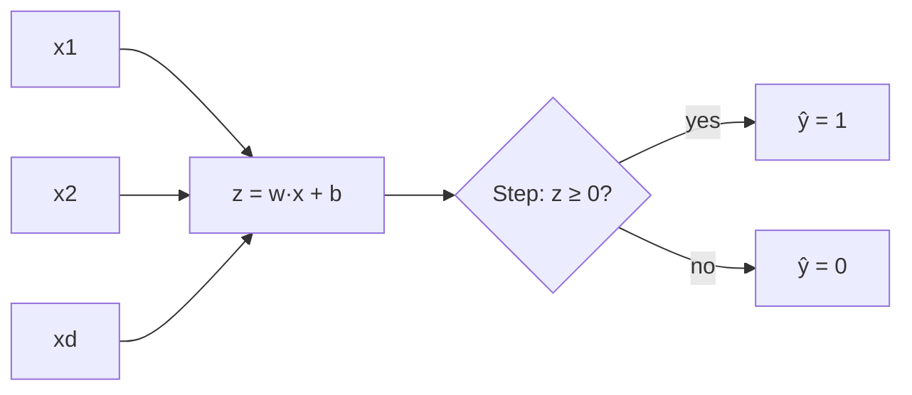

Every modern neural network — including the transformers behind large language models — is built from units that do three things: weight their inputs, add a bias, and push the result through an activation. The **perceptron** is the simplest version of that story: a single neuron that draws one straight decision boundary. Understanding it gives you geometric intuition for everything that comes later, and explains why depth and nonlinearity became necessary.

## Intuition

Think of a gatekeeper who scores a visitor with a checklist. Each trait `x_i` gets a weight `w_i` (how much that trait matters). The gatekeeper adds a bias `b` (how strict the default is), then decides “allow” or “deny” based on whether the total score clears a threshold.

That score is a **weighted sum**. On a 2D plane, the set of points where the score equals zero is a straight line. Everywhere on one side of the line, the neuron fires; on the other side, it stays silent. So a single perceptron is a **linear classifier**: it partitions space into two half-planes.

Bias matters geometrically. Without bias, the decision line must pass through the origin. With bias, you can slide the line anywhere. Weights set the *tilt*; bias sets the *offset*.

You can also read `z` as a signed distance (up to scaling by `|w|`) from the boundary: large positive `z` means confidently on the positive side; near zero means near the fence. Soft activations in modern nets keep that score continuous so gradients can flow; the classical perceptron simply hard-thresholds it.

## How it works

An artificial neuron computes a **score** from its inputs:

```
z = (w1 * x1) + (w2 * x2) + ... + (wd * xd) + b
```

In words: multiply each input by its weight, add them up, then add a bias `b`.

Then an activation maps `z` to an output. The classical **perceptron** uses a hard **step** (threshold):

```
if z >= 0:
    prediction = 1
else:
    prediction = 0
```

The decision boundary is the set of points where `z = 0`. In 2D that is a line; the two sides are half-planes. Points with `z > 0` are labeled positive; the rest negative.

**Perceptron learning rule.** When a labeled example `(x, y)` is misclassified, update:

```
w = w + learning_rate * (y - prediction) * x
b = b + learning_rate * (y - prediction)
```

If the prediction was too low (`y = 1`, `prediction = 0`), weights move toward `x`. If too high, they move away. The learning rate controls step size. If the data is **linearly separable**, this procedure is guaranteed to find a separating hyperplane in finite steps (the classic perceptron convergence theorem).



**AND and OR work; XOR does not.** Plot the four Boolean corners `(0,0), (0,1), (1,0), (1,1)`. For AND, only `(1,1)` is positive — one line separates it. For OR, only `(0,0)` is negative — again one line works. For **XOR**, positives sit on opposite corners `(0,1)` and `(1,0)`. No single straight line can put both positives on one side and both negatives on the other. That is the famous **XOR limitation**: one perceptron cannot learn XOR. Multilayer networks with nonlinear activations can.

Historically, that limitation (highlighted by Minsky and Papert) cooled enthusiasm for single-layer perceptrons and pushed research toward multilayer networks. The fix was not “more of the same linear unit,” but **composition**: hidden layers remapping features so a final linear readout can finish the job. When you hear that deep nets “learn representations,” this is the geometric ancestor of that idea — first bend or lift the data, then classify.

## In code

A tiny 2D perceptron step: score points and apply the hard threshold. Then one learning update on a misclassified example.

```python
import numpy as np

def perceptron_step(x, w, b):
    """x: shape (d,), w: shape (d,). Returns 0 or 1."""
    z = float(np.dot(w, x) + b)
    return 1 if z >= 0 else 0

# Decision line roughly: x1 + x2 - 1.5 = 0  (AND-like)
w = np.array([1.0, 1.0])
b = -1.5

points = np.array([
    [0.0, 0.0],
    [0.0, 1.0],
    [1.0, 0.0],
    [1.0, 1.0],
])

print("Predictions (expect ~AND):")
for p in points:
    print(p, "->", perceptron_step(p, w, b))

# Learning update: treat (1,0) as positive (OR-like target) but model says 0
x_bad = np.array([1.0, 0.0])
y_true, y_hat = 1, perceptron_step(x_bad, w, b)
eta = 0.5
w = w + eta * (y_true - y_hat) * x_bad
b = b + eta * (y_true - y_hat)
print("After one update:", w, b, "pred=", perceptron_step(x_bad, w, b))
```

Run this and you should see three zeros and a one for AND-like weights, then a nudge that pulls the boundary so `(1,0)` can flip toward the positive class.

## What goes wrong

- **Assuming one neuron can solve any pattern.** Anything not linearly separable (XOR, concentric rings, interleaved moons) will fail no matter how long you train a single perceptron.
- **Ignoring bias.** Forcing `b=0` can make an otherwise easy problem inseparable through the origin.
- **Confusing the step with soft activations.** The hard step is not differentiable, so you cannot train it with standard backpropagation the way you train sigmoid/ReLU networks. Modern nets use smooth (or piecewise-linear) activations and gradient descent instead of the classic perceptron rule.
- **Huge learning rates.** Oversized learning rates can thrash the boundary back and forth; tiny ones crawl. Separability still matters more than tuning when the geometry is impossible.

## One-line summary

A perceptron is a weighted sum plus bias passed through a threshold — geometrically a half-plane classifier that succeeds only when classes are linearly separable.

## Key terms

- **Weighted sum (`z`):** linear combination of inputs with weights, before activation.
- **Bias (`b`):** offset that shifts the decision boundary away from the origin.
- **Activation / step function:** maps `z` to an output; the classic perceptron uses a hard 0/1 threshold.
- **Linear classifier / half-plane:** decision regions separated by a hyperplane (a line in 2D).
- **Linear separability:** whether some hyperplane can perfectly separate the classes.
- **XOR limitation:** XOR (and similar patterns) cannot be solved by a single perceptron; needs multilayer nonlinear nets.
- **Perceptron learning rule:** additive weight update proportional to `(y - y_hat)x`.
