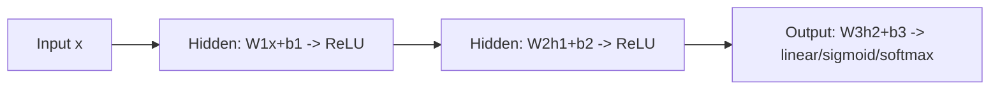

**Activation functions** bend the output of each neuron so stacked layers can learn curved boundaries — not just straight lines. A **multilayer perceptron (MLP)** is a stack of those nonlinear units, and it exists because many real problems (like XOR) cannot be separated by one straight line.

- Without a nonlinearity between layers, stacking linear layers collapses to one big linear map — depth buys nothing.
- **Hidden layers** let the network learn more complex patterns.
- **Backpropagation** sends error backward through the network so each weight knows how to change.
- MLP blocks still appear inside transformers as the feed-forward layer after attention.

## Intuition

Imagine drawing a map of land vs water with only straight cuts of a knife. One cut gives a half-plane. Two cuts, still polygons with straight edges — but if each cut can be *warped* before the next, you can carve islands, rings, and wiggly coasts. Nonlinearity is that warp.

Without a nonlinear activation, stacking linear layers collapses:

```
W2 * (W1 * x + b1) + b2  =  (W2 * W1) * x + (something)
```

That is still just one big linear map. Depth buys nothing. With a nonlinearity between layers, compositions can approximate extremely flexible functions.

Different activations bend differently. **Sigmoid** squashes to a value between 0 and 1 like a soft probability. **Tanh** centers around zero between -1 and 1. **ReLU (Rectified Linear Unit)** passes positives unchanged and zeros negatives — cheap, sparse, and the default in many hidden layers.

## How it works

**Common activations:**

| Plain-English idea | When to use it |
| --- | --- |
| **Sigmoid** — squashes z to a value between 0 and 1 | Binary output, gates in older architectures |
| **Tanh** — squashes z to a value between -1 and 1 | Older hidden layers (zero-centered) |
| **ReLU** — keep positives, zero out negatives: max(0, z) | Modern hidden layers (fast, sparse) |

**Tradeoffs.** Sigmoid and tanh **saturate**: for large |z|, the derivative flattens near zero, so gradients vanish in deep stacks (**vanishing gradient problem**). Tanh often trains a bit better than sigmoid in hidden layers because it is zero-centered. ReLU avoids saturation on the positive side and is fast to compute, but units can "die" if they always receive negative pre-activations (gradient forever zero). Variants (Leaky ReLU, GELU, Swish) soften that edge; GELU is common in transformers.

**MLP stacking.** An MLP is a stack of linear layers with a nonlinear activation between them:

```
h1 = activation(W1 * x  + b1)
h2 = activation(W2 * h1 + b2)
...
y_hat = WL * h(L-1) + bL
```

Hidden layers use a nonlinear activation (often ReLU). The output activation depends on the task: identity for regression, sigmoid for binary classification, softmax for multi-class. Pair the output with a matching loss (MSE, BCE, cross-entropy).



**Why this beats one perceptron.** Two hidden units with ReLU can create piecewise-linear regions; more units and layers tile space into richer decision regions. XOR becomes solvable: one hidden layer can remap the four corners into a linearly separable feature space, then the output layer finishes the job.

**Backpropagation and gradient descent.** Backprop uses the chain rule to send error backward through the network. A readable form is:

```
dE/dw = (dE/dy_hat) * (dy_hat/dz) * (dz/dw)
```

Then **gradient descent** updates weights:

```
W_new = W_old - eta * dE/dW
```

Here `eta` is the **learning rate** — how big each update step is.

**Output pairing:**

| Plain-English idea | When to use it |
| --- | --- |
| Linear output + MSE | Regression (predict a number) |
| Sigmoid + binary cross-entropy | Binary classification (yes/no) |
| Softmax + categorical cross-entropy | Multi-class classification (pick one of many) |

## In code

Print activation values for a few inputs, then run a tiny 2-layer MLP forward pass with ReLU.

```python
import numpy as np

def sigmoid(z):
    return 1.0 / (1.0 + np.exp(-z))

def tanh(z):
    return np.tanh(z)

def relu(z):
    return np.maximum(0.0, z)

zs = np.array([-2.0, -0.5, 0.0, 0.5, 2.0])
print("z      ", zs)
print("sigmoid", np.round(sigmoid(zs), 3))
print("tanh   ", np.round(tanh(zs), 3))
print("relu   ", relu(zs))

# MLP: 2 -> 3 (ReLU) -> 1 (linear)
rng = np.random.default_rng(0)
x = np.array([0.5, -1.0])          # one example, 2 features
W1 = rng.normal(scale=0.8, size=(2, 3))
b1 = np.array([0.1, -0.2, 0.0])
W2 = rng.normal(scale=0.8, size=(3, 1))
b2 = np.array([0.0])

h = relu(x @ W1 + b1)              # hidden activations
y_hat = float(h @ W2 + b2)         # scalar output
print("hidden h:", np.round(h, 3))
print("y_hat   :", round(y_hat, 3))
```

Notice how ReLU zeros some hidden units (sparsity) while sigmoid/tanh always emit a smooth value in a bounded range. That difference shows up in gradient flow during training.

## What goes wrong

- **Linear hidden layers.** Removing ReLU/tanh between layers makes a "deep" net equivalent to a shallow linear model — XOR and curved boundaries stay impossible.
- **Sigmoid everywhere in deep nets.** Saturating activations in every layer starve early layers of gradient; prefer ReLU-family (or GELU) in hidden stacks, and reserve sigmoid for binary outputs or gates.
- **Wrong output head.** Softmax + MSE, or linear output + cross-entropy, fights the math. Match activation to loss and task.
- **Exploding pre-activations.** Huge weights push sigmoid/tanh into flat regions or send ReLU into huge positive values; careful initialization and normalization matter as models deepen.
- **Dead ReLUs.** If a unit's input is always negative, it never updates. Monitor activation histograms if training stalls.

## One-line summary

Activations inject nonlinearity so stacked layers (an MLP) can learn complex boundaries; ReLU dominates hidden layers while sigmoid/tanh still matter at outputs and in gated designs.

## Key terms

- **Nonlinearity / activation** — elementwise function after a linear map that prevents layer collapse.
- **Sigmoid** — smooth map to a value between 0 and 1; saturates for large |z|.
- **Tanh** — zero-centered map between -1 and 1; also saturates.
- **ReLU (Rectified Linear Unit)** — max(0, z); sparse, efficient, can die.
- **MLP (multilayer perceptron)** — feed-forward stack of linear layers interleaved with activations.
- **Hidden layer** — intermediate nonlinear representation between input and output.
- **Backpropagation** — algorithm that sends error backward through the network using the chain rule.
- **Gradient descent** — update rule: W_new = W_old - learning_rate * gradient_of_loss.
- **Saturation / vanishing gradients** — near-zero derivatives in flat regions of sigmoid/tanh that slow learning in deep stacks.
