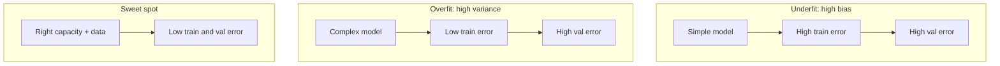

A model that aces the training set but fails on new users, new tickets, or next week’s traffic is not “smart” — it **memorized**. The whole point of learning is **generalization**: good predictions on data the model has never seen. **Underfitting** and **overfitting** are the two classic failure modes, and the **bias–variance tradeoff** is the language we use to reason about the capacity sweet spot between them. Every GenAI practitioner hits this when a fine-tune looks perfect on the demo set and collapses in production.

## Intuition

Imagine studying for an exam. **Underfitting** is only reading the chapter titles: you miss detail, so you score poorly on practice *and* on the real test. **Overfitting** is memorizing the answer key for last year’s quiz: practice scores soar, but a reworded question on exam day wrecks you.

In ML terms:

- **Underfit (high bias):** the hypothesis class is too weak — a straight line through a curved phenomenon. Training error stays high; validation error stays high.
- **Overfit (high variance):** the hypothesis class is too flexible — a wild polynomial that threads every noisy training point. Training error plummets; validation error rises.

**Bias** is error from wrong assumptions (too simple a model). **Variance** is error from sensitivity to the particular training sample (too wiggly a model). Irreducible **noise** remains even with a perfect learner. Roughly:


```
Expected error ≈ Bias^2 + Variance + Noise
```


You rarely minimize bias and variance at once. Bigger models and longer training cut bias but can inflate variance unless you regularize, add data, or stop early.

## How it works

**Detect with curves, not vibes.** Plot training loss/metric and validation loss/metric over epochs (or model complexity).

| Pattern | Train error | Val error | Diagnosis |
| --- | --- | --- | --- |
| Both high, gap small | High | High | Underfitting |
| Train low, val high, gap growing | Low | High | Overfitting |
| Both low, gap modest | Low | Low | Healthy fit |

A rising validation loss while training loss still falls is the classic overfit signal. In LLMs and classifiers, watch validation perplexity or F1 the same way.

**Capacity knobs.** More parameters, deeper trees, higher polynomial degree, longer fine-tuning → more capacity → lower bias risk, higher overfit risk. Less capacity or stronger constraints → opposite.

**What helps.**

- **More diverse data** — best variance reducer when you can get it.
- **Regularization** — weight decay, dropout, data augmentation (see the next lesson).
- **Early stopping** — halt when validation stops improving.
- **Simpler models / fewer epochs** — when data is scarce.
- **Cross-validation** — stabler estimate of generalization than one split.



**Bias–variance is a lens, not a single number you compute daily.** In deep learning the picture is richer: **double descent** can show test error rising then falling again as models grow past the interpolation threshold, and large models sometimes fit train data near-perfectly yet still generalize (**benign overfitting**). Those phenomena refine the classical U-shaped curve; they do not retire the practical checklist. Still compare train vs held-out metrics, still react when the gap balloons on *your* task and data regime, and still prefer a locked evaluation set when you claim a win.

## In code

Fit polynomials of increasing degree to a noisy sine wave. Low degree underfits; high degree overfits the noise.

```python
import numpy as np

rng = np.random.default_rng(0)
n = 30
x = np.linspace(0, 1, n)
y_true = np.sin(2 * np.pi * x)
y = y_true + 0.3 * rng.normal(size=n)

# Hold out last 8 points as "validation"
x_train, y_train = x[:22], y[:22]
x_val, y_val = x[22:], y[22:]

def mse(y_hat, y):
    return float(np.mean((y_hat - y) ** 2))

print(f"{'degree':>6}  {'train MSE':>10}  {'val MSE':>10}")
for degree in [1, 3, 9, 15]:
    # Vandermonde design matrix
    Phi_tr = np.vander(x_train, N=degree + 1, increasing=True)
    Phi_va = np.vander(x_val, N=degree + 1, increasing=True)
    # Least squares
    coef, *_ = np.linalg.lstsq(Phi_tr, y_train, rcond=None)
    tr = mse(Phi_tr @ coef, y_train)
    va = mse(Phi_va @ coef, y_val)
    print(f"{degree:6d}  {tr:10.4f}  {va:10.4f}")
```

Expect degree 1: both MSEs mediocre (underfit). Mid degrees: both improve. Very high degree: train MSE near zero while validation MSE blows up (overfit). That gap *is* the lesson.

## What goes wrong

- **Tuning on the test set.** If you peek at final test metrics to choose architecture or early-stop epoch, you overfit the test set itself. Keep a true holdout or use a locked evaluation set.
- **Tiny validation sets.** Noisy val curves cause false “overfit” alarms or missed ones. Prefer enough val data or cross-validation.
- **Assuming bigger always better.** Extra capacity without data or regularization often memorizes annotation quirks and leakage.
- **Ignoring distribution shift.** Low val error on yesterday’s traffic can still fail tomorrow if the world moved — that is not classical variance, but it looks like “bad generalization” in production.
- **Misreading LLM demos.** A chatbot that regurgitates fine-tune examples may be overfitting prompts, not learning a robust skill. Probe with paraphrases and out-of-sample tasks.

## One-line summary

Underfitting is a model too simple for the pattern (high bias); overfitting is a model that memorizes training quirks (high variance) — watch the train/validation gap and aim for the capacity sweet spot.

## Key terms

- **Generalization:** performance on unseen data, not just the training set.
- **Underfitting:** high train and validation error; model too simple (high bias).
- **Overfitting:** low train error, high validation error; model too flexible (high variance).
- **Bias:** error from inaccurate assumptions / limited hypothesis class.
- **Variance:** sensitivity of the fitted model to the particular training sample.
- **Bias–variance tradeoff:** tension between simplicity and flexibility in expected error.
- **Validation set / early stopping:** held-out data and halt rule used to detect and limit overfitting during training.
