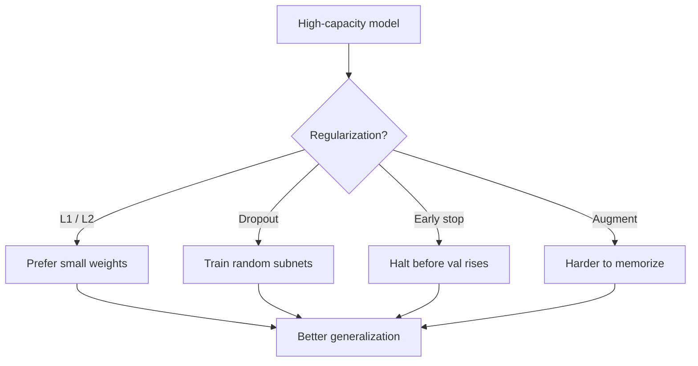

**Regularization** is the family of techniques that deliberately hold a model back during training so it learns patterns that transfer, not quirks that only appear in the training set. It exists because unconstrained capacity lets models memorize noise.

- **L1 regularization** can push some weights to exactly zero, helping remove unhelpful features.
- **L2 regularization** shrinks weights smoothly toward zero, making the model calmer and less extreme.
- **Dropout** randomly zeros neurons during training so no single pathway dominates.
- **Early stopping** and **data augmentation** also fight overfitting without changing the architecture.

## Intuition

Think of fitting a curve through a scatter of points. With enough parameters you can snake through every point, including noise. On new points the snake misses badly. Regularization says: prefer simpler snakes. "Simpler" can mean smaller weights (L2), sparser connections (L1, dropout), fewer effective training steps (early stopping), or more diverse examples so noise is harder to memorize (data augmentation).

Overfitting thrives when the model has more degrees of freedom than the signal in the data. Regularization does not make the architecture smaller on paper; it changes the *effective* capacity the optimizer is allowed to use. You still have a deep network, but training is biased toward solutions that generalize.

## How it works

**L1 and L2 regularization:**

| Plain-English idea | When to use it |
| --- | --- |
| **L1** — can make some weights exactly zero, so it helps remove unhelpful features | Feature selection, sparse models |
| **L2 (weight decay)** — shrinks weights smoothly toward zero, making the model calmer | Default weight penalty in most deep learning |

Readable formulas:

```
L1:  Loss_total = Loss_original + lambda * sum(abs(Wi))
L2:  Loss_total = Loss_original + lambda * sum(Wi^2)
```

Gradient descent then pulls every weight slightly toward zero each step. Large weights that chase individual training quirks become expensive. The hyperparameter `lambda` controls strength: too small and you barely regularize; too large and the model underfits.

**Dropout.** During training, randomly set a fraction of neuron activations to zero (e.g. 50%). Each minibatch trains a slightly different sub-network. At inference, use all neurons and scale activations (or use inverted dropout during training so inference needs no scaling). The network cannot rely on a single co-adapted pathway; features must be useful in many random contexts.

**Early stopping.** Track validation loss while training. When validation stops improving for a patience window, stop and keep the best checkpoint. Late epochs often keep driving training loss down while validation rises — early stopping cuts that second phase short without changing the loss formula.

**Data augmentation.** For images: random crops, flips, color jitter. For text: synonym swaps or back-translation (used carefully). You enlarge the effective dataset with label-preserving transforms so memorizing exact pixels or token sequences is harder. Augmentation is regularization through data, not through the loss.

**K-fold cross-validation (CV).** Splits data into k parts, tests on each part once, and averages the scores:

```
avg_score = (score_1 + score_2 + ... + score_k) / k
```

This gives a stabler estimate of generalization than one train-test split.



These methods stack. Vision models often use augmentation + weight decay + dropout in later layers + early stopping on a validation split.

**Why this fights overfitting.** Overfitting is high variance: the hypothesis wiggles to fit noise. Shrinking weights (L1/L2) and randomizing pathways (dropout) bias learning toward smoother functions. Early stopping limits how long the optimizer can chase residual noise. Augmentation makes "the same label" appear under many surface forms, so memorizing one surface form stops paying off.

## In code

**L2 penalty on weights.** Pure NumPy sketch of the penalty term and its gradient contribution:

```python
import numpy as np

def l2_penalty(weights, lam=1e-3):
    # Sum of squared weights across all parameter arrays
    return lam * sum(np.sum(w ** 2) for w in weights)

def l2_grad(weights, lam=1e-3):
    # d/dw (lam * ||w||^2) = 2 * lam * w
    return [2 * lam * w for w in weights]

# Toy: one weight matrix + bias (usually skip L2 on bias)
W = np.array([[1.5, -2.0], [0.3, 0.8]])
b = np.array([0.1, -0.2])
params = [W]

data_loss = 0.42  # from your task loss
total = data_loss + l2_penalty(params, lam=1e-2)
print("L2 term:", l2_penalty(params, lam=1e-2))
print("Total loss:", total)
print("Extra grad on W:", l2_grad(params, lam=1e-2)[0])
```

In frameworks, `weight_decay` in AdamW/SGD applies this idea during the update; the math matches "shrink weights each step."

**Dropout mask demo.** Apply a random binary mask, then invert-scale so expected activation stays similar:

```python
import numpy as np

rng = np.random.default_rng(0)
h = np.array([0.5, 1.2, -0.3, 0.8, 2.0])  # hidden activations
p_keep = 0.5

mask = rng.random(h.shape) < p_keep
h_drop = h * mask / p_keep  # inverted dropout
print("mask:", mask.astype(int))
print("after dropout:", h_drop)

# Inference: no mask, use full h
h_infer = h
```

Train with masks; evaluate without them. If you forget to disable dropout at test time, predictions become noisy and usually worse.

## What goes wrong

**Too much regularization.** Train and validation loss both stay high. The model never fits the signal. Lower `lambda`, reduce dropout rate, or train longer with milder early-stop patience.

**Too little.** Train loss collapses; validation diverges. Increase regularization or add augmentation before growing the model further.

**Dropout at inference.** Leaving dropout on at test time injects randomness. Always switch to eval mode.

**Augmenting away the label.** Aggressive crops that remove the object, or text edits that change meaning, teach the wrong mapping. Augmentations must preserve the target.

**Early stopping on the wrong split.** If you tune patience and checkpoint using the same data you later report as "test," you leak information. Keep a true holdout or nested validation.

**L2 on the wrong scale.** Features with huge magnitudes need huge weights; naive L2 fights that. Prefer normalized inputs (and often normalized layers) so weight penalties are meaningful.

## One-line summary

Regularization fights overfitting by making complex, memorizing solutions expensive — via smaller weights, random dropout, earlier stopping, or richer training data — so the model keeps what generalizes.

## Key terms

- **Regularization** — Any constraint or procedure that reduces overfitting and improves generalization.
- **L1 regularization** — Penalty on absolute weights that can push some weights to exactly zero.
- **L2 / weight decay** — Penalty on squared weights that shrinks parameters toward zero.
- **`lambda`** — Strength of the L1 or L2 penalty.
- **Dropout** — Randomly zeroing activations during training to prevent co-adaptation.
- **Early stopping** — Halting training when validation performance stops improving.
- **Data augmentation** — Label-preserving transforms that expand effective training diversity.
- **K-fold cross-validation (CV)** — Splitting data into k parts, testing on each once, and averaging scores.
- **Effective capacity** — How complex a function the model can actually learn under training constraints.
