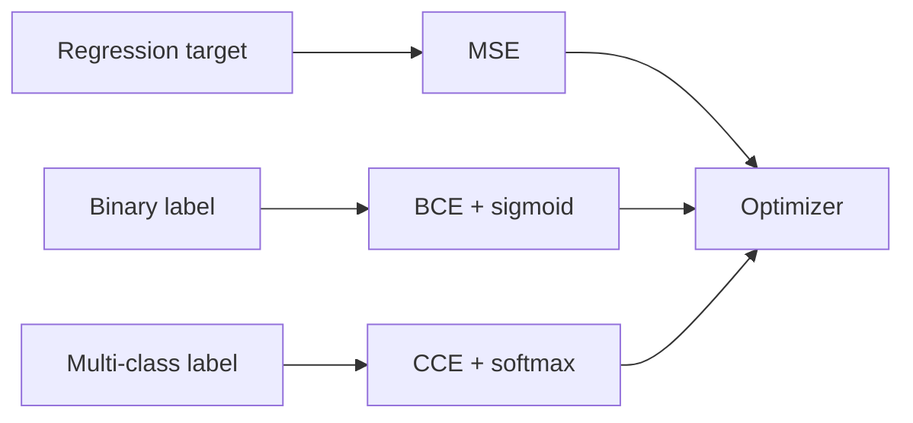

**What is a loss function?** It is the scoreboard training reads. It measures how far the model's guess is from the correct answer. **Why does it matter?** Pick the wrong scoreboard and the model learns the wrong thing — like grading a spelling test with a ruler instead of a red pen.

Machine learning problems fall into two families. **Regression** asks "how much?" or "how many?" — you predict a continuous number (house price, temperature). **Classification** asks "which group?" — you pick a label from a fixed set (spam or not spam; cat, dog, or bird). The loss function must match the task type.

:::key
Regression → mean squared error (MSE). Binary classification → binary cross-entropy (BCE). Multi-class classification → categorical cross-entropy (CCE). Match the loss to the task.
:::

## Intuition

**Regression** cares about numeric distance. If the true price is $300,000 and you guess $310,000, the error is $10,000. Squaring that error makes big misses hurt more than small ones.

**Classification** cares about probability on the correct label. If the true class is "cat" and the model says 99% "dog," that is a confident mistake — and cross-entropy punishes it hard. The formula uses `-log(probability of true class)`. When that probability is tiny, the loss shoots up.

- **Binary classification** — exactly two choices (spam / not spam). Use **binary cross-entropy (BCE)** with a **sigmoid** output that squashes scores between 0 and 1.
- **Multi-class classification** — three or more choices (cat / dog / bird). Use **categorical cross-entropy (CCE)** with a **softmax** output that turns scores into percentages summing to 100%.

| Plain-English idea | Loss function | Task type | Output layer |
| --- | --- | --- | --- |
| "How far off is the number?" | Mean squared error (MSE) | Continuous regression | Linear (no squashing) |
| "How wrong is the yes/no probability?" | Binary cross-entropy (BCE) | Two-class decision | Sigmoid |
| "How wrong is the class pick?" | Categorical cross-entropy (CCE) | Three or more classes | Softmax |

| Loss function | How it punishes mistakes |
| --- | --- |
| MSE | Squares the gap — big misses get punished much harder than small ones |
| BCE | Uses logarithms — confident wrong answers (0.99 on the wrong side) get hammered |
| CCE | Looks only at the true class slot — low probability there means high loss |

## How it works

**Mean squared error (MSE)** — for regression only.

```
MSE = (1/n) * sum of (y_true - y_pred)^2 over all examples
```

Example: errors of 2 and -1 → MSE = ((2)^2 + (-1)^2) / 2 = 2.5.

**Binary cross-entropy (BCE)** — for two-class problems.

```
BCE = -(1/n) * sum of [ y * log(p) + (1 - y) * log(1 - p) ]
```

- `y` is the true label (0 or 1).
- `p` is the predicted probability (from sigmoid).
- Only one side of the formula is active per example.

**Categorical cross-entropy (CCE)** — for multi-class problems.

```
CCE = -(1/n) * sum of log(p_true_class)
```

After softmax, if the correct class gets probability 0.8, loss is `-log(0.8) ~= 0.22`. If it only gets 0.05, loss is `-log(0.05) ~= 3.0` — much worse.

**Why confident mistakes hurt more.** True-class probability 0.9 → loss ~= 0.11. True-class probability 0.01 → loss ~= 4.6. Training spends effort fixing arrogant errors before polishing already-good predictions.



## In code

Compute the three losses from scratch. Use clipping for stable logs in teaching code; production frameworks prefer fused logit losses.

```python
import numpy as np

def mse(y_true, y_pred):
    y_true = np.asarray(y_true, dtype=float)
    y_pred = np.asarray(y_pred, dtype=float)
    return np.mean((y_true - y_pred) ** 2)

def binary_cross_entropy(y_true, p, eps=1e-7):
    y_true = np.asarray(y_true, dtype=float)
    p = np.clip(np.asarray(p, dtype=float), eps, 1 - eps)
    return -np.mean(y_true * np.log(p) + (1 - y_true) * np.log(1 - p))

def categorical_cross_entropy(y_true_onehot, p, eps=1e-7):
    p = np.clip(np.asarray(p, dtype=float), eps, 1.0)
    y = np.asarray(y_true_onehot, dtype=float)
    return -np.mean(np.sum(y * np.log(p), axis=-1))

# --- Regression ---
print("MSE:", mse([2.0, 0.0, -1.0], [2.5, 0.2, -0.5]))

# --- Binary classification ---
y_bin = np.array([1, 0, 1, 0])
p_good = np.array([0.9, 0.1, 0.8, 0.2])
p_bad = np.array([0.1, 0.9, 0.2, 0.8])  # confidently wrong
print("BCE good:", binary_cross_entropy(y_bin, p_good))
print("BCE bad: ", binary_cross_entropy(y_bin, p_bad))

# --- Multi-class (one-hot labels) ---
y_oh = np.array([[1, 0, 0], [0, 0, 1], [0, 1, 0]])
p_ok = np.array([[0.7, 0.2, 0.1], [0.1, 0.2, 0.7], [0.2, 0.6, 0.2]])
p_confident_wrong = np.array([[0.05, 0.90, 0.05], [0.80, 0.10, 0.10], [0.10, 0.10, 0.80]])
print("CCE ok:  ", categorical_cross_entropy(y_oh, p_ok))
print("CCE bad: ", categorical_cross_entropy(y_oh, p_confident_wrong))
```

For raw scores (logits) and a class index, a stable multi-class loss avoids computing softmax separately:

```python
def cross_entropy_from_logits(logits, class_indices):
    z = logits - logits.max(axis=-1, keepdims=True)
    log_sum_exp = np.log(np.exp(z).sum(axis=-1))
    log_p = z[np.arange(len(class_indices)), class_indices] - log_sum_exp
    return -np.mean(log_p)
```

## What goes wrong

- **MSE on classification** — Saturating sigmoid/softmax plus MSE gives weak gradients when predictions are confidently wrong. Use cross-entropy instead.
- **Probabilities outside (0, 1)** — Feeding raw logits into `log(p)` produces NaN. Apply sigmoid/softmax first, or use loss-from-logits APIs.
- **Class imbalance** — A 99% negative class lets the model predict "always negative" with low average BCE. Use class weights, focal loss, or resampling.
- **Wrong reduction** — Summing loss vs averaging it changes the effective learning rate. Be consistent between experiments.
- **Label noise** — Hard one-hot cross-entropy overfits wrong labels. Label smoothing or robust losses help when annotations are imperfect.

## One-line summary

Use MSE when the target is a continuous number; use BCE or categorical cross-entropy when the target is a class — so training especially unlearns confident mistakes.

## Key terms

- **Loss function** — A number that measures how wrong the model's prediction is compared to the true answer.
- **MSE (mean squared error)** — Regression loss: average of squared differences between guesses and targets.
- **BCE (binary cross-entropy)** — Two-class loss that punishes confident wrong probability assignments.
- **CCE (categorical cross-entropy)** — Multi-class loss: `-log(probability of true class)` after softmax.
- **Logits** — Raw unbounded scores before sigmoid or softmax.
- **Softmax** — Turns logits into a probability distribution over classes.
- **Label smoothing** — Soft targets that reduce overconfidence during training.
