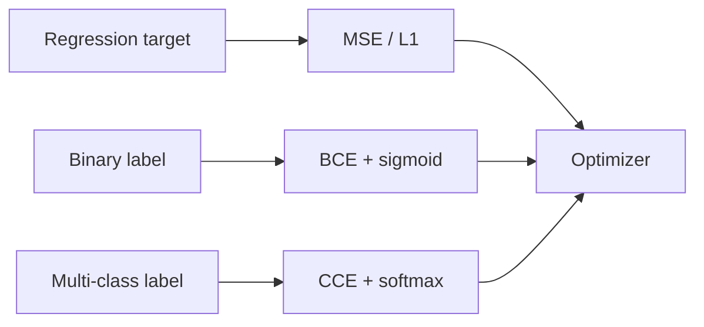

The loss function is the scoreboard the optimizer reads. Change the scoreboard and you change what “good” means—so the same network can become a regressor, a spam filter, or a multi-class classifier depending on the loss you attach. Picking MSE for classification or cross-entropy for unbounded regression is not a minor detail; it warps gradients and usually slows or breaks learning. This lesson builds the three losses you will see constantly: mean squared error, binary cross-entropy, and categorical cross-entropy—and shows why confident wrong answers get hit hardest.

## Intuition

**Regression** asks: how far is the predicted number from the true number? Distance in output space is natural, so squared error fits.

**Classification** asks: how wrong is the predicted *probability* of the correct class? You do not care that the logit was “3.2 vs 3.1”; you care that the model said 99% for the wrong label. Cross-entropy measures surprise: if the true class had probability `p`, loss is `-log p`. When `p` is tiny (confident mistake), `-log p` explodes. That is intentional—overconfident errors should dominate the gradient.

Binary problems (spam / not spam) use binary cross-entropy (BCE). Multi-class problems (cat / dog / bird) use categorical cross-entropy (CCE), usually after softmax.

A useful mental model: MSE cares about *numeric distance* in output space; cross-entropy cares about *how much probability mass you put on the truth*. If your product metric is “was the class correct?” or “was the predicted probability well calibrated?”, start from CE-family losses. If the product metric is “how many degrees off was the temperature forecast?”, start from MSE (or related regression losses like MAE / Huber).

## How it works

**Mean squared error (MSE).** For targets `y` and predictions `y_hat`:

```
error_i = y_i - y_hat_i
MSE = average of (error_i)^2 over all examples
```

Example: if errors are `2` and `-1`, then MSE = `((2)^2 + (-1)^2) / 2 = (4 + 1) / 2 = 2.5`.

Penalizes large misses more than small ones (quadratic). Sensitive to outliers.

**Binary cross-entropy (BCE).** For labels `y` in `{0, 1}` and predicted probability `p` (from a sigmoid):

```
if y = 1:  loss = -log(p)
if y = 0:  loss = -log(1 - p)

BCE = average of those losses over examples
```

Only the true side of the formula is active per example. Numerically, implement with logits (`BCEWithLogits`) to avoid `log(0)`.

**Categorical cross-entropy (CCE).** For a true class and a probability vector `p` from softmax:

```
CCE = -log(p_true_class)
```

If the model gives the correct class probability `0.8`, loss is `-log(0.8) ≈ 0.22`. If it only gives `0.05`, loss is `-log(0.05) ≈ 3.0` — much larger. Soft labels (label smoothing) keep a small mass on other classes and reduce overconfidence.



**Why confident mistakes hurt more.** Suppose true class probability is 0.9 → loss `≈ 0.105`. If it is 0.01 → loss `≈ 4.6`. Ten times more confident wrong is not ten times the loss—it is much worse on a log scale. Training therefore spends capacity fixing arrogant errors before polishing already-good predictions. That property is exactly why CE pairs well with softmax: as the model drives `p_true` toward 1, loss gently approaches 0; as it drives `p_true` toward 0, loss grows without a soft ceiling.

## In code

Compute the three losses from scratch (NumPy). Use clipping for stable logs in teaching code; production prefers fused logit losses.

```python
import numpy as np

def mse(y_true, y_pred):
    y_true = np.asarray(y_true, dtype=float)
    y_pred = np.asarray(y_pred, dtype=float)
    return np.mean((y_true - y_pred) ** 2)

def binary_cross_entropy(y_true, p, eps=1e-7):
    y_true = np.asarray(y_true, dtype=float)
    p = np.clip(np.asarray(p, dtype=float), eps, 1 - eps)
    return -np.mean(y_true * np.log(p) + (1 - y_true) * np.log(1 - p))

def categorical_cross_entropy(y_true_onehot, p, eps=1e-7):
    p = np.clip(np.asarray(p, dtype=float), eps, 1.0)
    y = np.asarray(y_true_onehot, dtype=float)
    # mean over batch of -sum_k y_k log p_k
    return -np.mean(np.sum(y * np.log(p), axis=-1))

# --- Regression ---
print("MSE:", mse([2.0, 0.0, -1.0], [2.5, 0.2, -0.5]))

# --- Binary classification ---
# True labels and predicted probabilities
y_bin = np.array([1, 0, 1, 0])
p_good = np.array([0.9, 0.1, 0.8, 0.2])
p_bad = np.array([0.1, 0.9, 0.2, 0.8])  # confidently wrong
print("BCE good:", binary_cross_entropy(y_bin, p_good))
print("BCE bad: ", binary_cross_entropy(y_bin, p_bad))

# --- Multi-class ---
# one-hot for classes 0, 2, 1
y_oh = np.array([
    [1, 0, 0],
    [0, 0, 1],
    [0, 1, 0],
])
p_ok = np.array([
    [0.7, 0.2, 0.1],
    [0.1, 0.2, 0.7],
    [0.2, 0.6, 0.2],
])
p_confident_wrong = np.array([
    [0.05, 0.90, 0.05],  # true=0 but mass on 1
    [0.80, 0.10, 0.10],  # true=2
    [0.10, 0.10, 0.80],  # true=1
])
print("CCE ok:  ", categorical_cross_entropy(y_oh, p_ok))
print("CCE bad: ", categorical_cross_entropy(y_oh, p_confident_wrong))
```

You should see BCE/CCE jump sharply for the “confidently wrong” vectors even when MSE-style absolute gaps look moderate. That is the log at work.

For logits `z` and class index `c`, a stable multi-class loss is:

```python
def cross_entropy_from_logits(logits, class_indices):
    # log-softmax: log p_i = z_i - logsumexp(z)
    z = logits - logits.max(axis=-1, keepdims=True)
    log_sum_exp = np.log(np.exp(z).sum(axis=-1))
    log_p = z[np.arange(len(class_indices)), class_indices] - log_sum_exp
    return -np.mean(log_p)
```

## What goes wrong

**MSE on one-hot classification.** Saturating sigmoid/softmax plus MSE yields weak gradients when predictions are confidently wrong. Cross-entropy + logits keeps gradients healthier.

**Probabilities outside (0, 1).** Feeding raw logits into `log(p)` NaNs the run. Sigmoid/softmax first—or better, loss-from-logits APIs.

**Class imbalance.** Averaging BCE treats every example equally; a 99% negative class lets the model predict “always negative” with low average loss. Use class weights, focal loss, or resampling.

**Wrong reduction.** Summing loss vs meaning it changes effective learning rate. Be consistent between experiments.

**Label noise.** Hard one-hot CE overfits wrong labels. Label smoothing or robust losses help when annotations are imperfect.

## One-line summary

Use MSE when the target is a continuous value; use BCE or categorical cross-entropy when the target is a class probability—so training especially unlearns confident mistakes.

## Key terms

- **Loss function** — Scalar objective minimized during training.
- **MSE** — Mean of squared prediction errors; standard for regression.
- **BCE** — Binary cross-entropy for two-class probability targets.
- **CCE / categorical cross-entropy** — Multi-class loss `-log p_true` after softmax.
- **Logits** — Raw unbounded scores before sigmoid/softmax.
- **Softmax** — Maps logits to a probability distribution over classes.
- **Label smoothing** — Soft targets that reduce overconfidence.
