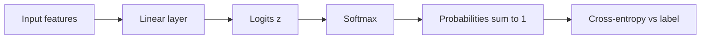

**What is softmax?** It is the "percentage maker." Neural networks for multi-class problems output raw scores called **logits** — not probabilities. Softmax converts those messy numbers into clean percentages that add up to exactly 100% (or 1.0).

**Why do we need it?** You cannot plug raw scores into cross-entropy loss. You need real probabilities first. Language models, image classifiers, and intent detectors all use this same two-step pipeline: linear layer → softmax → cross-entropy.

:::key
Softmax does two things: (1) raise e to each score so negatives disappear and the winner stands out, then (2) divide each result by the total so everything sums to 1.
:::

## Intuition

Imagine three judges holding up scores: 2.0, 1.0, 0.1. Softmax does not just pick a winner — it converts the score gaps into shares of a probability pie. Bigger scores get bigger slices; the total pie is always 100%.

Because of the exponential step, *differences* matter more than absolute values. Adding 5 to every logit leaves probabilities unchanged (the extras cancel in the normalization). Relative ordering and gaps drive the distribution.

**Temperature** — divide logits by a temperature `T` before softmax:
- `T < 1` → sharper distribution (winner takes most).
- `T > 1` → flatter distribution (more uniform, more diverse sampling).
- Think of temperature as a volume knob on how "decisive" the distribution is.

## How it works

For logits `z = [z1, z2, ..., zK]`, softmax produces a probability for each class:

```
Step 1 (exponential):  exp_z_i = e^(z_i)     for each class i
Step 2 (normalize):    p_i = exp_z_i / (exp_z_1 + exp_z_2 + ... + exp_z_K)
```

In plain English:

1. Raise Euler's number `e` (~= 2.718) to each logit. This removes negative numbers and amplifies the highest score.
2. Add all those exponential values together (the denominator).
3. Divide each exponential value by that total to get its percentage share.

Properties to remember:

1. Every `p_i` is greater than 0.
2. All `p_i` values add up to 1.
3. Softmax is **invariant to adding a constant** to all logits (same probabilities).
4. Softmax is **not** invariant to scaling — multiplying logits by 2 sharpens the distribution (like lowering temperature).

| Plain-English idea | What happens |
| --- | --- |
| Raw scores (logits) | Unbounded real numbers from the last linear layer |
| Exponential step | Turns scores positive; big scores grow much faster |
| Normalization step | Divides each value by the total → percentages sum to 100% |
| Cross-entropy | Uses `-log(p_true_class)` on the softmax output |

**Worked numbers.** Logits `[2.0, 1.0, 0.1]`:

```
e^2.0 ~= 7.39
e^1.0 ~= 2.72
e^0.1 ~= 1.11
sum   ~= 11.22

p ~= [7.39/11.22, 2.72/11.22, 1.11/11.22]
  ~= [0.66, 0.24, 0.10]
```

The top class is not certain — about one-third of the mass still sits on the others. Raise the first logit to `5.0` and the top probability jumps near 0.96.

**Contrast with sigmoid.** Sigmoid maps one logit to a probability in (0, 1) for binary (or independent multi-label) tasks. Softmax couples classes: raising one logit lowers others because they share the denominator. Use sigmoid when labels are independent; softmax when exactly one class is true.



## In code

Naive softmax overflows when logits are large (`exp(1000)` → infinity). The standard fix: subtract the max logit before exponentiating. Mathematically identical; numerically safe.

```python
import numpy as np

def softmax(logits, temperature=1.0):
    """Stable softmax along the last axis."""
    z = np.asarray(logits, dtype=float) / temperature
    z = z - np.max(z, axis=-1, keepdims=True)
    exp_z = np.exp(z)
    return exp_z / np.sum(exp_z, axis=-1, keepdims=True)

logits = np.array([2.0, 1.0, 0.1, -1.0])
p = softmax(logits)
print("probs:", p)
print("sum:", p.sum())           # ~ 1.0
print("argmax:", p.argmax())     # class 0

batch = np.array([[2.0, 1.0, 0.1], [0.0, 0.0, 5.0]])
print("batch probs:\n", softmax(batch))

print("T=0.5 (sharp):", softmax(logits, temperature=0.5))
print("T=2.0 (flat): ", softmax(logits, temperature=2.0))

shifted = logits + 100.0
print("same after +100?", np.allclose(softmax(logits), softmax(shifted)))

big = np.array([1000.0, 1001.0, 999.0])
print("stable:", softmax(big))
```

**From probabilities back to training.** Cross-entropy only needs `log(p_true)`. Frameworks compute `log_softmax` directly:

```
log(p_i) = z_i - log( e^(z1) + e^(z2) + ... + e^(zK) )
```

Prefer that path over `log(softmax(z))`, which can hit `log(0)`.

## What goes wrong

- **Overflow / NaNs** — Exponentiating large logits without subtracting max yields `inf` and `nan` gradients. Always use a stable implementation.
- **Treating logits as probabilities** — A logit of 0.7 is not "70%." After softmax, `[0.7, 0.2, 0.1]` as logits is a mild preference, not a calibrated distribution.
- **Softmax on independent labels** — Multi-label tags ("cat" and "indoor" both true) need per-label sigmoids, not a single softmax that forces competition.
- **Temperature misuse at train time** — Changing temperature without adjusting the loss changes gradient scale. Temperature is usually an inference/sampling knob.
- **Overconfidence** — Softmax can assign 0.999 to the wrong class. Calibration (temperature scaling on a validation set) and label smoothing are separate fixes.
- **Tiny numerical zeros** — In float32, extremely peaked distributions can underflow some `p_i` to 0. Loss-from-logits avoids taking `log` of those zeros.

## One-line summary

Softmax converts logits into positive percentages that sum to 1 — use max-subtraction for stability, and remember temperature only reshapes how sharp that distribution is.

## Key terms

- **Logits** — Raw real-valued class scores before normalization.
- **Softmax** — Activation that turns logits into probabilities: `p_i = e^(z_i) / sum of all e^(z_j)`.
- **Probability distribution** — Non-negative values that sum to one.
- **Temperature** — Divisor on logits that sharpens (T < 1) or flattens (T > 1) softmax.
- **Numerical stability** — Subtract max logit (or use log-sum-exp) to avoid `exp` overflow.
- **Argmax** — Index of the largest logit or probability; hard class prediction.
- **Log-softmax** — Stable `log(p_i)` used inside cross-entropy.
